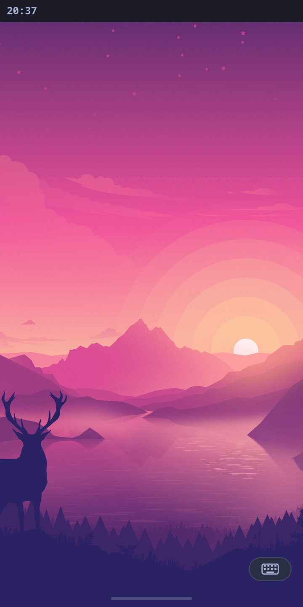
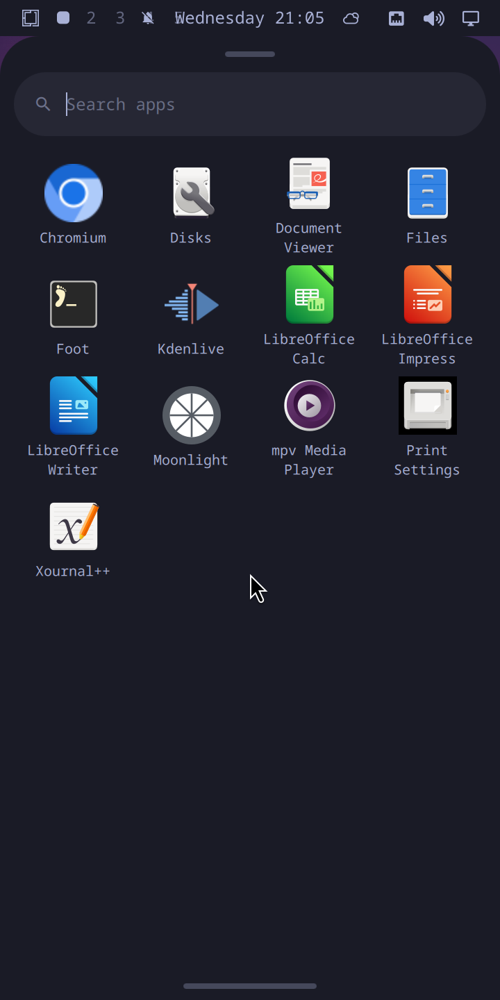
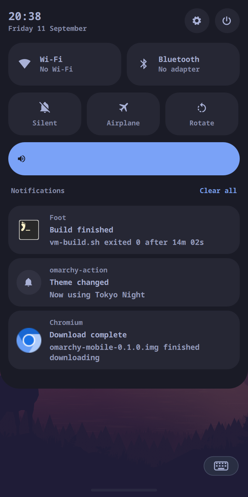
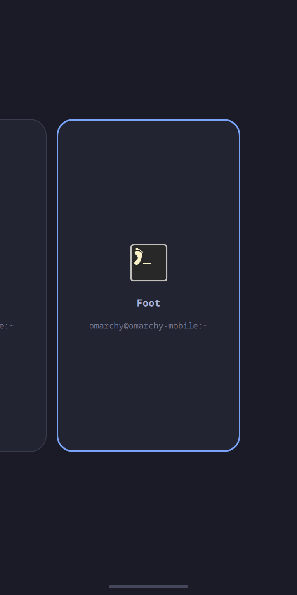
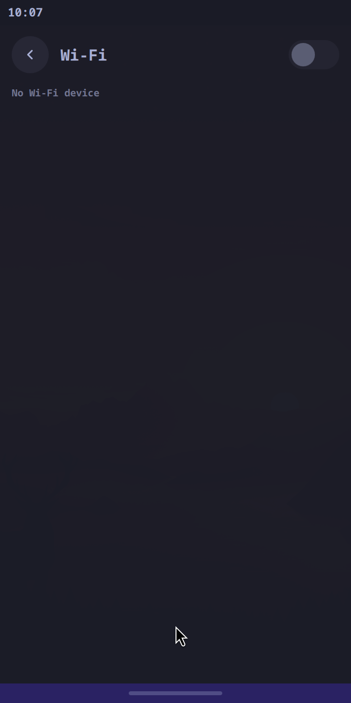
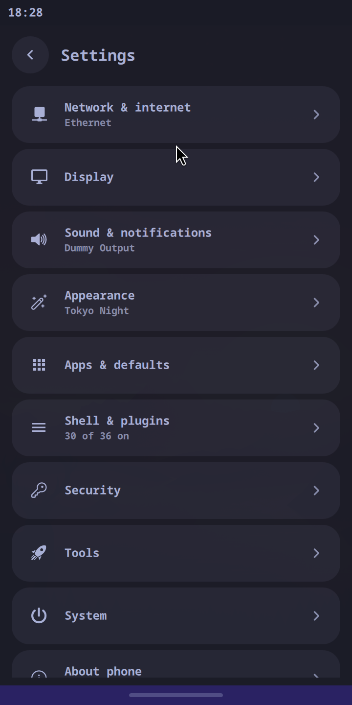
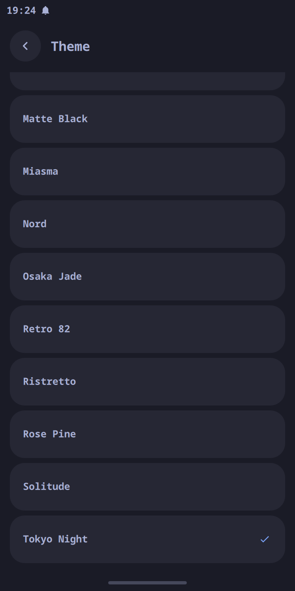

# omarchy-mobile

Upstream Omarchy on **Hyprland**, on an aarch64 VM, with a mobile UI built on
top of it rather than instead of it.

<p align="center">
  
  
  
  
</p>

<sub>Straight off the VM, not mocked: the home screen, the app drawer, the
shade, and the recents carousel.</sub>

This is the sibling of [moarchy](https://github.com/SimonSchubert/moarchy), which
puts Omarchy on an original PinePhone. That phone's hardware forces moarchy to
swap Hyprland for Sway. This project gives up the phone to keep Hyprland, so the
mobile UI is built on Omarchy as it actually is.

## Why not just extend moarchy?

The PinePhone's Mali-400 tops out at **OpenGL ES 2.0**, and Hyprland 0.50
removed its GLES2 renderer. So moarchy runs Sway and carries `port-4x.patch`,
264 insertions that rewrite the shell from `Quickshell.Hyprland` to
`Quickshell.I3` and lose `HyprlandFocusGrab`, and with it click-outside-to-dismiss.
A VM has no Mali-400: Mesa's **llvmpipe advertises GLES 3.2 in software**, which
clears Hyprland's floor without a GPU.

| | moarchy | omarchy-mobile |
| --- | --- | --- |
| Compositor | Sway (wlroots, GLES 2.0) | **Hyprland 0.56**, upstream |
| Omarchy config layer | vendored + `port-4x.patch` | vendored, **unpatched** |
| Shell IPC | `Quickshell.I3` | `Quickshell.Hyprland` |
| `HyprlandFocusGrab` | unavailable | available |
| Blur, shadows, rounded corners, animations | dropped | available |
| Target | real PinePhone hardware | a VM, for now |

The trade: moarchy runs on a phone you can hold, and this does not.

## Quick start

```bash
brew install qemu
./scripts/vm-build.sh          # ~30 min the first time, most of it downloads
./scripts/vm-run.sh            # a window on the Mac
```

`vm-run.sh` prints the ssh and VNC ports it forwards. The guest autologins on
tty1 straight into Hyprland, so there is nothing to type.

```bash
./scripts/vm-ssh.sh --wait                 # a shell in the guest
./scripts/vm-ssh.sh hyprctl monitors       # one command
./scripts/vm-screenshot.sh                 # grim, from inside the session
./scripts/vm-run.sh --headless             # no window; Hyprland headless + VNC
./scripts/vm-run.sh --detach               # the window, owned by no terminal or session
./scripts/vm-run.sh --geometry 1080x2340   # a different panel
./scripts/vm-drag.sh 180 712 -300          # swipe up from the bottom edge
./scripts/vm-push.sh                       # the overlay into a running guest, no rebuild
./scripts/vm-selftest.sh                   # the gestures, one line per acceptance criterion
./scripts/vm-waydroid.sh install           # Android in a container, as windows Hyprland manages
```

`./scripts/vm-build.sh --session-only` skips the application tier for fast
iteration on the session itself.

## How the image is built

- **A plain UEFI disk.** The ESP is mounted at `/boot`, so an in-guest
  `pacman -Syu` that updates the kernel writes it where the firmware reads it.
  Both partitions have fixed PARTUUIDs, so `fstab` and the loader entry are the
  same in every build.
- **No loop devices.** `mkfs.ext4 -d` and `mcopy` fill filesystem images
  straight from directories, which Docker Desktop cannot reliably do with
  mounts. Only `mkinitcpio` needs a chroot, which is why the builder runs
  `--privileged`. The initramfs drops `autodetect`, which would keep only the
  modules of the container doing the build, and names the virtio drivers
  instead.
- **The package set.** 120 of upstream's 147 base packages exist for aarch64 in
  Arch Linux ARM. Of the other 27, two are built here from the AUR:
  xdg-terminal-exec, which every terminal Omarchy opens goes through, and
  mise-bin, which every coding agent installs through. The other
  25 are listed with reasons in [`vm/packages/omitted`](vm/packages/omitted),
  along with eight that do exist and are left out on purpose.
  [`session`](vm/packages/session) is what Hyprland and the shell need to start;
  [`apps`](vm/packages/apps) is the rest, plus GNOME's phone apps.
- **Hyprland is rebuilt.** ALARM moved `aquamarine` to `libaquamarine.so=14`
  without rebuilding `hyprland`, so a plain `pacstrap` fails. This project
  builds Arch's own `hyprland 0.56.2-2` packaging for aarch64 at a commit pinned
  in `manifest.toml`. Once ALARM catches up, its package wins on version and
  `[pkg.hyprland]` can be deleted.

## Where this deliberately differs from upstream Omarchy

The intent is to track upstream, not to fork it. Omarchy is vendored at the
commit `manifest.toml` pins (v4.0.3 today), and keeping up with upstream means
moving that pin. The mobile UI adds to upstream rather than changing it: it is
an ordinary user plugin, and pointing `bar.id` back at `omarchy.bar` gives stock
desktop Omarchy.

Where upstream's own code has to change, the change is a patch in
[`patches/`](patches/), applied with `--fuzz=0` and no offset. If upstream moves
under a patch, the build fails and names the hunk rather than landing it
somewhere it was never aimed. Every patch is meant to go upstream and be deleted
here once it lands:

| Patch | What it fixes | Upstream |
| --- | --- | --- |
| `notification-card-max-width.patch` | Toast cards are a fixed 380 wide, so on a 360-wide screen they hang off the left edge | [#11034](https://github.com/omacom/omarchy/pull/11034) |
| `lock-field-max-width.patch` | The lock screen's password field is 381px, wider than the screen it is centred on | [#11244](https://github.com/omacom/omarchy/pull/11244) |
| `weather-panel-fit.patch` | The weather panel's hero row overlaps itself and its forecast row clips in a narrow popup | [#11238](https://github.com/omacom/omarchy/pull/11238) |
| `plugin-manifest-kinds.patch` | A plugin that declares `kind: "menu"` never gets the app library, because its manifest's `kinds` is not an `Array` after a `QVariant` round trip | not submitted yet |
| `notification-popups-bar-opt-out.patch` | A bar that shows notifications itself cannot turn the toasts off, so they float over its shade and every app | not submitted yet |
| `launch-osd-bar-opt-out.patch` | A bar that answers a launch itself cannot turn the launch OSD off, so a panel reading "Launching…" arrives over the app it announces | not submitted yet |

The first three matter only on a narrow screen and change nothing at desktop
width. The fourth is a plain bug. The last two are hooks that do nothing unless
a bar asks for them, so desktop Omarchy keeps its toasts and its launch panel.
None of them is specific to aarch64 or to phones.

Three divergences are deliberate and will stay, because they come from building
a phone image rather than from aarch64:

- **No display manager.** Upstream enables `sddm`. Here tty1 autologins into
  `uwsm start -- hyprland-uwsm.desktop`, because a phone shows no login screen,
  and on a software-rendered VM sddm is one more thing that can fail before
  Hyprland starts.
- **No password.** The account is locked and ssh password login is off, as on
  moarchy's phone image. `vm-build.sh` authorises your ssh public key so that
  `vm-ssh.sh` can get in (`--no-ssh-key` opts out). That is acceptable only
  because this image is a local development VM and is never published.
- **A phone's app set.** Upstream's LibreOffice, Kdenlive, Moonlight,
  Xournal++, Evince, Print Settings and Disks are left out, and so is sushi,
  which depends on Evince.
  GNOME's Calculator, Calendar, Contacts, Maps, Clocks, Weather, Text Editor,
  Geary, Camera, Sound Recorder and Showtime are added: the apps a phone is
  expected to have, and libadwaita apps that fit a 360px screen. No music
  player, which `vm/packages/apps` explains and puts a price on. mpv stays
  installed for upstream's scripts, but the drawer's player is Showtime.
- **Three of them are web apps.** X, Discord and Spotify are in the drawer, and
  each opens as its own window with no browser chrome at all, through
  `omarchy-launch-webapp` and the window rule in `hypr/mobile.lua` that tells
  Epiphany it is fullscreen while the compositor keeps laying it out under the
  bar. They also ask for the mobile web: a `.gschema.override` makes WebKit
  send an iPhone user agent, without which YouTube serves a page carrying no
  viewport meta at all. Upstream ships entries for the first two that nothing
  on this image ever copied into a home, and artwork beside them that nothing
  ever put in an icon theme, so both are done at build time; Spotify is written
  here, because upstream has no entry for it and because this image has no music
  player. Each entry names the window class its launch will produce, which is
  what gives a web app a name and an icon on its recents card rather than
  `org.gnome.Epiphany.WebApp_x_com`.
- **Those apps follow the theme.** Upstream themes a GTK app twice -- light or
  dark, and an icon theme -- so Calendar and Contacts would sit in stock Adwaita
  beside a shell drawn in the theme's own colours
  ([basecamp/omarchy#7557](https://github.com/basecamp/omarchy/issues/7557), open,
  with two unreviewed PRs). Here a user template renders the active theme's
  `colors.toml` into `~/.config/gtk-4.0/gtk.css` on every `omarchy-theme-set`,
  and a hook restarts the app daemons that parse it once at startup, so the
  GNOME apps take the theme's background, text and accent. Geary is GTK3, where
  that does not work -- GTK3's built-in Adwaita has its colours baked in, so a
  user stylesheet never reaches the rules that draw -- so it gets `adw-gtk3`,
  libadwaita's stylesheet ported to GTK3, whose rules do read named colours,
  and a second template recolours that.

## The mobile UI

<p align="center">
  
  
  
  
</p>

It ships as one ordinary Omarchy shell plugin, `mobile.shell`, in the user
plugin directory upstream already scans, and `bar.id` in `shell.json` switches
it on.

- **Swipe up from the pill** for the recents carousel, which follows the
  finger. Let go short of 15% of the travel and it springs back, between 15% and
  75% it stays, and past 75% you land on a home screen with every app still
  running. Tap a card to switch to it; flick it up to close it.
- **Swipe sideways along the pill** for the next or previous app. Every app
  gets a workspace of its own, filling it, through a window rule in
  [`hypr/mobile.lua`](default/etc/skel/.config/hypr/mobile.lua).
- **Swipe in from the left edge** to go back, which always undoes the topmost
  thing: the on-screen keyboard if it is up, then whatever sheet is open, then
  the app itself -- *asked* to close, so an editor with unsaved work still
  prompts. Inside Settings it walks up the page stack first and leaves the
  window only from the root. The band is 16 logical px and stops short of the
  bar at the top and of the pill and the keyboard at the bottom, so it never
  swallows a key or the shade's handle.
- **Drag up on the wallpaper** of a home screen for the app drawer, 1:1 with
  the finger. Drag down to put it away.
- **Hold an app icon** for a card that says what it is: the package that owns
  it, its version and installed size. Uninstall never removes on the first tap
  -- it shows the plan first, every package the removal would take and how much
  they weigh, read out of `pacman -Rs --print`. Nothing this phone is made of
  can go: the shell's own packages, and anything in the session tier, say so
  instead of offering a button.
- **Pull down the status bar** for the shade: Wi-Fi, Bluetooth, Silent,
  Airplane and Rotate, brightness and volume where there is hardware for them,
  the media player, and your notifications, each led by its app's icon: tap
  one to open it, swipe it away to dismiss it. Nothing toasts over the screen:
  a bell in the status bar says something is waiting. Holding the Wi-Fi or
  Bluetooth tile opens that radio's screen, which is the way to both: neither
  is in the drawer.
- **Tap an app and its own icon comes up on the wallpaper**, centred, until its
  window appears -- the phone's answer to "did that register" on a VM where an
  app takes seconds to map. Upstream shows a rounded panel reading "Launching
  Files..." two seconds after the tap instead, which is most of the way through
  the launch it is announcing; the bar turns that off
  (`launch-osd-bar-opt-out.patch`) and
  [`Splash.qml`](default/etc/skel/.config/omarchy/plugins/mobile.shell/Splash.qml)
  draws the icon. The surface is the size of the icon and its input region is
  one pixel, so the pill, the back edge and the bar stay live underneath it.
- **Screens are windows**, so each gets a workspace and a carousel card: Wi-Fi,
  Bluetooth and Settings. Settings is ten phone-style sections over upstream's
  Omarchy menu, opened from the shade's gear, its power glyph (straight to
  Power), the drawer, or `omarchy-shell settings open`. Its pages are data in
  [`Pages.js`](default/etc/skel/.config/omarchy/plugins/mobile.shell/Pages.js),
  its rows run upstream's own commands, and it has native pages where a
  terminal was the wrong shape: audio routing, reminders, time zone, plugins,
  and Theme, Wallpaper and Font. A row this image cannot run (Lock, installing
  from the AUR) is hidden until it can -- as AI agent was, until `mise-bin`
  became a pin.
- **The coding agent is an app**, not only a Settings row four taps deep
  (settings.md P). Picking one on Apps & defaults > Default apps > AI agent
  writes a single drawer tile that carries whichever agent was picked last, and
  a phone that has picked none draws a setup tile that opens that page and
  answers a drawer search for any of the thirteen agents by name.
  `omarchy-mobile-agent` is the whole of it, and everything behind the tile is
  upstream's own `omarchy-default-agent`.
- **The on-screen keyboard** is moarchy's,
  [moarchy-keyboard](https://github.com/SimonSchubert/moarchy-keyboard), built
  from its pin in `manifest.toml` like any package ALARM lacks. It rises by
  itself when a text field takes focus and retracts when focus leaves one,
  types into apps whether or not they speak a text input protocol, and
  recolours with the theme. Going home and closing the drawer put it away;
  Super+I forces it up or down.
- **Notes and the App Store** are moarchy's two default apps,
  [moarchy-keep](https://github.com/SimonSchubert/moarchy-keep) and
  [moarchy-store](https://github.com/SimonSchubert/moarchy-store), built from
  their pins like the keyboard and in the drawer from first boot. The store
  installs from its curated catalogue by touch with no password: the image
  locks the account, so a polkit rule grants the store's one action to wheel,
  as moarchy's does. Its Open goes through `omarchy-shell drawer launch`.

The criteria are moarchy's, copied into [`docs/spec/`](docs/spec/) with their
ids unchanged. [`docs/acceptance.md`](docs/acceptance.md) says which of them hold
here, and `./scripts/vm-selftest.sh` checks them by driving a real pointer
through `/dev/uinput` in the guest.

**One plugin, where moarchy has nine.** Omarchy 4.0.3 sandboxes plugins so that
each can summon only itself, and one surface has to own the edges and drive
every sheet anyway (see below). moarchy patches the host to get round the
sandbox; this project does not.

### What Hyprland does differently from Sway

All measured, and the surface layout is shaped around them.
[`docs/build-log.md`](docs/build-log.md) has the numbers.

- **The implicit pointer grab ends at a layer surface's edge.** A drag stops
  getting motion when it leaves the surface it started on, so the edge surface
  is full-screen and opens its input mask to the whole screen for the length of
  a drag. The back edge is the same trick and the plainest case of it: moarchy's
  is a 16px-wide surface that reads the press and the release, which here would
  see 16px of a 60px swipe and never commit one.
- **A layer surface with exclusive keyboard focus takes every pointer event.**
  So the drawer holds `OnDemand` focus (tap the search field before typing) and
  the carousel holds none, which keeps the bottom edge live over both.
- **A drag goes to the topmost surface under the finger.** So the shade handles
  an up-swipe from the pill itself instead of letting it fall through.
- **`Toplevel.activate()` focuses apps but ignores the shell's own windows.**
  Sway drops it for both. Every focus goes through Hyprland's dispatcher by
  window address.
- **Exclusive zones are arranged from Background up, not from Overlay down.**
  On one edge the lowest layer gets the screen's edge. The keyboard is on Top,
  as moarchy ships it, and while the strip reserved its band from Overlay the
  keyboard took the edge and the pill landed between the app and the keys. The
  band is reserved from a Bottom surface instead, and the strip on Overlay only
  draws the pill.
- **The `empty` workspace selector** is where the window rule sends a new app
  and where the home gesture goes, so the two always agree on which workspace
  is free. moarchy computes that twice, and the two copies drifted.

## Android apps, through Waydroid

`./scripts/vm-waydroid.sh install` puts a whole Android 13 in an LXC container
beside the session, rendering into the same Wayland compositor, so Android
arrives as an ordinary Hyprland toplevel — `class: Waydroid`, 360x674 at 0,26,
which is the same box an Omarchy app gets under the status bar and above the
strip. `start` boots it and asks for the full UI; `status` says what it is
doing.

What has been seen: the container reaching `sys.boot_completed=1` in about 60
seconds, an IP on `waydroid0`, `waydroid app list` enumerating Lineage's apps,
and that window mapped with `QuickstepLauncher` as the focused activity. What
has **not**: a screenshot of the launcher actually drawn, and whether the
bottom-edge gestures and the carousel drive an Android window the way they
drive a native one. Being an ordinary toplevel at the right geometry is a good
reason to expect it and is not the same as having checked.

Four things made this more than `pacman -S waydroid`, and the script's header
carries the detail:

- **Binder is already there.** ALARM's `linux-aarch64` has
  `CONFIG_ANDROID_BINDER_IPC=y` and `CONFIG_ANDROID_BINDERFS=y` built in, so the
  `binder_linux-dkms` every Waydroid-on-Arch guide opens with is not needed.
- **The `arm64_only` images, not the `arm64` ones.** Apple Silicon has no
  AArch32, so every 32-bit binary exits 127 — and `boringssl_self_test32_vendor`
  carries init's `reboot_on_failure`, which shut Android down 3.2 seconds into
  every boot. Waydroid already detects the CPU and names the channel it wants;
  `[waydroid]` in `manifest.toml` pins that channel's build by filename and
  sha256.
- **No GPU anywhere in the path.** This VM's virtio-gpu reports `-virgl`, and
  the QEMU that runs it has no `virtio-gpu-gl` to offer instead, so the guest
  cannot be given 3D. Waydroid's default gralloc allocates through GBM, and GBM
  cannot allocate here — a render node refuses dumb buffers by design
  (`DRM_IOCTL_MODE_CREATE_DUMB failed: Permission denied`), and pointing it at
  `card0` instead only moves the failure to `gbm_mesa_bo_import`, because
  kms_swrast can allocate a dumb buffer and cannot import one back. So
  `ro.hardware.gralloc=default` drops GBM for the ashmem gralloc, Android's EGL
  resolves to ANGLE, and ANGLE finds `vulkan.pastel.so` — SwiftShader's Vulkan
  driver, in the image all along. A complete software GPU. Leaving
  `ro.hardware.vulkan` unset is part of the fix: forcing it to `lvp` picks
  lavapipe, which segfaults.
- **Room, and the images fetched on the Mac.** The images need about 2 GB and a
  built image's root has 3.6 GB free, so the script grows the guest's disk
  live — QEMU's `block_resize`, `sfdisk -N 2`, `resize2fs`, no reboot, the window
  on the Mac untouched. They are downloaded on the Mac because SourceForge gives
  the guest 64 kB/s through slirp and the Mac 20 MB/s, and checked against the
  channel's sha256 before unpacking and again after the push.

It is software-rendered, so it is slow — the launcher takes its time and
`com.android.systemui` can ANR on first boot. `waydroid init -f` regenerates
`waydroid_base.prop` and puts `gralloc=gbm` back, which undoes the third point;
re-run `./scripts/vm-waydroid.sh props` after any re-init.

## Layout

| Path | What it is |
| --- | --- |
| `manifest.toml` | The version pins. The only file that says what version of anything is built |
| `vm/Dockerfile` | The aarch64 container both build stages run in |
| `vm/build-packages.sh` | Builds what ALARM is behind on or lacks, from Arch's packaging repos and the AUR |
| `vm/build-disk.sh` | pacstrap → configure → ESP + ext4 → GPT disk |
| `vm/configure.sh` | Runs in the rootfs under `arch-chroot`: identity, fstab, initramfs, user, session |
| `vm/packages/` | The package set, in three files, with every omission explained. `session` is installed into the guest as `/etc/omarchy-mobile/session-packages`, because it is also the answer to "what may not be uninstalled" (gestures.md L12) |
| `default/` | This project's own overlay, copied onto the rootfs |
| `default/etc/skel/.config/omarchy/plugins/mobile.shell/` | The mobile UI -- status bar, shade, gestures, sheets and the Wi-Fi, Bluetooth and Settings screens -- as one Omarchy shell plugin. Settings' pages are data, in `Pages.js` |
| `default/etc/skel/.config/hypr/mobile.lua` | One app per workspace, filling it, no layer animation on the shell's own sheets, no pointer drag that moves or resizes a window, and the on-screen keyboard started and bound to Super+I -- a user override loaded after upstream's defaults |
| `default/etc/skel/.config/omarchy/themed/gtk.css.tpl` | The active theme's palette for GTK4 and libadwaita apps. Upstream's own template engine renders it on every theme set, because it sits in the user template directory it already reads; `~/.config/gtk-4.0/gtk.css` is a symlink to the result, and `hooks/theme-set.d/50-gtk-apps.sh` restarts the app daemons that parse it once at startup |
| `default/etc/skel/.local/bin/` | `omarchy-mobile-*`, the helpers behind Settings' native pages: audio routing, reminders, time zone, plugins, About; and the keyboard toggle |
| `default/etc/skel/.local/share/` | Desktop entries and icons for the Wi-Fi, Bluetooth and Settings screens. Only Settings shows in the drawer. Also a copy of mpv's entry that hides it from the drawer, and the fourteen `omarchy-mobile-agent-*` icons the coding-agent tile draws itself with |
| `default/etc/skel/.config/mimeapps.list` | The default handlers, named rather than left to the mimeinfo cache: GNOME Web for http/https, Evince for PDFs |
| `default/usr/local/bin/` | Shadows of upstream `omarchy-*` scripts that assume a Chromium-family browser -- `/usr/local/bin` comes before `/usr/bin` in the guest's PATH, so this overrides without patching the vendored tree. Also `omarchy-mobile-app-remove`, which the drawer's long-press card asks what an app is and what removing it would take, and `omarchy-mobile-agent`, which puts the chosen coding agent in the app grid (settings.md P); both live here rather than in `~/.local/bin` so that a caller with no login shell -- a `.desktop` `Exec`, for one -- can name them without a path |
| `patches/` | Fixes to the vendored upstream. Applied with `--fuzz=0`, so a moved upstream fails the build |
| `scripts/vm-*.sh` | Build, run, ssh, screenshot, drag, push the overlay into a running guest, selftest, and the lease that makes sessions take turns at the VM |
| `scripts/vm-waydroid.sh` | Android in a container: grows the disk, installs Waydroid, fetches and verifies the pinned images, and configures the one prop that lets it render without a GPU. Its header is the reasoning |
| `docs/spec/` | moarchy's acceptance criteria, copied with their ids unchanged |
| `docs/acceptance.md` | Which of those criteria hold here, and how each one is checked |
| `docs/build-log.md` | The chronological account, including the dead ends |

## Status

**Phase 1**, upstream Omarchy 4.0.3 on Hyprland 0.56.2 in a VM at phone
geometry, is done. **Phase 2** ports moarchy's mobile UI back up from Sway to
the Hyprland it was first written against. The bottom-edge gestures, the
carousel, the home screen, the drawer, the status bar, the shade, the Wi-Fi,
Bluetooth and Settings screens, the on-screen keyboard and the left-edge back
gesture are in (gestures.md A to I and K, shade.md, settings.md). [`docs/build-log.md`](docs/build-log.md) is the chronological
account, dead ends included.

### Not done yet

- The still of an app being put away (gestures.md J).
- Back over a *vendored* popup (settings.md B5). Omarchy 4.0.3's third-party
  plugin facade has no `openPanelIds`, and its `hide` resolves every request to
  the caller's own plugin, so this shell can neither see one nor put it away.
  moarchy gets both by patching `shell.qml`, which is the one thing this project
  does not do. Everything else in gestures.md G is in.
- An image built before the keyboard, Notes and the App Store landed has none
  of them, and no `archlinuxarm-keyring` either, so pacman in that guest trusts
  none of ALARM's signatures and can fetch nothing, the store's installs
  included. Install the keyring first, as a local file from the builder's
  pacman cache; then `pacman -U` `moarchy-keyboard`, `moarchy-keep` and
  `moarchy-store-git` from `vm/out/packages/`, and copy
  `default/usr/share/polkit-1/rules.d/49-moarchy-store.rules` to the same path
  in the guest. Or rebuild. The image build itself was never affected, since it
  verifies against the builder's keyring.
- Settings search from the drawer (settings.md O) is in, but the quiet open O4
  needs -- `quietOpen`, `settlePending` and the floor under a guard batch that
  never answers -- has no `vm-selftest.sh` line yet.
- An image built before 2026-09-11 has no xdg-terminal-exec, and on it every
  Settings row that opens a terminal shows nothing. Rebuild, or install the
  package.
- An image built before 2026-09-12 has no coding-agent tile at all, and behind
  the AI agent row neither the mise an agent installs through nor the node it
  runs on (settings.md P). `./scripts/vm-push.sh` puts the script and its icons
  into a running guest and seeds the tile, which is enough for the setup tile
  and for the drawer to answer a search for "agent". For the agents themselves,
  rebuild -- or in the guest `pacman -U` the `mise-bin` that
  `vm/build-packages.sh` leaves in `vm/out/packages/`, then `pacman -S nodejs
  npm`: mise installs an agent happily with no node on the system, and the
  agent then answers `exec: node: not found`.
- An image built before 2026-09-12 has Chromium and neither GNOME Web nor
  Evince, so the browser is the one that has no narrow layout and PDFs open in
  it. Rebuild, or in the guest `pacman -S epiphany evince`, then
  `./scripts/vm-push.sh` for the default handlers and the web app launcher that
  go with them; `pacman -R chromium` last, since removing it before the
  launcher is pushed leaves every web app tile execing nothing.
- Choosing the browser does not make every site narrow. Epiphany's own chrome
  adapts, and a site laid out with CSS media queries adapts with it, but one
  that switches on the user agent gets the desktop layout WebKitGTK asks for --
  WhatsApp Web in a web app window is clipped on the right. Chromium's `--app=`
  behaved the same way. Whether Epiphany can be told to send a mobile user
  agent is not investigated.
- The Wi-Fi and Bluetooth screens are untested: the VM has neither device.
  `mac80211_hwsim` and `hci_vhci` are in its kernel, which is where testing
  them starts.
- Upstream's first-run toasts do not time out, and until dismissed they take
  every touch in the top ~170px of any sheet. Pulling the shade down clears
  them.
- The phone bar hosts no widgets, so upstream's weather panel logs
  `Cannot read property 'foreground' of null` a few times a minute. Noise, not
  breakage.
- `yay` and `ttf-ia-writer` are omitted, and Settings hides the rows that need
  yay. `vm/build-packages.sh` builds any `[pkg.*]` the manifest pins, as it does
  xdg-terminal-exec, so each is a pin away -- which is how `mise-bin` stopped
  being on this list on 2026-09-12, and with it the AI agent row and the
  coding-agent tile (settings.md P).
- On upstream's bar at phone width, the centred clock overlaps the workspace
  list. It is unpatched because the fix is a design call: elide the centre, or
  shift it the way `PopupCard.onAnchoring` shifts popups.
- Nothing verifies a built image. `vm-selftest.sh` tests the running session;
  moarchy has `scripts/verify-image.sh` for the image.
- Touch is a QEMU `usb-tablet`, a mouse that reports absolute coordinates, so
  every gesture is a `MouseArea` rather than moarchy's `MultiPointTouchArea`.
  Real multi-touch will need something else.
