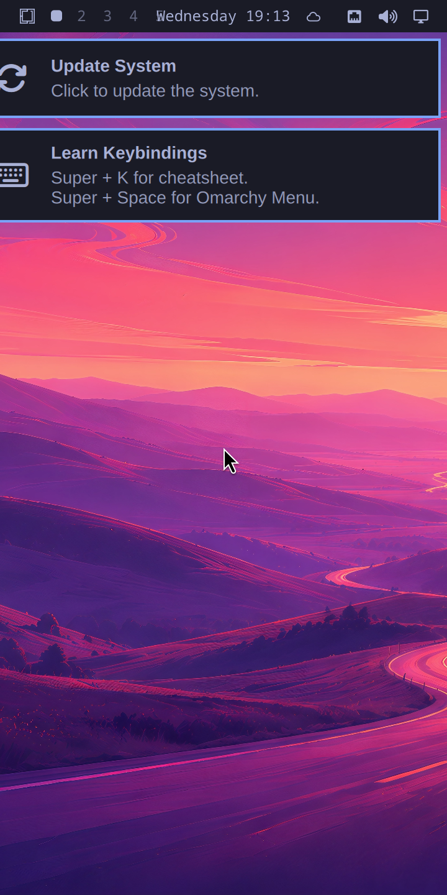
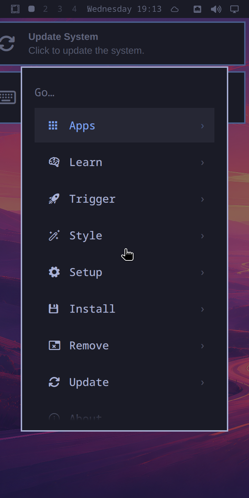
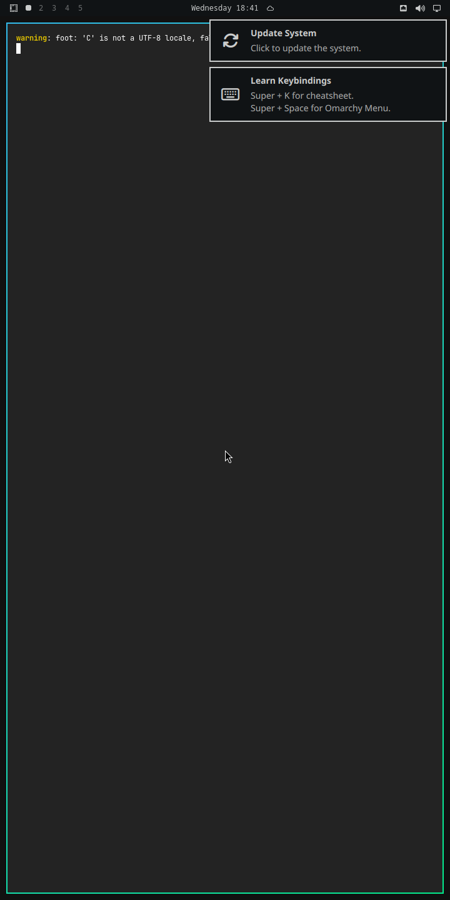
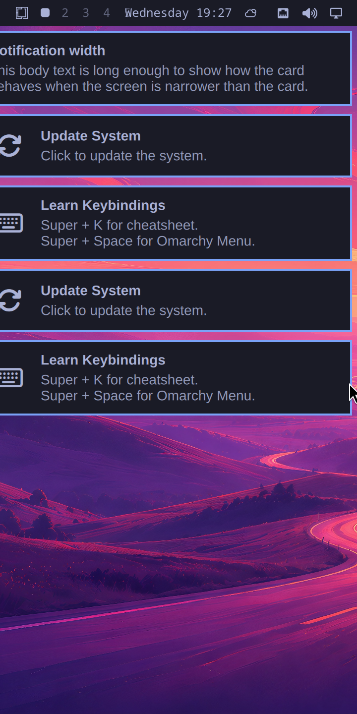
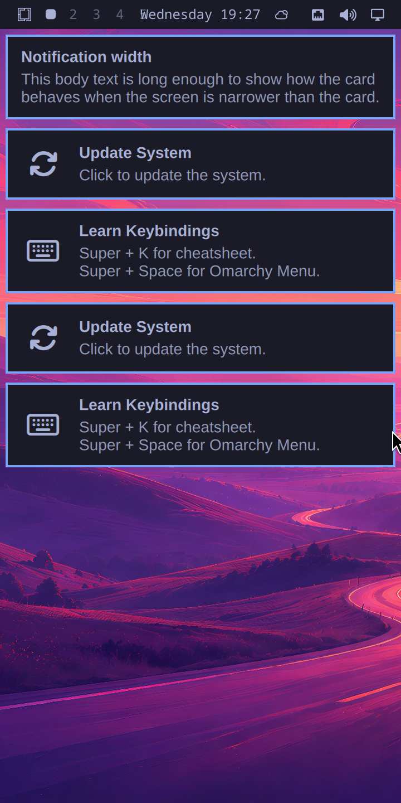

# omarchy-mobile

Omarchy on **Hyprland**, unmodified, on an aarch64 VM — with the mobile UI
built on top rather than instead of it.

<p align="center">
  
  
  
  
</p>

<sub>Straight off the VM, not mocked. Left to right: the shell with its themed
wallpaper, <code>omarchy-menu</code>, a tiled terminal with Hyprland's focus
border and rounded corners, and — for contrast — the same session at the
<code>scale = "auto"</code> upstream ships, which on a 720x1440 panel resolves
to 1.</sub>

This is the sibling of [moarchy](https://github.com/SimonSchubert/moarchy),
which puts Omarchy's look, keybindings and theming on an original PinePhone. It
exists because that phone's hardware forces one substitution moarchy could not
avoid, and this project's whole premise is that the substitution is no longer
necessary once the hardware stops being the constraint.

## Why not just extend moarchy?

moarchy replaces Hyprland with Sway, and it has to:

> The PinePhone's Allwinner A64 has a Mali-400 MP2 driven by Lima, which tops
> out at **OpenGL ES 2.0**. That is a hardware limit, not a driver gap, and
> Hyprland 0.50 removed the legacy GLES2 renderer that would have been the last
> way around it.

Everything downstream of that follows: `port-4x.patch`, 264 insertions across
10 QML files, rewriting `Quickshell.Hyprland` into `Quickshell.I3` so the shell
talks to Sway's IPC — and with it the loss of `HyprlandFocusGrab`, so vendored
popups have no click-outside-to-dismiss.

A VM has no Mali-400. Mesa's **llvmpipe advertises GLES 3.2 in software**, which
clears Hyprland's floor without a host GPU being involved at all. So:

| | moarchy | omarchy-mobile |
| --- | --- | --- |
| Compositor | Sway (wlroots, GLES 2.0) | **Hyprland 0.56**, upstream |
| Omarchy config layer | vendored + `port-4x.patch` | vendored, **unpatched** |
| Shell IPC | `Quickshell.I3` | `Quickshell.Hyprland` |
| `HyprlandFocusGrab` | unavailable | available |
| Blur, shadows, rounded corners, animations | dropped | available |
| Target | real PinePhone hardware | a VM, for now |

The trade is honest and worth stating plainly: moarchy runs on a phone you can
hold, and this does not. What this gets in exchange is Omarchy as Omarchy
actually is, which is the only sound base to build a mobile UI *on top of*.

## Quick start

```bash
brew install qemu
./scripts/vm-build.sh          # ~30 min the first time, most of it downloads
./scripts/vm-run.sh            # a window on the Mac
```

`vm-run.sh` prints the ssh and VNC ports it forwards. The guest autologins on
tty1 straight into Hyprland, so there is nothing to type.

```bash
./scripts/vm-ssh.sh --wait                 # a shell in the guest
./scripts/vm-ssh.sh hyprctl monitors       # one command
./scripts/vm-screenshot.sh                 # grim, from inside the session
./scripts/vm-run.sh --headless             # no window; Hyprland headless + VNC
./scripts/vm-run.sh --geometry 1080x2340   # a different panel
```

For fast iteration on the session itself, `./scripts/vm-build.sh --session-only`
skips the application tier — chromium, libreoffice and kdenlive are most of the
download and none of them decides whether Hyprland starts.

## How it boots

A plain UEFI disk, because a VM boots through edk2 and has none of the
`SPL-at-byte-131072` constraints a PinePhone image has:

```
LBA 2048      ESP    FAT32 512M   Image, initramfs, systemd-boot, entries
LBA 1050624   root   ext4         sized to contents + slack
```

The ESP is mounted at **`/boot`**, not `/efi`. That is what makes an in-guest
`pacman -Syu` that bumps `linux-aarch64` land somewhere the firmware can
actually read: pacman writes `/boot/Image`, mkinitcpio writes
`/boot/initramfs-linux.img` beside it, and systemd-boot's entry names both.

Both partitions get **fixed PARTUUIDs** rather than generated ones, so
`/etc/fstab` and the loader entry are identical in every build.

No loop devices anywhere: `mkfs.ext4 -d` and `mcopy` populate a filesystem
image from a directory without mounting it, which Docker Desktop's VM cannot do
reliably. Only `mkinitcpio` needs a chroot, which is the one reason the builder
wants `--privileged`. That technique is moarchy's, and it is here for moarchy's
reason.

`autodetect` is removed from the initramfs hooks on purpose — it would build an
initramfs containing only the modules loaded on the machine doing the building,
which here is a Docker container on a Mac. The virtio drivers are named
explicitly instead.

## The package set

Upstream's `install/omarchy-base.packages` lists 147 packages. **120 of them
exist for aarch64** in Arch Linux ARM's repos, Hyprland and quickshell
included. The 27 that do not are in
[`vm/packages/omitted`](vm/packages/omitted), each with a reason — ten from
Basecamp's x86_64-only repo, six in the AUR, five x86-only upstreams, and six a
VM has no use for.

The rest is split in two so the slow half can be skipped:

| File | What it is |
| --- | --- |
| [`vm/packages/session`](vm/packages/session) | What Hyprland and the Omarchy shell cannot start without |
| [`vm/packages/apps`](vm/packages/apps) | Everything else that exists for aarch64 |
| [`vm/packages/omitted`](vm/packages/omitted) | The 27, with reasons |

One correction to moarchy's own notes falls out of this: it dropped Omarchy's
OCR capture because `tesseract` "has no aarch64 build". It has one now, so this
port keeps OCR.

### Packages Arch Linux ARM is behind on

ALARM rebuilt `aquamarine` to 0.15.0 (`libaquamarine.so=14`) and never rebuilt
`hyprland`, which still links `libaquamarine.so=13`. So a plain `pacstrap`
fails:

```
:: unable to satisfy dependency 'libaquamarine.so=13-64' required by hyprland
```

Every other dependency lines up. Arch x86_64 already shipped the answer —
`hyprland 0.56.2-2` depends on `libaquamarine.so=14-64` — so this project builds
that tag for aarch64 from Arch's own packaging repo, at a commit pinned in
`manifest.toml`, and serves it from a `file://` repo listed ahead of ALARM's.

Building hyprland rather than pinning aquamarine back is deliberate: an old
aquamarine would need an `IgnorePkg` forever and would break again on the
guest's first `pacman -Syu`, whereas when ALARM catches up its package wins on
version and `[pkg.hyprland]` can simply be deleted.

## Where this deliberately differs from upstream Omarchy

### Patches

`patches/` holds mobile fixes to the vendored upstream. There is one so far:

**`notification-card-max-width.patch`** — `NotificationCard.qml` sets
`implicitWidth: Style.space(380)`, a fixed desktop width. On a 360-logical-wide
screen the card is *wider than the screen*, and since the toast column is
anchored right, 20 pixels hang off the **left** edge — taking the border and the
first character of every line with them.

<p align="center">
  
  
</p>

The fix is one expression, and it is a no-op on any screen wider than about 390
logical pixels:

```qml
implicitWidth: Math.min(Style.space(380), Screen.width - 2 * Style.gapsOut)
```

Patches apply with `--fuzz=0` and no offset, so a moved upstream fails the build
and names the hunk rather than landing a change where it was never aimed — the
rule moarchy holds `port-4x.patch` to, for the same reason.

This one is a candidate for upstream rather than a permanent fork: it is a
narrow-screen robustness fix, not an aarch64 or a mobile-only concern.

### Two deliberate divergences

Both about a phone rather than about aarch64:

**No display manager.** Upstream enables `sddm`. A phone shows no login screen,
and on a software-rendered VM sddm is one more graphical thing that can fail
before Hyprland gets a chance to. tty1 autologin into
`uwsm start -- hyprland-uwsm.desktop` replaces it — `uwsm` because Omarchy's own
`autostart.lua` imports the environment into the systemd user manager and
launches every app through `uwsm-app`, so bare `Hyprland` would leave those app
scopes unparented.

**No password.** The guest account is locked and `PasswordAuthentication` is
off, exactly as moarchy's phone image arranges it. `vm-build.sh` authorises your
ssh public key by default, because otherwise `vm-ssh.sh` has no way in at all;
`--no-ssh-key` opts out. This image is a local development VM and is not
published, which is the only reason baking a key in is acceptable here and is
not in moarchy.

## Layout

| Path | What it is |
| --- | --- |
| `manifest.toml` | The version pins. The only file that says what version of anything is built |
| `vm/Dockerfile` | The aarch64 container both build stages run in |
| `vm/build-packages.sh` | Builds what ALARM is behind on, from Arch's packaging repos |
| `vm/build-disk.sh` | pacstrap → configure → ESP + ext4 → GPT disk |
| `vm/configure.sh` | Runs in the rootfs under `arch-chroot`: identity, fstab, initramfs, user, session |
| `vm/packages/` | The package set, in three files, with every omission explained |
| `default/` | This project's own overlay, copied onto the rootfs |
| `patches/` | Mobile fixes to the vendored upstream. Applied with `--fuzz=0`, so a moved upstream fails the build |
| `scripts/vm-*.sh` | Build, run, ssh, screenshot |
| `docs/build-log.md` | The chronological account, including the dead ends |

## Roadmap

**Phase 1 — Omarchy as it is.** Upstream Omarchy, unpatched, on Hyprland, in a
VM at phone geometry. This is the current phase.

**Phase 2 — the mobile UI.** moarchy has already built and measured most of
this against real hardware: a gesture strip that owns the bottom edge as a
layer surface and follows the finger, a recents carousel, an app drawer, a
pull-down shade, and an on-screen keyboard as a separate Qt program. All of it
is quickshell/QML, and all of it was written against Hyprland's shell and then
patched *down* to Sway. Porting it here is running that patch backwards, which
is the direction that gains a feature (`HyprlandFocusGrab`, and with it
click-outside-to-dismiss) rather than losing one.

## Status

**Phase 1 is up.** Omarchy 4.0.3's quickshell shell runs on Hyprland 0.56.2 on
aarch64, unpatched, and the screenshots above are off the VM rather than
mocked. The cheapest proof that the shell is not merely running but talking to
the compositor:

```
$ ./scripts/vm-ssh.sh hyprctl monitors
Monitor Virtual-1 (ID 0):
        720x1440@74.99900 at 0x0
        reserved: 0 26 0 0
```

`reserved` is the bar's exclusive zone — claimed through `Quickshell.Hyprland`,
the import moarchy has to rewrite, with no patch applied.

[`docs/build-log.md`](docs/build-log.md) is the chronological account, including
the five failures on the way there — four of which turned out to be one bug
(Docker Desktop's VirtioFS silently discarding the write-to-temp-then-rename
that pacman, `useradd` and `systemd-sysusers` all rely on) wearing four
different disguises.

### Not done yet

- The gesture layer, recents carousel, app drawer, shade and on-screen keyboard
  — all of phase 2.
- The four AUR packages moarchy already builds for aarch64 (`yay`,
  `xdg-terminal-exec`, `ttf-ia-writer`, `mise-bin`) are omitted rather than
  blocked. `vm/build-packages.sh` is already the loop that would build them —
  it takes any `[pkg.*]` section in the manifest — so wiring them in is a pin
  and a PKGBUILD source, not new machinery.
- Nothing verifies an image after it is built. moarchy has
  `scripts/verify-image.sh` and 93 checks; this has none.
- Touch input is a `usb-tablet`, which is a mouse that reports absolute
  coordinates. Real multi-touch gestures will need something else.
