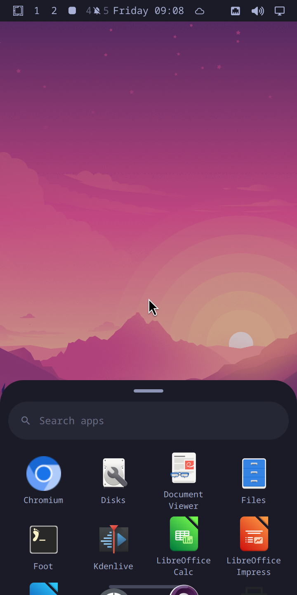
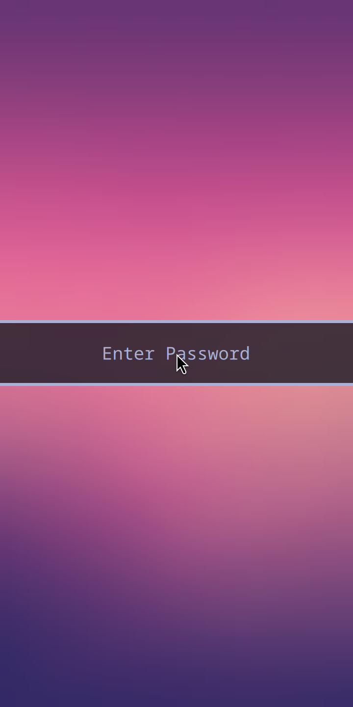
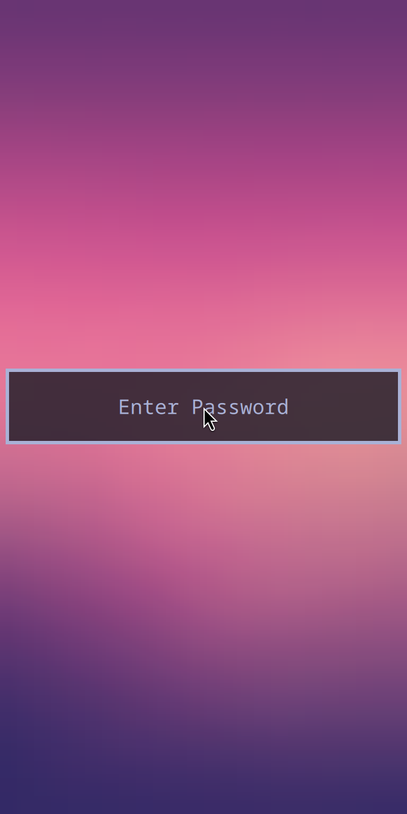
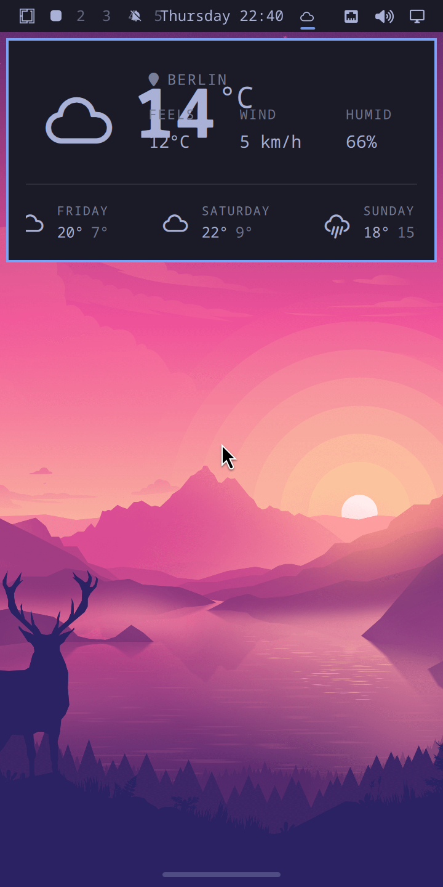
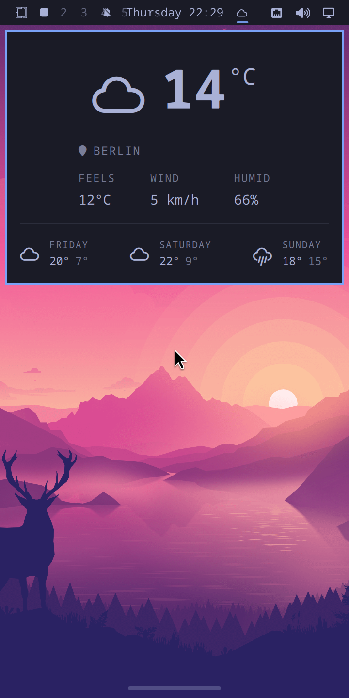
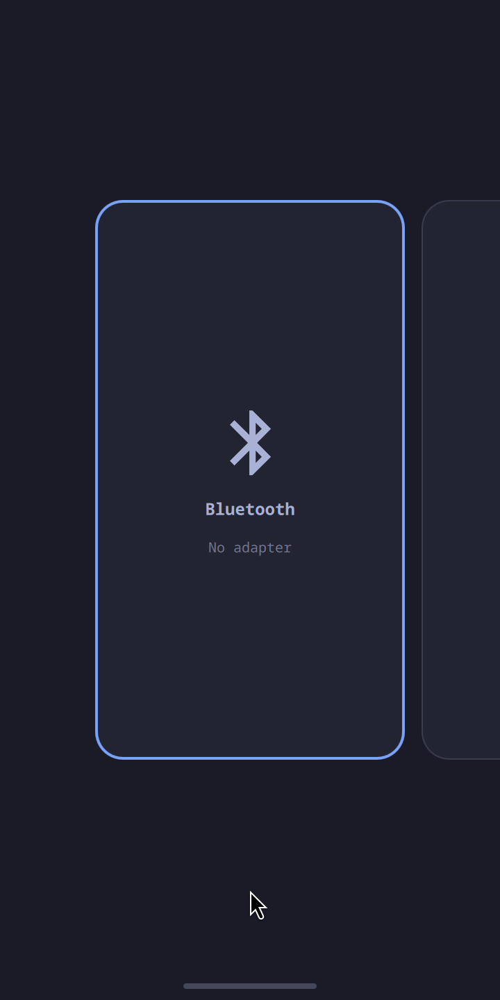

# omarchy-mobile

Omarchy on **Hyprland**, unmodified, on an aarch64 VM — with the mobile UI
built on top rather than instead of it.

<p align="center">
  
  
  
  
</p>

<sub>Straight off the VM, not mocked. Left to right: the shell with its themed
wallpaper, the recents carousel raised by a swipe up from the pill, the app
drawer following a drag up on a home screen, and the same drawer open.</sub>

This is the sibling of [moarchy](https://github.com/SimonSchubert/moarchy),
which puts Omarchy's look, keybindings and theming on an original PinePhone. It
exists because that phone's hardware forces one substitution moarchy could not
avoid, and this project's whole premise is that the substitution is no longer
necessary once the hardware stops being the constraint.

## Why not just extend moarchy?

moarchy replaces Hyprland with Sway, and it has to:

> The PinePhone's Allwinner A64 has a Mali-400 MP2 driven by Lima, which tops
> out at **OpenGL ES 2.0**. That is a hardware limit, not a driver gap, and
> Hyprland 0.50 removed the legacy GLES2 renderer that would have been the last
> way around it.

Everything downstream of that follows: `port-4x.patch`, 264 insertions across
10 QML files, rewriting `Quickshell.Hyprland` into `Quickshell.I3` so the shell
talks to Sway's IPC — and with it the loss of `HyprlandFocusGrab`, so vendored
popups have no click-outside-to-dismiss.

A VM has no Mali-400. Mesa's **llvmpipe advertises GLES 3.2 in software**, which
clears Hyprland's floor without a host GPU being involved at all. So:

| | moarchy | omarchy-mobile |
| --- | --- | --- |
| Compositor | Sway (wlroots, GLES 2.0) | **Hyprland 0.56**, upstream |
| Omarchy config layer | vendored + `port-4x.patch` | vendored, **unpatched** |
| Shell IPC | `Quickshell.I3` | `Quickshell.Hyprland` |
| `HyprlandFocusGrab` | unavailable | available |
| Blur, shadows, rounded corners, animations | dropped | available |
| Target | real PinePhone hardware | a VM, for now |

The trade is honest and worth stating plainly: moarchy runs on a phone you can
hold, and this does not. What this gets in exchange is Omarchy as Omarchy
actually is, which is the only sound base to build a mobile UI *on top of*.

## Quick start

```bash
brew install qemu
./scripts/vm-build.sh          # ~30 min the first time, most of it downloads
./scripts/vm-run.sh            # a window on the Mac
```

`vm-run.sh` prints the ssh and VNC ports it forwards. The guest autologins on
tty1 straight into Hyprland, so there is nothing to type.

```bash
./scripts/vm-ssh.sh --wait                 # a shell in the guest
./scripts/vm-ssh.sh hyprctl monitors       # one command
./scripts/vm-screenshot.sh                 # grim, from inside the session
./scripts/vm-run.sh --headless             # no window; Hyprland headless + VNC
./scripts/vm-run.sh --geometry 1080x2340   # a different panel
./scripts/vm-drag.sh 180 712 -300          # swipe up from the bottom edge
./scripts/vm-push.sh                       # the overlay into a running guest, no rebuild
./scripts/vm-selftest.sh                   # the gestures, one line per acceptance criterion
```

For fast iteration on the session itself, `./scripts/vm-build.sh --session-only`
skips the application tier — chromium, libreoffice and kdenlive are most of the
download and none of them decides whether Hyprland starts.

## How it boots

A plain UEFI disk, because a VM boots through edk2 and has none of the
`SPL-at-byte-131072` constraints a PinePhone image has:

```
LBA 2048      ESP    FAT32 512M   Image, initramfs, systemd-boot, entries
LBA 1050624   root   ext4         sized to contents + slack
```

The ESP is mounted at **`/boot`**, not `/efi`. That is what makes an in-guest
`pacman -Syu` that bumps `linux-aarch64` land somewhere the firmware can
actually read: pacman writes `/boot/Image`, mkinitcpio writes
`/boot/initramfs-linux.img` beside it, and systemd-boot's entry names both.

Both partitions get **fixed PARTUUIDs** rather than generated ones, so
`/etc/fstab` and the loader entry are identical in every build.

No loop devices anywhere: `mkfs.ext4 -d` and `mcopy` populate a filesystem
image from a directory without mounting it, which Docker Desktop's VM cannot do
reliably. Only `mkinitcpio` needs a chroot, which is the one reason the builder
wants `--privileged`. That technique is moarchy's, and it is here for moarchy's
reason.

`autodetect` is removed from the initramfs hooks on purpose — it would build an
initramfs containing only the modules loaded on the machine doing the building,
which here is a Docker container on a Mac. The virtio drivers are named
explicitly instead.

## The package set

Upstream's `install/omarchy-base.packages` lists 147 packages. **120 of them
exist for aarch64** in Arch Linux ARM's repos, Hyprland and quickshell
included. The 27 that do not are in
[`vm/packages/omitted`](vm/packages/omitted), each with a reason — ten from
Basecamp's x86_64-only repo, six in the AUR, five x86-only upstreams, and six a
VM has no use for.

The rest is split in two so the slow half can be skipped:

| File | What it is |
| --- | --- |
| [`vm/packages/session`](vm/packages/session) | What Hyprland and the Omarchy shell cannot start without |
| [`vm/packages/apps`](vm/packages/apps) | Everything else that exists for aarch64 |
| [`vm/packages/omitted`](vm/packages/omitted) | The 27, with reasons |

One correction to moarchy's own notes falls out of this: it dropped Omarchy's
OCR capture because `tesseract` "has no aarch64 build". It has one now, so this
port keeps OCR.

### Packages Arch Linux ARM is behind on

ALARM rebuilt `aquamarine` to 0.15.0 (`libaquamarine.so=14`) and never rebuilt
`hyprland`, which still links `libaquamarine.so=13`. So a plain `pacstrap`
fails:

```
:: unable to satisfy dependency 'libaquamarine.so=13-64' required by hyprland
```

Every other dependency lines up. Arch x86_64 already shipped the answer —
`hyprland 0.56.2-2` depends on `libaquamarine.so=14-64` — so this project builds
that tag for aarch64 from Arch's own packaging repo, at a commit pinned in
`manifest.toml`, and serves it from a `file://` repo listed ahead of ALARM's.

Building hyprland rather than pinning aquamarine back is deliberate: an old
aquamarine would need an `IgnorePkg` forever and would break again on the
guest's first `pacman -Syu`, whereas when ALARM catches up its package wins on
version and `[pkg.hyprland]` can simply be deleted.

## Where this deliberately differs from upstream Omarchy

### Patches

`patches/` holds fixes to the vendored upstream. There are four:

**`notification-card-max-width.patch`** — `NotificationCard.qml` sets
`implicitWidth: Style.space(380)`, a fixed desktop width. On a 360-logical-wide
screen the card is *wider than the screen*, and since the toast column is
anchored right, 20 pixels hang off the **left** edge — taking the border and the
first character of every line with them.

<p align="center">
  
  
</p>

The fix follows the card's own stated contract. Its header says *"Pure
presentational"*, and `cornerRadius` and `fontFamily` are both **injected by the
container** — so the width limit arrives the same way, rather than the card
reaching out to `Screen`:

```qml
// NotificationCard.qml -- 0 leaves the card at its natural width
property real maxWidth: 0
implicitWidth: maxWidth > 0 ? Math.min(Style.space(380), maxWidth) : Style.space(380)

// Service.qml -- the container knows how much room it has
maxWidth: popupWindow.width
          - popupWindow.popupPlacement.margins.left
          - popupWindow.popupPlacement.margins.right
```

The margins come from `popupPlacement`, which the container already computes, so
there is no magic factor — and it stays correct when the bar is on the right
edge, where `margins.right` becomes the bar clearance rather than the gap.

Measured in the VM at both ends: at 360 logical the card clamps to 350 and wraps;
at 1920×1080 `maxWidth` is 1910, `Math.min` returns 380, and the toast is
byte-identical to upstream's.

**`lock-field-max-width.patch`** — the same shape one surface over.
`LockView.qml` sets `fieldWidth: 381`, a raw pixel constant that never goes
through `Style.space()`, on a field anchored `centerIn: parent`. At 360 logical
the field is 21 pixels wider than the screen it is centred on, so the 3px
outline and the rounded corners walk off **both** edges and what is left reads
as a full-width band:

```
PROBE lock-field screen=360 fieldW=381 x=-11 right=370
```

<p align="center">
  
  
</p>

The fix is the idiom the shell already uses twice — `polkit/Service.qml` and
`reminders/Service.qml` both clamp their card against `panel.width -
Style.gapsOut * 2`:

```qml
readonly property int fieldWidth: root.width > 0 ? Math.min(381, root.width - Style.gapsOut * 2) : 381
```

The `> 0` guard is not decoration: `root.width` is 0 until the lock surface is
mapped, and without it the field would come up at a negative width. Measured at
both ends: at 360 logical the field lands on 350 — the same number the
notification card clamps to — with symmetric 5px gutters; at 1920×1080
`Math.min` returns 381 and the capture differs from upstream's by at most 2/255
on 8 pixels, which is llvmpipe's own anti-aliasing.

**`weather-panel-fit.patch`** — two rows in the weather panel lose content on a
narrow screen. The popup itself is fitted to the screen —
`fittedContentWidth(Style.space(480))` returns 350 at 360 logical — but both
rows inside it are still laid out for 480:

```
PROBE weather-hero       avail=318 leftEnd=185.36 rightX=99.72 overlap=85.64
PROBE weather-forecast   avail=318 rowW=329.3 rowX=-6 cut=11.3
```

The hero anchors icon-and-temperature to the left edge and location-and-stats
to the right, so at 318 wide they print 85px on top of each other. The forecast
is a centred row inside a `Flickable` that scrolls vertically only, so its 11px
of overflow is not just off-screen but unreachable. Both now scale down to fit,
the way `SpeedTestOverlay.qml` already scales its dial:

```qml
// the hero: laid out at the width both halves need, scaled from its left edge
width: Math.max(parent.width, heroLeft.width + heroRight.width + Style.space(16 + 20 + 16))
scale: Math.min(1, parent.width / width)
transformOrigin: Item.Left

// the forecast row
scale: Math.min(1, parent.width / Math.max(1, width))
```

<p align="center">
  
  
</p>

Both scales are exactly 1 wherever the content fits, so a desktop gets
upstream's layout. Measured at both ends and across a live switch between them
in each direction: at 360 logical the hero renders at about 76% and nothing
overlaps or clips, and at 1920×1080 the popup matches upstream's to within
3/255 on 38 pixels.

**`plugin-manifest-kinds.patch`** — a third-party plugin that declares
`kind: "menu"` never receives the application-library facade its manifest
promises it, so an app grid written as a plugin gets no apps.

The manifest reaches `pluginShellFor()` through an `Instantiator`'s model, and
a model entry makes a round trip through `QVariant`. A `QVariantList` comes
back to JavaScript as a sequence wrapper rather than an `Array`, so
`Array.isArray(manifest.kinds)` is **false** — and `manifestHasKind()` guards on
exactly that, returning no for a plugin whose kinds are plainly `["menu"]`.
Nothing is logged; the plugin simply gets `appLibrary: null`. Probed in the VM:

```
PROBE omarchy.monitor  isArray= true   kinds= ["bar-widget"]
PROBE mobile.drawer    isArray= false  kinds= ["menu"]
```

The fix reads the live manifest out of the registry instead of the model's copy,
which is one line and repairs every other consumer of that object at the same
time.

Patches apply with `--fuzz=0` and no offset, so a moved upstream fails the build
and names the hunk rather than landing a change where it was never aimed — the
rule moarchy holds `port-4x.patch` to, for the same reason.

All four are candidates for upstream rather than a permanent fork: three are
narrow-screen robustness fixes and the fourth is a plain bug, and none of them
is an aarch64 or a mobile-only concern.

### Two deliberate divergences

Both about a phone rather than about aarch64:

**No display manager.** Upstream enables `sddm`. A phone shows no login screen,
and on a software-rendered VM sddm is one more graphical thing that can fail
before Hyprland gets a chance to. tty1 autologin into
`uwsm start -- hyprland-uwsm.desktop` replaces it — `uwsm` because Omarchy's own
`autostart.lua` imports the environment into the systemd user manager and
launches every app through `uwsm-app`, so bare `Hyprland` would leave those app
scopes unparented.

**No password.** The guest account is locked and `PasswordAuthentication` is
off, exactly as moarchy's phone image arranges it. `vm-build.sh` authorises your
ssh public key by default, because otherwise `vm-ssh.sh` has no way in at all;
`--no-ssh-key` opts out. This image is a local development VM and is not
published, which is the only reason baking a key in is acceptable here and is
not in moarchy.

## The mobile UI

### The bottom edge, the carousel and the drawer

<p align="center">
  
  
  
</p>

Sections A to F of moarchy's gesture spec, running on Hyprland:

- **Swipe up from the pill** with an app open, and the recents carousel follows
  the finger. Let go short of 15% of the travel and it springs back, between
  15% and 75% it stays, and past 75% you land on a home screen with every app
  still running. Tap a card to go to that app; flick it up to close it.
- **Swipe sideways along the pill** for the next or the previous app.
- **Drag up on the wallpaper** of a home screen for the app drawer, 1:1 with the
  finger. Drag down anywhere on it to put it away; tap an icon to launch it.
- **One app per workspace**, which is what makes a workspace an app and a
  sideways swipe "next app". It is a window rule in
  [`hypr/mobile.lua`](default/etc/skel/.config/hypr/mobile.lua) -- a user
  override that upstream's `hyprland.lua` loads after its own defaults -- which
  also takes away the gaps and a lone window's border, so an app fills the
  screen.

The criteria are moarchy's, copied into [`docs/spec/`](docs/spec/) with every
id unchanged, and [`docs/acceptance.md`](docs/acceptance.md) says which of them
hold here. `./scripts/vm-selftest.sh` drives a pointer through each one and
prints a line per AC: 38 checks, all passing.

It all ships as one ordinary Omarchy shell plugin, `mobile.shell`, in
`default/etc/skel/.config/omarchy/plugins/` -- a directory upstream already
scans. moarchy had to patch `PluginRegistry` to add a system-wide plugin path;
here the user directory costs nothing.

**One plugin, where moarchy has nine**, for two reasons that point the same
way. Omarchy 4.0.3 sandboxes an installed plugin: its `shell` can summon and
hide only its own id, so a gesture plugin could not drive a carousel plugin
frame by frame. moarchy gets round that by patching `shell.qml` to trust its own
namespace, and this project does not patch the host. And Hyprland's two input
rules below mean one surface has to own the edges and drive every sheet
directly anyway. So the edge, the carousel and the drawer are three files in one
scope.

Two things turned out simpler here than on Sway, both measured:

- **Going home and launching cannot disagree about which workspace is free.**
  Hyprland's `empty` workspace selector is the lowest-numbered workspace with
  nothing on it, holes included. The window rule sends a new app there and the
  home gesture dispatches there, so one word does both. moarchy computes it
  twice, in QML and in a Python daemon, and its spec records how the two drifted.
- **`Toplevel.activate()` works.** Tapping a card focuses its app through the
  foreign-toplevel protocol. Sway drops the request silently, so moarchy had to
  rebuild focusing as a criteria dispatch.

The search field wants a tap before it takes keys, and so does Escape — the
drawer holds `OnDemand` keyboard focus rather than exclusive, for the reason
below, and a compositor hands that over on a click. On a phone it is what you
want anyway: opening the drawer should not raise the on-screen keyboard.

`./scripts/vm-drag.sh` drives a real pointer through `/dev/uinput` in the guest,
because the VM's own pointer is a `usb-tablet` QEMU forwards from the host and
nothing on either side can move it. `./scripts/vm-push.sh` puts the overlay into
a running guest and restarts the shell, so iterating is a push and not an image
build.

### The status bar, the shade, and screens that are windows

<p align="center">
  
  
  
</p>

shade.md, ported. Upstream's bar is replaced by a phone status bar with no tap
targets -- through shell.json's own `bar.id`, which picks any plugin that
declares kind "bar", so still with nothing patched -- and the whole of it is the
handle the shade is pulled down by. The shade carries quick settings (Wi-Fi,
Bluetooth, Silent, Airplane, Rotate, brightness where there is a backlight,
volume where there is a sink), the media player while something plays, and the
notification history: swipe a card sideways to dismiss it, or tap Clear all.
Holding the Wi-Fi or Bluetooth tile opens that radio's screen.

Two things about how that fits the host are worth knowing:

- **`bar.id` is the phone-mode switch.** `mobile.shell` declares kinds `menu`
  and `bar`, and the host enables a bar-kind plugin exactly when `bar.id` names
  it, for every entry point it has. Point it back at `omarchy.bar` and this is
  stock desktop Omarchy with nothing of this project loaded.
- **The bar kind is also what the shade needed.** The host gives a bar-kind
  plugin first-party service proxies (Do Not Disturb, the media player) and
  leave to summon any menu. The gear and the power button open upstream's
  Omarchy menu that way until Settings exists -- and on Hyprland that menu
  dismisses on a tap outside it, which moarchy's Sway port could not manage.

The Wi-Fi and Bluetooth screens are windows rather than sheets (gestures.md K):
the window rule gives each one a workspace, the carousel a card, and the strip a
way back to it. They are moarchy's screens, ported, and neither has hardware to
talk to in this VM yet.

### What Hyprland does differently from Sway here

Four findings, all measured, and all of which the surface layout is now shaped
around:

**The implicit pointer grab does not survive a layer surface boundary.** Wayland
says a press latches the pointer to the surface it landed on and motion keeps
arriving there. moarchy relies on that — a 20px strip on Sway tracks a
full-height swipe. On Hyprland, motion stops at the surface's own edge, to the
pixel:

```
press at surface-local y=19, drag up 58px   ->  last motion at dy = -18
press at surface-local y=13, drag up 300px  ->  last motion at dy = -10
```

The release still arrives, so an 18px sample of a 300px drag reads as a tap. So
the surface that owns a gesture has to be as large as the gesture: the edge
surface is full-screen on Overlay, and its input region is the bottom band at
rest and the whole screen for the length of a drag, which a `mask` does without
resizing anything. A watchdog puts it back if a gesture ever ends without a
release. The rule is also why the drawer takes no input at all while the home
screen is dragging it up: a region opening under the finger mid-drag would, by
the same rule, take the rest of the gesture.

**A layer surface with exclusive keyboard focus takes every pointer event.**
That is what every full-screen overlay in the Omarchy shell asks for, and what
moarchy's drawer asks for on Sway. Under it, a press on the bottom edge while
the drawer was open produced no press, no release and no log line at all. The
drawer therefore takes `OnDemand` and the carousel takes no keyboard at all,
which keeps the edge alive over both -- and A6 and A7 depend on exactly that: a
second swipe from the pill has to reach the edge with either sheet up.

**A drag goes to the topmost surface under the finger.** The first finding,
arriving from the other side. moarchy's shade cuts the home pill's band out of
its input region so that an up-swipe from the pill falls through to the gesture
strip underneath. The press does fall through here -- and then the drag stops
dead, because it has to travel up over the shade and the shade is the topmost
surface there. So while the shade is up it keeps the band and hands the gesture
to the strip's own logic, rather than a copy of it.

**`Toplevel.activate()` ignores the shell's own windows.** The foreign-toplevel
request focuses foot, and does nothing at all for the Wi-Fi screen, with no
warning anywhere. Every focus in the shell goes through Hyprland's own
dispatcher by window address instead.

## Layout

| Path | What it is |
| --- | --- |
| `manifest.toml` | The version pins. The only file that says what version of anything is built |
| `vm/Dockerfile` | The aarch64 container both build stages run in |
| `vm/build-packages.sh` | Builds what ALARM is behind on, from Arch's packaging repos |
| `vm/build-disk.sh` | pacstrap → configure → ESP + ext4 → GPT disk |
| `vm/configure.sh` | Runs in the rootfs under `arch-chroot`: identity, fstab, initramfs, user, session |
| `vm/packages/` | The package set, in three files, with every omission explained |
| `default/` | This project's own overlay, copied onto the rootfs |
| `default/etc/skel/.config/omarchy/plugins/mobile.shell/` | The mobile UI -- status bar, shade, gestures, sheets and screens -- as one Omarchy shell plugin |
| `default/etc/skel/.config/hypr/mobile.lua` | One app per workspace, filling it, and no layer animation on the shell's own sheets -- a user override loaded after upstream's defaults |
| `default/etc/skel/.local/share/` | Drawer entries and icons for the Wi-Fi and Bluetooth screens |
| `patches/` | Fixes to the vendored upstream. Applied with `--fuzz=0`, so a moved upstream fails the build |
| `scripts/vm-*.sh` | Build, run, ssh, screenshot, drag, push the overlay into a running guest, selftest |
| `docs/spec/` | moarchy's acceptance criteria, copied with their ids unchanged |
| `docs/acceptance.md` | Which of those criteria hold here, and how each one is checked |
| `docs/build-log.md` | The chronological account, including the dead ends |

## Roadmap

**Phase 1 — Omarchy as it is.** Upstream Omarchy, unpatched, on Hyprland, in a
VM at phone geometry. Done.

**Phase 2 — the mobile UI.** moarchy has already built and measured most of
this against real hardware: a gesture strip that owns the bottom edge as a
layer surface and follows the finger, a recents carousel, an app drawer, a
pull-down shade, and an on-screen keyboard as a separate Qt program. All of it
is quickshell/QML, and all of it was written against Hyprland's shell and then
patched *down* to Sway. Porting it here is running that patch backwards, which
is the direction that gains a feature (`HyprlandFocusGrab`, and with it
click-outside-to-dismiss) rather than losing one.

The bottom edge, the carousel, the home screen and the app drawer are in --
gestures.md A to F, with A5's split in force now that the carousel exists to be
the other half of it: the pill is the overview and the wallpaper is the
launcher, and no strip gesture ever opens the drawer. So are the phone status
bar, the shade, and the Wi-Fi and Bluetooth screens (shade.md, gestures.md H and
K). The back gesture, the keyboard and Settings are not in yet.

## Status

**Phase 1 is up, and phase 2 has started.** Omarchy 4.0.3's quickshell shell
runs on Hyprland 0.56.2 on aarch64, and the phone bar, the shade, the carousel,
the home screen and the app drawer are up on top of it. Every screenshot here is
off the VM rather than mocked. The cheapest proof that the shell is not merely running but talking to
the compositor, and that the mobile UI is part of it:

```
$ ./scripts/vm-ssh.sh hyprctl monitors | grep reserved
        reserved: 0 26 0 20

$ ./scripts/vm-ssh.sh hyprctl layers | grep namespace
        namespace: omarchy-background,      xywh: 0 0 360 720    background
        namespace: omarchy-mobile-home,     xywh: 0 26 360 674   bottom
        namespace: omarchy-mobile-drawer,   xywh: 0 26 360 694   top
        namespace: omarchy-mobile-recents,  xywh: 0 0 360 720    top
        namespace: omarchy-mobile-bar,      xywh: 0 0 360 26     top
        namespace: omarchy-mobile-edge,     xywh: 0 0 360 720    overlay
        namespace: omarchy-mobile-strip,    xywh: 0 700 360 20   overlay
        namespace: omarchy-mobile-shade,    xywh: 0 0 360 720    overlay
```

Every full-screen one of those is transparent until it has something to show,
and takes no input outside a band until it is used.

`reserved` is 26 at the top for the phone bar and 20 at the bottom for the home
pill -- both exclusive zones claimed by this project's plugin, on Hyprland, with
upstream's shell hosting it unpatched. An app is laid out between them.

<p align="center">
  
  
</p>

<sub>The rest of phase 1, kept for the record: <code>omarchy-menu</code>, which is
the desktop's own command palette running unmodified — and, for contrast, the
same session at the <code>scale = "auto"</code> upstream ships, which on a
720x1440 panel resolves to 1.</sub>

[`docs/build-log.md`](docs/build-log.md) is the chronological account, including
the five failures on the way there — four of which turned out to be one bug
(Docker Desktop's VirtioFS silently discarding the write-to-temp-then-rename
that pacman, `useradd` and `systemd-sysusers` all rely on) wearing four
different disguises.

### Not done yet

- The back gesture, the on-screen keyboard, Settings, and the still of the app
  being put away (gestures.md G, settings.md, gestures.md J). The shade's gear
  and power button open upstream's Omarchy menu until Settings exists.
  [`docs/acceptance.md`](docs/acceptance.md) has the whole list, AC by AC.
- The Wi-Fi and Bluetooth screens are ported but unexercised: this VM has no
  Wi-Fi device and no Bluetooth adapter. `mac80211_hwsim` and `hci_vhci` are in
  its kernel, which is where testing them starts.
- Upstream's first-run toasts do not time out, and until they are dismissed they
  take every touch in the top ~170px of any sheet. Pulling the shade down
  archives them into its list, which is the way to clear them by hand.
- A phone bar hosts no widgets, so upstream's weather panel, which expects to be
  hosted by one, logs `Cannot read property 'foreground' of null` a few times a
  minute. Noise rather than breakage.
- The drawer has no long-press, no uninstall, no settings results — moarchy's
  drawer has all three, and each of them wants a screen this shell does not
  have yet.
- The four AUR packages moarchy already builds for aarch64 (`yay`,
  `xdg-terminal-exec`, `ttf-ia-writer`, `mise-bin`) are omitted rather than
  blocked. `vm/build-packages.sh` is already the loop that would build them —
  it takes any `[pkg.*]` section in the manifest — so wiring them in is a pin
  and a PKGBUILD source, not new machinery.
- One more narrow-screen defect is measured but unpatched: the bar's left,
  centre and right sections never negotiate a width, so the centred clock starts
  at x=121 while the workspace list runs to x=140.5 — the `5Thursday` collision
  in every screenshot above. Fixing it is a design call, between eliding the
  centre and shifting it into the free span the way `PopupCard.onAnchoring`
  already shifts popups.
- Nothing verifies an image after it is built. `vm-selftest.sh` checks the
  running session's gestures, not the image; moarchy has
  `scripts/verify-image.sh` and 93 checks for that, and this has none.
- Touch input is a `usb-tablet`, which is a mouse that reports absolute
  coordinates. Every gesture here is therefore a `MouseArea` rather than the
  `MultiPointTouchArea` moarchy uses — Qt synthesises a mouse event from an
  unhandled touch but never a touch from a mouse, so this works on hardware and
  a touch area would not work here. Real multi-touch will need something else.
