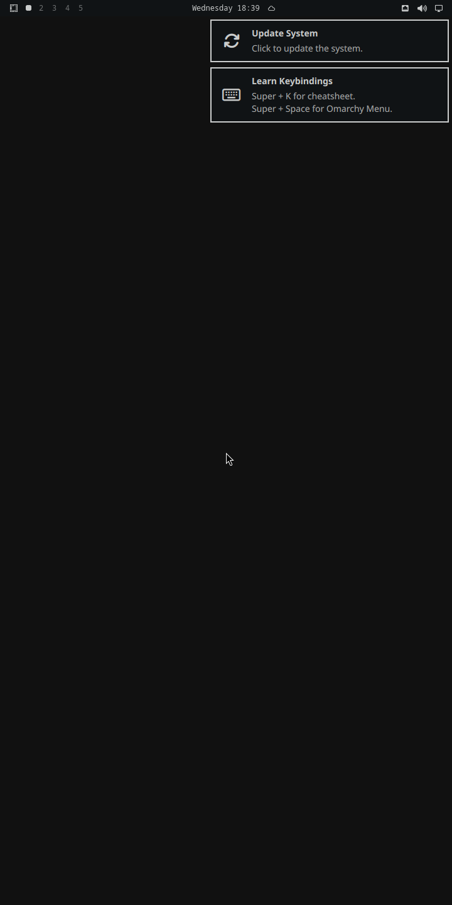
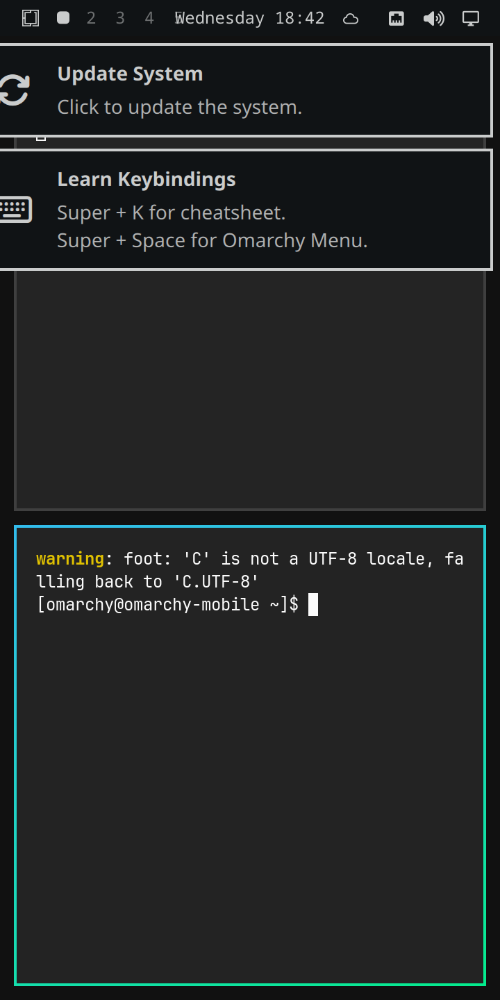

# Build log

The chronological account: every measurement, and every dead end. Written the
way moarchy's is, because the useful half of a port is the part that did not
work the first time.

---

## 2026-09-09 -- the premise, checked before building anything

moarchy exists because of two blockers on PinePhone hardware, both of which it
verified rather than assumed:

1. **Hyprland cannot run on a Mali-400.** Its renderer includes `<GLES3/gl32.h>`
   and aborts if it cannot get a GLES 3.x context. Lima on an Allwinner A64
   tops out at GLES 2.0, and Hyprland 0.50 removed the legacy GLES2 renderer.
2. **Omarchy's package repo is x86_64-only.** `pkgs.omarchy.org/stable/aarch64/`
   is a 404.

This project's premise is that a VM has neither problem. Before writing a line
of it, both halves were checked.

### Hyprland for aarch64 exists, prebuilt

```
$ docker run --rm --platform linux/arm64 menci/archlinuxarm@sha256:f7c6f64... \
    pacman -Si hyprland quickshell ...

hyprland                     0.56.1-3       extra
hyprlang                     0.6.8-5        extra
hyprutils                    0.14.2-1       extra
hyprcursor                   0.1.13-7       extra
hyprgraphics                 0.5.1-4        extra
aquamarine                   0.15.0-2       extra
hyprwayland-scanner          0.4.6-1        extra
xdg-desktop-portal-hyprland  1.4.1-2        extra
quickshell                   0.3.1-1        extra
mesa                         1:26.2.2-1     extra
vulkan-swrast                1:26.2.2-1     extra
uwsm                         0.26.7-1       extra
```

Arch Linux ARM rebuilds Arch's `extra` for aarch64, and the whole Hyprland
stack is in it. **Nothing about Hyprland needs cross-compiling.** That was the
single biggest unknown in the project and it cost one `pacman -Si` to settle.

The GLES floor is cleared by Mesa's llvmpipe, which advertises GLES 3.2 in
software. So the port's central patch -- moarchy's 264-line
`port-4x.patch` turning `Quickshell.Hyprland` into `Quickshell.I3` -- is not
needed here at all. Upstream Omarchy is vendored unpatched.

### 120 of Omarchy's 147 base packages exist for aarch64

`install/omarchy-base.packages` at the pinned commit lists 147. Checked one by
one with `pacman -Si` in an aarch64 container:

```
available: 120 / missing: 27
```

The 27 are in `vm/packages/omitted`, each with a reason. They break down as ten
packages from Basecamp's own x86_64-only repo (`aether`, `herdr`, `omacalc`,
`omacut`, `omawrite`, `omarchy-nvim`, `ttfx`, `tensaku`, `tobi-try`, `cliamp`),
six AUR packages that moarchy already builds for aarch64, five x86-only
upstreams, and six that a VM has no use for.

One correction to moarchy's own notes falls out of this: it dropped Omarchy's
OCR capture on the grounds that `tesseract` "has no aarch64 build". It has one
now -- `tesseract 5.x` and `tesseract-data-eng` are both in `extra` -- so this
port keeps OCR.

`herdr` deserves its own line because moarchy's history turns on it: an earlier
port read Omarchy 4.0.0's move to herdr as a move to a closed-source x86_64
shell, and that reading was wrong twice over. herdr is neither the shell (that
is quickshell) nor closed source. It is omitted here only because it is
packaged for x86_64 alone.

### What Omarchy 4.x actually starts

Worth writing down, because it decides what the image has to arrange:

- Hyprland is configured in **Lua**, not `hyprland.conf`:
  `~/.config/hypr/hyprland.lua` sources `/usr/share/omarchy/default/hypr/*.lua`.
- `default/hypr/autostart.lua` runs `omarchy-launch-shell` on `hyprland.start`,
  which is what brings up the quickshell bar/launcher/notifications/OSD.
- New users get their `~/.config` from **`/etc/skel`**, populated from the
  source tree's `config/`. `omarchy-provision-user`'s own help text is the
  authority on this.
- Upstream enables **sddm**, with
  `CompositorCommand=start-hyprland -- --config /usr/share/sddm/hyprland.lua`.

This image does not use sddm. A phone shows no login screen, and on a
software-rendered VM a display manager is one more graphical thing that can
fail before Hyprland gets a chance to. tty1 autologin into
`uwsm start -- hyprland-uwsm.desktop` replaces it -- `uwsm` because Omarchy's
own autostart imports the environment into the systemd user manager and
launches every app through `uwsm-app`, so a bare `Hyprland` would leave those
app scopes unparented.

### Host

Apple M2 Pro, 16 GB, macOS 25.6. QEMU 11.1.1 from Homebrew;
`edk2-aarch64-code.fd` ships with it at 64 MiB, which is the size the pflash
pairing requires. Docker Desktop 28.3.0 runs `linux/arm64` containers natively,
so every package in the image is built and installed at full speed with nothing
emulated anywhere.

---

## 2026-09-09 -- first boot

It works. Omarchy 4.0.3's quickshell shell, on Hyprland 0.56.2, on aarch64, at
720x1440:



```
$ ./scripts/vm-ssh.sh 'pgrep -a Hyprland; pgrep -a quickshell'
470 Hyprland --watchdog-fd 4
522 quickshell -n -p /usr/share/omarchy/shell

$ ./scripts/vm-ssh.sh hyprctl version
Hyprland 0.56.2 built from branch v0.56.2 at commit efb5099378 clean

$ ./scripts/vm-ssh.sh hyprctl monitors
Monitor Virtual-1 (ID 0):
        720x1440@74.99900 at 0x0
        reserved: 0 26 0 0
        scale: 1
```

`reserved: 0 26 0 0` is the shell's bar claiming its exclusive zone, which is
the cheapest possible proof that the QML shell is not merely running but
talking to the compositor. And it is talking to it through
`Quickshell.Hyprland` — the import moarchy has to rewrite — with no patch
applied.

The window in the second screenshot has a teal focus border, gaps and rounded
corners: three of the things moarchy's README lists under "Gone, because they
are Hyprland renderer features that a GLES 2.0 device could never have driven".

### Five failures on the way there, four of them one bug

Worth writing down together, because four of the five had the same cause
wearing four different disguises, and each one read as a defect somewhere else
entirely.

**1. `pacstrap` refused the transaction.**

```
:: unable to satisfy dependency 'libaquamarine.so=13-64' required by hyprland
```

Arch Linux ARM is one rebuild behind. Fixed by building hyprland 0.56.2-2 for
aarch64 from Arch's packaging repo — see `[pkg.hyprland]` in `manifest.toml`.

**2. `arch-chroot` could not find a file that was plainly there.**

```
chroot: failed to run command '/tmp/configure.sh': No such file or directory
```

`arch-chroot` mounts a fresh tmpfs over the target's `/tmp` before it chroots,
so anything staged there is hidden by the time it runs. Staged in `/root`
instead.

**3, 4, 5. Docker Desktop's VirtioFS silently discards atomic writes.**

Three separate failures, one cause. First pacman, on a file it had just
written:

```
error: could not rename /var/cache/pacman/pkg/libxau-1.0.12-1-aarch64.pkg.tar.xz.part
       to /var/cache/pacman/pkg/libxau-1.0.12-1-aarch64.pkg.tar.xz (No such file or directory)
```

Then `useradd`, reporting that every base group was missing. Then
`systemd-sysusers`, which is what creates those groups — and which printed
that it had created them:

```
Creating group 'wheel' with GID 998.
Creating group 'audio' with GID 995.
```

while `/etc/group` still contained exactly one line. Reduced to a test that
isolates it:

```
$ systemd-sysusers --root=/out/t          # /out is a host bind mount
Creating group 'wheel' with GID 999.
Failed to flush /out/t/etc/.#group5b567ce2a2a0917e: No such file or directory
$ cat /out/t/etc/group
root:x:0:root

$ systemd-sysusers --root=/tmp/t          # container-internal
Creating group 'wheel' with GID 999.
$ cat /tmp/t/etc/group
root:x:0:root
wheel:x:999:
```

**A rootfs cannot be built on a Docker Desktop bind mount at all.** The
write-to-temp-then-rename pattern that every careful program uses loses the
file, usually without an error. The build now assembles the rootfs in a Docker
named volume and copies only the finished image out to `/out`; the pacman cache
and the package output are named volumes for the same reason.

The lesson generalises past this project: on Docker Desktop for macOS, a bind
mount is fine for *reading* a repo and for *writing* one finished artifact, and
is not a filesystem you can install an operating system onto.

### `--headless` meant the wrong thing

The first design gave the guest no display device at all, on the reasoning that
Hyprland would fall back to aquamarine's headless backend. It does — but the
guest then has no `/dev/dri` **and no tty1**, and the session is started by
tty1 autologin:

```
$ systemctl status getty@tty1.service
     Active: failed (Result: start-limit-hit)
    Process: 789 ExecStart=/sbin/agetty --autologin omarchy --noclear tty1 $TERM
```

agetty exits immediately on a VT that does not exist, five times, and systemd
gives up. `--headless` now keeps the virtio-gpu and withholds only the window
on the Mac, so the guest is byte-for-byte the same in both modes and the panel
geometry stays a host-side flag.

### The UEFI variables outlived the hardware

Adding the virtio-gpu shifted the PCI topology, and the persisted edk2 NVRAM
still held a boot order naming the old one:

```
>>Start PXE over IPv4.
  PXE-E16: No valid offer received.
BdsDxe: failed to load Boot0002 "UEFI PXEv4 (MAC:525400123456)" ... Not Found
```

Deleting `vm/out/edk2-vars-*.fd` fixes it. Nothing in this image depends on
NVRAM state — systemd-boot is installed at the removable-media path
(`/EFI/BOOT/BOOTAA64.EFI`) which the firmware finds by enumeration — so the
vars file is safe to delete whenever the device set changes.

### `hyprctl keyword` is gone in 0.56

Omarchy 4.x configures Hyprland in Lua, and 0.56 wires `hyprctl` to the same
parser:

```
$ hyprctl keyword monitor "Virtual-1,720x1440@75,0x0,2"
keyword can't work with non-legacy parsers. Use eval.

$ hyprctl eval 'hl.monitor({output="Virtual-1", mode="720x1440@75", position="0x0", scale=2})'
ok
```

Anything in this project that pokes the running compositor has to go through
`hyprctl eval` and the `hl.*` API, not the string-keyword syntax that most
Hyprland documentation still shows.

### What scale 1 looks like, and why the manifest now sets 2

Upstream ships `scale = "auto"`, which on this panel resolves to 1: a 26-pixel
bar on a 1440-pixel-tall screen, and a UI that is desktop-sized on a screen the
shape of a phone. moarchy measured the original PinePhone at 720x1440 with
`scale 2` -> 360x720 logical, and that is what `[vm] scale` now generates into
`~/.config/hypr/monitors.lua`:



That file is one upstream already ships as a user override and loads after its
own defaults (`require("hypr.monitors")`), so the geometry changes with nothing
patched. It is the same move moarchy makes with its Sway theme template — add a
file to a directory the upstream engine already reads — and it is the mechanism
the rest of the mobile overlay should be built on.

---

## 2026-09-09 -- the full package set, and Docker's disk

`--session-only` is 546 packages. The full set is **853**, and building it hit
the one remaining resource limit:

```
==> assemble
dd: error writing '/work/omarchy-mobile-0.1.0.img': No space left on device
```

Docker Desktop's VM disk is 59 GB. The build was holding three copies of the
same bytes at once — the rootfs (8.8 GB), a full-size `root.img` (8.6 GB) and
the disk image being assembled from it (15 GB apparent). Fixed by writing the
root filesystem straight into the disk image at the partition's byte offset:

```bash
mkfs.ext4 -q -F -b 4096 -E offset=$(( ROOT_LBA * SECTOR )) \
  -L omarchy-root -d "$ROOTDIR" "$IMG" $(( ROOT_MIB * 1024 * 1024 / 4096 ))
rm -rf "$ROOTDIR"
```

`-E offset=` removes one copy and deleting the rootfs immediately afterwards
removes the other, so the peak is one rootfs plus one sparse image. The
explicit block count matters: without a size argument mke2fs takes the whole
file and the offset stops meaning anything. The package manifest
(`arch-chroot pacman -Q`) moved earlier in the script for the same reason —
anything that has to read the rootfs now has to read it before it is deleted.

### Verified end to end

```
$ cat /etc/omarchy-mobile/release
VERSION=0.1.0
COMMIT=716aeb55c2f302d7f956b6c23a79455df043efc1

$ hyprctl monitors
        720x1440@74.99900 at 0x0
        reserved: 0 26 0 0
        scale: 2

$ hyprctl layers
        namespace: omarchy-background,    xywh: 0 0 360 720
        namespace: omarchy-bar,           xywh: 0 0 360 26
        namespace: omarchy-notifications, xywh: 0 0 360 720
        namespace: omarchy-menu,          xywh: 0 0 360 720

$ pacman -Q | wc -l
853
```

Four layer surfaces, all at 360x720 logical, all from one pid — the quickshell
shell. The background, the bar, the notification stack and `omarchy-menu` are
each a layer surface rather than a window, which is why `hyprctl clients`
reports "no open windows" while the menu is plainly on screen. Worth knowing
before phase 2 starts adding layer surfaces of its own.

### `known_hosts` is /dev/null now

The guest's host key is regenerated on every image build and the address is
always `127.0.0.1` on a forwarded port, so a `known_hosts` entry is stale by
the next build and says so in the loudest possible terms:

```
Offending ED25519 key in vm/out/known_hosts:1
Password authentication is disabled to avoid man-in-the-middle attacks.
```

There is nothing for it to protect — the port is bound to loopback by the QEMU
this repo started, and the key belongs to an image this repo built minutes ago.
What it *does* protect is `~/.ssh/known_hosts`, which never gets an entry for a
`127.0.0.1` that will mean something different tomorrow.

---

## 2026-09-09 -- the app drawer, and two things Hyprland does not do

Phase 2's first surface: a band at the bottom edge that drags a full-screen app
grid up behind the finger. It ships as a plugin, `mobile.drawer`, in
`default/etc/skel/.config/omarchy/plugins/`.

### Where a plugin lives, and why not where moarchy puts it

moarchy installs its nine plugins to `/usr/share/moarchy/plugins`, which needs a
patch: upstream's `PluginRegistry` scans `$OMARCHY_PATH/shell/plugins` and
`~/.config/omarchy/plugins` and nowhere else, so `port-4x.patch` adds a
`systemPluginsDir` and a third `scan_thirdparty` call.

That is the right shape for a package that is upgraded independently of the
image. It is the wrong shape here, where the plugin ships *in* the image and the
user directory is seeded from `/etc/skel` anyway. So this uses the directory
upstream already scans, and the patch is not needed. It also buys something
moarchy has to work for: saving a file under `~/.config/omarchy/plugins`
hot-reloads the plugin, so iterating on the drawer is `scp` and nothing else.

Enabling is one jq call in `configure.sh` — a third-party plugin is on exactly
when its id appears in `shell.json` — and the id list is derived from the
directories that shipped rather than written out, so the second plugin is a
directory and not also an edit somewhere else.

### One plugin, not two, because 4.0.3 sandboxes them

moarchy splits the gesture from the drawer: `moarchy.gestures` owns every edge
and drives `moarchy.drawer` through the shell. That needs the trusted host
object, and 4.0.3 does not hand it to an installed plugin — `pluginShellFor()`
returns a facade whose `summon`/`hide` accept only the plugin's own id, with no
`panelLoaders` and no `callIfLoaded` at all. moarchy patches `shell.qml` to
trust its own namespace; this project would rather not, so the edge and the
sheet are one plugin and talk to each other directly.

### `kind: "menu"`, and the bug behind it

The manifest declares `"menu"` rather than `"panel"`, because that is the kind
that gets an application library: `pluginAppLibraryFor()` is handed to a plugin
whose manifest declares `menu` and to no other. Writing the app list without it
would mean re-implementing desktop-entry enumeration and the icon-theme fallback
index, and getting the second wrong is a grid of blank squares.

It did not work. `state` reported `apps=0` with no warning anywhere, and the
facade came through as `appLibrary: null` while the sibling `bar` facade on the
same `createObject` call arrived fine. A probe in the host said why:

```
PROBE omarchy.monitor  isArray= true   kinds= ["bar-widget"]  hasMenu= false
PROBE mobile.drawer    isArray= false  kinds= ["menu"]        hasMenu= false
```

The manifest reaches `pluginShellFor()` as an `Instantiator` model entry, which
round-trips through `QVariant`; a `QVariantList` returns to JavaScript as a
sequence wrapper, and `Array.isArray` on one is false. `manifestHasKind()` guards
on exactly that. `JSON.stringify` still prints `["menu"]`, which is why the
manifest injected into the plugin looked perfectly normal.

`patches/plugin-manifest-kinds.patch` reads the live manifest out of the registry
instead of the model's copy. One line, and every other consumer of that object is
repaired with it.

### Hyprland does not hold the implicit pointer grab across a layer surface

This is the one that cost a rewrite. Wayland says a press latches the pointer to
the surface it landed on and that motion keeps arriving there however far it
travels; moarchy's gesture strip is 20px tall and tracks a full-height swipe on
Sway because of it. Hyprland stops at the surface edge, to the pixel:

```
press at surface-local y=19, drag up 58px   ->  last motion at dy = -18
press at surface-local y=13, drag up 300px  ->  last motion at dy = -10
```

The button release still arrives, so the gesture ends having seen 18px of a
300px drag — which reads as a tap every time, and the drawer sprang back on a
swipe that had crossed the whole screen.

So the surface that owns a gesture has to be as large as the gesture. It cannot
be a permanently full-screen input region, which would eat every touch meant for
an app, so the region grows for the length of the drag: the bottom band at rest,
the whole surface from press to release. A `mask` does that without a resize, so
no configure round trip and the exclusive zone never moves. `dragWatchdog` puts
it back if a release never comes, because a stuck mask is a screen that answers
nothing.

The strip that draws the pill and reserves the band is now input-transparent
(`mask: Region {}`) and the drawer surface underneath owns the gesture, because
the drawer is the one that can grow.

### A layer surface with exclusive keyboard focus takes every pointer event

Every full-screen overlay in the Omarchy shell asks for
`WlrKeyboardFocus.Exclusive`, and so does moarchy's drawer. Under it, a press on
the bottom edge while the drawer was open produced no press, no release and no
log line at all — the edge was deaf for as long as the sheet was mapped. Under
`OnDemand` the same press arrives and the swipe dismisses.

It is not a cosmetic choice: the carousel, the shade and the back swipe all live
on edges, and Exclusive would make every one of them deaf whenever the drawer is
open. What it costs is that Qt's focus stays on the sheet rather than the search
field until the field is tapped — which on a phone is wanted anyway, since
opening the drawer should not raise the on-screen keyboard.

Keyboard focus is keyed on the settled state rather than on `progress`, so it
never changes mid-gesture: a focus change moves the pointer focus with it, and
that cancels the drag being delivered.

### A Region's own properties do not re-apply the mask

Written the obvious way — one `Region` whose `y`/`height` are bound to a
`inputFull` flag — the surface kept the region it measured when it was first
attached. The band worked, because the band is the state it was created in, and
nothing else on the sheet answered a press: the drawer could be dragged up and
then its handle could not be pressed.

Two `Region` objects, swapped by assigning `mask`, re-apply.

### `Date.now()` is not a good enough clock for a fling

The velocity term is moarchy's, smoothed over `dt = max(1, now - lastT)`. On a
compositor handing on a pointer stream, two motion events land in the same
millisecond often enough that the clamp turns a 3px step into 3 px/ms — five
times the fling threshold — off a finger that has barely moved. Measured: a 41px
drag over 120ms reported **2.98 px/ms** and opened the drawer on what should have
been a spring-back.

Speed is now sampled at most once per 8ms, over real elapsed time. A phone
touchscreen samples at 60-120Hz and would never have shown this.

### Testing a gesture with no hands

The guest's pointer is the `usb-tablet` QEMU forwards from the host, and nothing
in the guest can drive it. `scripts/vm-drag.sh` creates a second, relative
pointer through `/dev/uinput` for the length of one gesture and destroys it
afterwards; the drawer answers `omarchy-shell shell call mobile.drawer state ""`
with one line, so each criterion is checkable from a terminal:

```
A  edge up 40px  (<35%)     closed progress=0 apps=13
B  edge up 300px (>35%)     open progress=100 apps=13
C  edge up while open       closed progress=0 apps=13
D  handle down 400px        closed progress=0 apps=13
E  handle down 60px         open progress=100 apps=13
F  grid drag down 400px     closed progress=0 apps=13
G  tap the field, "libre"   open progress=100 apps=3
H  Escape clears the query  open progress=100 apps=13
I  Escape again closes      closed progress=0 apps=13
J  tap Foot                 closed, and `hyprctl clients` has a foot window
K  edge up over an app      open progress=100 apps=13
```

G is where the keyboard focus decision shows up. Escape does nothing on a
freshly opened drawer and works from the first tap on the sheet onwards, because
OnDemand means the compositor hands focus over on a CLICK and this surface is
mapped from startup -- opening the drawer is not an event it acts on. On a phone
that is nearly the wanted behaviour anyway (no Escape key, and the drawer must
not raise the on-screen keyboard); on a VM with a real keyboard it is the price
of keeping the edge alive.

Two things the harness taught about itself, both of which looked like product
bugs first. Correcting the pointer against `hyprctl cursorpos` *during* the drag
makes the correction's own jitter read as a downward fling on release, so the
drag is open loop with `accel_profile flat` set first — one relative unit, one
logical pixel. And a single relative jump of 180 units lands at the far edge of
the screen rather than the middle, because libinput accelerates it; the start
position is walked to in small steps instead.

Repeatedly rewriting the plugin file in place also segfaulted quickshell three
times, in `QQmlComponent::createObject` under "Local plugin changed, reloading".
Writing to a temp file and renaming stopped it: the inotify watcher was reading
a file that was still being written. Not a shipping concern -- the file changes
once, at build time -- but worth knowing before iterating on device.

---

## 2026-09-10 -- a sweep for the rest of the notification bug

`notification-card-max-width.patch` was found by looking at one surface. The
question this session asks is how many others are wrong the same way, so every
surface the shell can put on screen got opened over IPC and captured with
`grim`:

```
for t in omarchy.power omarchy.monitor omarchy.bluetooth omarchy.network \
         omarchy.agents omarchy.clock omarchy.weather omarchy.audio; do
  omarchy-shell $t open; sleep 2; ./scripts/vm-screenshot.sh shots/$t.png
  omarchy-shell $t close
done
```

plus the menu, the emoji and clipboard pickers, the OSD, the notification
history, the lock preview, the background switcher and the keybindings
cheatsheet. Five surfaces are wrong at 360 logical, and screenshots only say
*that* they are wrong, not by how much — so the guest's copy of the shell got
temporary probes, the same trick that found the manifest bug:

```qml
Timer { running: true; interval: 1500; repeat: true; onTriggered:
  console.log("PROBE weather-hero avail=" + heroProbe.width + ...) }
```

`console.log` from the shell lands in the compositor's own unit, which is where
to look for it:

```
journalctl --user -u 'wayland-wm@hyprland\x2duwsm.desktop.service'
```

The five, measured:

```
PROBE lock-field         screen=360 fieldW=381 x=-11 right=370
PROBE weather-hero       avail=318 leftEnd=185.36 rightX=99.72 overlap=85.64
PROBE weather-forecast   avail=318 rowW=329.3 rowX=-6 cut=11.3
PROBE bar                width=360 leftEnd=140.5 rightStart=271 freeMiddle=130.5
PROBE bar-center         anchorX=121 anchorW=118.125
PROBE clock-calendar     viewport=318 content=426 grid=426 flickable=true
```

Two are the notification bug exactly — a fixed desktop width on a surface
narrower than it — and both are patched: `lock-field-max-width.patch` and
`weather-forecast-fit.patch`, described in the README.

Two are a different fault, and are not patched. The weather hero and the bar
both anchor one child to the left edge and another to the right and never ask
whether the two fit; the hero overlaps by 85px and the bar's centred clock
starts 19.5px inside the workspace list. Neither can be fixed by clamping,
because in both cases the content genuinely does not fit — they need to reflow
or to give something up, which is a design decision rather than a robustness
fix.

The fifth is not a defect. The calendar grid is 426 wide in a 318 viewport, but
`flickable=true` and upstream's own comment says the grid is meant to scroll
rather than shrink. It is merely a poor thing to do with a thumb, inside a panel
that also scrolls vertically.

### The A/B at desktop width, and why the first one lied

The notification patch was held to "measured in the VM at both ends", so these
were too. The first attempt to widen the screen produced two identical
screenshots and a conclusion that was nonsense, because

```
$ hyprctl keyword monitor Virtual-1,1920x1080@60,0x0,1
keyword can't work with non-legacy parsers. Use eval.
```

prints its complaint on stdout and exits **0**. Redirected into `/dev/null` next
to the rest of the setup, a silent no-op looks exactly like a successful mode
change. `hyprctl eval` and `hl.monitor({...})` is the working form, already
noted above; it needs to be checked with `hyprctl monitors`, not assumed.

With the mode actually changed, upstream and patched captures at 1920×1080
differ by at most **2/255 on 33 of 32,219 pixels** in the weather hero, and by
the same margin over a 24×4 patch of the lock screen's mouse cursor. That is
llvmpipe's anti-aliasing between two renders, not a layout change — which is
what both patches predict, since `Math.min` returns the upstream value on every
screen wide enough to hold it.

### The hero after all, and a binding loop on the way

The hero overlap was left unpatched above as a design call. The PR's "after"
image settled it — the popup still overlapped as badly as the "before" did,
and a fix nobody can see in its own screenshot is not a fix anyone will take —
so it joins the forecast in one patch, now `weather-panel-fit.patch`.

The first version bound the anchors to conditionals, the pattern `Button.qml`
uses:

```qml
anchors.left: hero.stacked ? undefined : parent.left
anchors.horizontalCenter: hero.stacked ? parent.horizontalCenter : undefined
```

It looked right at 360 and was wrong at 1920, where the hero's halves piled up
at the left edge. The journal said why:

```
Binding loop detected for property "stacked"
Binding loop detected for property "height"
```

`stacked` flips on every open, because the popup's width starts at 0. The anchor
bindings that depend on it re-evaluate in no fixed order, so for a moment the
row can hold both `left` and `horizontalCenter`, and Qt reads that pair as a
stretch: it sizes the row to twice the distance between them. The row's width
feeds `stacked`, which is the loop, and QML breaks it wherever the values happen
to stand. `Button.qml`'s condition does not depend on the button's own width, so
there it has nothing to feed back into.

`State` plus `AnchorChanges` is Qt's answer — it clears the old anchors before it
sets the new ones — and it leaves the default state as upstream's own anchor
lines. With it, a fresh start and a live switch in either direction land in the
same place, within 3/255 on at most 49 pixels, and the journal is clean.

One capture pass on the way was worthless, and it is worth saying how: the
Bash tool's shell is zsh, which does not word-split an unquoted `$SSHO`, so
`scp $SSHO file host:` failed, the upstream file never reached the guest, and
the "upstream" captures were of the patched code. The helper scripts are bash
with an array now.

### Smaller, in the end

The `State` version worked and was 26 lines, which is a lot to ask a reviewer
to read for a popup that only misbehaves on a small screen. The forecast fix
already had the idiom — lay the row out at the size it wants and scale it to
the room it gets — and the hero takes the same thing in four lines: its width
becomes `max(parent.width, what the halves need)` and it scales from its left
edge. The PR drops to +6 −1.

The trade is that at 360 logical the hero renders at about 76% instead of
stacking at full size. What it buys is that the desktop layout keeps its shape
on a phone, the popup does not grow taller, and there is nothing to loop on:
the width it reads is the halves' own, not anything positioned.

Re-verified the same way: 38 pixels at 3/255 against upstream at 1920×1080,
live switches landing where fresh starts do, and a clean journal.

### A patch that carried half of upstream with it

The lock fix is branched from today's `quattro` for the PR, and
`patches/lock-field-max-width.patch` was then regenerated by diffing the pinned
v4.0.3 file against the fork's copy. But `LockView.qml` has moved on `quattro`
since v4.0.3 — video wallpapers arrived, through a new `BackgroundMedia` — so
that diff was the one-line fix *plus* three hunks of upstream's wallpaper work.

It applied cleanly, because it was a perfectly valid diff from v4.0.3. The VM
is what caught it: the lock plugin stopped loading altogether,

```
LockView.qml:90:5: BackgroundMedia is not a type
service plugin load failed for omarchy.lock: ... Type LockView unavailable
```

and with it went the `lock` IPC target, which is to say the lock screen. A
build from that patch would have shipped exactly that.

`--fuzz=0` guarantees a patch lands where it was aimed; it says nothing about
what the patch contains. So the rule this leaves behind: `patches/` are
generated from the pinned tree plus the change, never from a file that came
from `quattro`, and a patch's hunk count gets looked at, not just its exit code.
The weather patch was not affected — `Panel.qml` is identical on both — but it
was checked again for the same reason.

---

## 2026-09-11 -- moarchy's criteria, and the carousel

moarchy's UI specs are now this project's: `docs/spec/` holds `gestures.md`,
`shade.md`, `windows.md`, `style.md` and `settings.md` copied at `d0e5dd2` with
every id and every line unchanged, and `docs/acceptance.md` is the ledger of
which ones hold here. Copied rather than rewritten, so an id means the same
thing in both projects, and so the places where Hyprland changes the answer are
written down as changes rather than silently absorbed.

The first slice is gestures.md A to F plus windows.md W1-W5: the strip, the
carousel, going home, the home screen, and the drawer moved off the edge.
`scripts/vm-selftest.sh` checks 38 of them and all 38 pass.

### One plugin, `mobile.shell`

`mobile.drawer` became `mobile.shell`, with the edge, the carousel and the
drawer as three files under one entry point. The reasons are the 4.0.3 sandbox
(a plugin can drive only its own id) and the two Hyprland input findings from
the drawer, and they arrive at the same layout from opposite ends: one surface
owns the edges and writes every sheet's `progress` directly.

The edge is its own full-screen Overlay surface now, rather than the drawer's
input region. That is what lets the strip work over both sheets (A6, A7): the
drawer and the carousel are Top, and every Overlay surface is above every Top
one. The drawer takes no input while the home screen drags it up, for the grab
reason -- a region opening under the finger would take the rest of the drag.

### Dispatching under Lua

```
$ hyprctl dispatch workspace 3
error: [string "return hl.dispatch(workspace 3)"]:1: ')' expected near '3'
```

0.56 wraps a dispatch request in `return hl.dispatch(...)`, so the request has
to be an `hl.dsp` expression. That also works through Quickshell's socket:
`Hyprland.dispatch('hl.dsp.focus({ workspace = "e+1" })')` from QML switches
workspace, measured, and nothing forks.

### One app per workspace is a window rule

moarchy needs `bin/moarchy-one-app-per-workspace`, a Python loop on Sway's IPC.
Hyprland's rule engine does it at map time:

```lua
hl.window_rule({ match = { class = ".*", float = false }, workspace = "empty" })
```

Three foots opened from one workspace landed on 1, 2 and 3, with focus following
the last. And `empty` is moarchy's F1 rule exactly: with windows on 1 and 3,
`focus({ workspace = "empty" })` from 3 went to 2, the hole. The home gesture
dispatches the same word, so the "two implementations that drifted" defect
moarchy's F1 records has nothing to drift between.

W1 in numbers: upstream's `gaps_out = 10` and `border_size = 2` left a lone foot
at `[12,38] 336x650` inside a `360x674` usable area. With `hypr/mobile.lua` it
is `[0,26] 360x674` exactly. The border rule is `match = { workspace = "w[tv1]" }`,
so it comes back on a split workspace (W3). `hyprland.lua` gets
`require("hypr.mobile")` appended by `configure.sh` -- the file's own last
comment is where it says personal configuration goes.

### `Toplevel.activate()` works here

moarchy's E2 comment records the foreign-toplevel activate request doing nothing
on Sway, silently, for as long as the carousel existed. On Hyprland it switches
to the window's workspace and focuses it (`misc:focus_on_activate` is on
upstream), so tapping a card is `activate()` and nothing else.

### Two QML traps

The edge component was first called `Edges.qml`. Quickshell exports an
uncreatable `Edges` enum, and an explicit import outranks a file in the plugin's
own directory, so the whole plugin failed with

```
Shell.qml[181:3]: Element is not creatable.
```

and what stayed on screen was the *old* `mobile.drawer`, which the push had not
removed -- a working drawer on screen, from the wrong plugin. It is
`EdgeGestures.qml` now.

The carousel card's press veil read `parent.color.a` inside a `Behavior`. A
Behavior is not an Item, `parent` there does not reach the Rectangle, and it
threw `Cannot read property 'a' of undefined` once per card.

### A toast is not a test fixture

The first full selftest run was 37 of 38: H6, dragging the drawer's handle,
failed. Probing by start position found a clean line -- drags from y ≤ 160
never reached the drawer, from y ≥ 200 they closed it -- which looked like an
input-region bug in upstream's notification surface. It was not. That surface
is `visible: popupModel.count > 0`, and a screenshot showed why it was mapped:
upstream's two first-run toasts, "Update System" and "Learn Keybindings", which
do not time out and sit on Overlay from y 26 to about 174.

So H6 was test isolation, and `reset_session` now calls
`omarchy-shell notifications dismissAll`. But it is a real phone finding too:
until those toasts are dismissed, the top of every sheet is dead to touch. That
is the shade's job (S18, S19) and is recorded in `docs/acceptance.md`.

### Iterating without a rebuild

`scripts/vm-push.sh` copies the overlay into the running guest's home, does what
`configure.sh` does at build time, reloads Hyprland and restarts the shell. A
restart rather than the shell's own hot reload, which segfaulted three times
while a file was mid-write (above), and a plugin that is four files is four
windows for that race.

---

## 2026-09-11 -- the bar, the shade, and two screens that are windows

shade.md next, and it needed two decisions before any code. How the shade shares
the top edge with upstream's bar -- Wayland cannot hand a tap on to the surface
underneath, so whatever owns the pull-down loses the bar's taps -- was settled as
*replace the bar*, moarchy's route. And the screens behind the shade's gear,
power button and long presses were settled as *port moarchy's*: Wi-Fi and
Bluetooth now, Settings later.

### The bar kind is a bigger grant than it looks

Replacing the bar is sanctioned: shell.json's `bar.id` picks any plugin that
declares kind `bar`. Reading how the host treats one turned up three things:

- `PluginRegistry.isEnabled` answers for a bar-kind plugin from `bar.id` alone,
  ignoring the plugins list -- for every entry point the plugin has.
- `barPluginMayControl` lets a bar-kind plugin summon and hide any plugin with a
  UI kind. `omarchy.menu` is one, so the gear can open it.
- `firstPartyServiceFor` hands a bar-kind plugin proxies for the notifications
  and media services -- Do Not Disturb and the active player, which the shade
  needs and a sandboxed plugin cannot reach.

So `mobile.shell` declares `["menu", "bar"]` with Bar.qml as the second entry
point, and gets all three with no patch. The first bullet is also a feature:
`bar.id` is now the switch between the phone UI and stock desktop Omarchy.

The proxy has no `clearPopups` or `clearHistory`, so Clear all and absorbing
toasts on open go through the service's public IPC: `notifications dismissAll`,
which archives the toasts into the history, then `notifications clear`, in one
process, because two could clear the history before the archive landed in it.

### A8, three designs later

The shade is a full-screen Overlay surface, always mapped, whose input region
grows: the bar's band at rest, everything from the press on -- the edge
surface's pattern, for the grab reason. moarchy's answer to A8 is a third
state: open, with the home pill's band cut out, so an up-swipe from the pill
falls through to the strip. It failed, twice over:

- The press reached nothing at all after an open, by IPC or by drag. Polled
  through a held drag, the edge surface never saw it and neither did the shade.
  After two taps on a tile it did reach the edge -- so the cut-out region,
  applied as the open animation ended, stayed uncommitted until something
  repainted.
- Once it reached the edge, the drag still stopped dead. It has to travel up
  over the shade, and Hyprland hands a drag to whichever surface is topmost under
  the finger: the grab finding again, from the other side.

The one that works: the shade keeps the band and forwards the gesture to
EdgeGestures' own functions, with a `borrowed` flag so the edge surface does not
open its own region and take the drag back. B3 comes with it -- a sideways swipe
with the shade down is the strip's sideways swipe.

Probing it took two tries of its own. A fixed sleep before reading "mid-hold"
state read it before vm-drag.sh had pressed at all -- `hyprctl cursorpos` still
showed the start position. Polling inside the guest every 200ms while the drag
ran is what finally showed who got the press.

### H2 cancelled by its own sheet

A close drag on the scrim delivered eleven samples and left the shade open. The
drag took progress to 0, the scrim and the sheet are `visible: progress > 0`,
and Qt cancels the grab of a MouseArea whose item disappears under it --
`sheetCancel` put the sheet back up. Both stay visible for the length of a drag
now.

### Glyphs lost in transit, by range

The gear and power buttons drew as empty circles. Every other glyph in the file
rendered. The two that vanished are U+E615 and U+F011, in the Basic
Multilingual Plane's private-use area; the ones that survived are all U+F0xxx,
in plane 15. Whatever the cause in the toolchain, the rule is now: private-use
glyphs are written as escapes -- `"\uF104"`, `"\u{F092F}"` -- in every file this
project writes.

### The screens, and `activate()` on the shell's own windows

Wi-Fi and Bluetooth are FloatingWindows (gestures.md K). The window rule gives
each a workspace -- `org.quickshell`, `[0,26] 360x674`, alone on it -- and the
carousel lists them as `mobile.wifi` and `mobile.bluetooth`.

K12 failed: summoning Wi-Fi while Bluetooth was focused left Bluetooth focused.
The handle was resolved -- `recents list` named the screen through it -- so the
foreign-toplevel `activate()` that focused foot in E2 does nothing for the
shell's *own* windows. Focusing by Hyprland address,
`hl.dsp.focus({ window = "address:0x…" })`, moved focus across workspaces, and
every focus goes that way now, with `activate()` as the fallback. (A `title:^…`
selector answered "window not found".) moarchy's `show()` -- visible false, then
true -- reopens a screen the compositor closed from outside, measured by closing
Bluetooth through `hl.dsp.window.close()` and summoning it again.

### The selftest nearly closed someone's Moonlight

A Moonlight window appeared on workspace 1 mid-session: the user's. The suite's
reset killed every client, and E3 and E6 flicked card 0 blind. It now opens its
own windows as `sel-*`, closes only those and the shell's screens, skips the two
criteria that need an empty phone while anything else is up, and will not flick
a card that is not its own.

### Hyprland's debug overlay deadlocked Hyprland

The drag traces had fallen from 13-14 samples to 3-4, and `debug:overlay` was
the obvious way to read frame times. It showed them -- 4 FPS, ~270ms average
render time mid-drag -- and shortly after it was switched off Hyprland stopped:
every thread in `__futex_wait`, IPC and screencopy dead, the log silent. A new
`[pango] fontcon` thread had appeared, and pango draws the overlay's text.
SIGTERM was ignored; SIGKILL, then a reboot at the user's word. Not again.

### What the slowdown was not

Two suspects, each tested on its own:

- **Pointer churn.** vm-drag.sh creates a uinput device per gesture, 87 so far,
  each removal logging libseat's "Could not close device: Device not taken". A
  fresh session read 4 samples with none, and 4 again after 20 more.
- **The shade's always-mapped surface.** Pushed with it unmapped, then with the
  drawer unmapped too: 3-4 and 3-7 samples, the same as with both mapped. An idle
  transparent surface costs nothing measurable here.

What did change is the environment. The fast numbers were taken with QEMU
headless; every slow one with it windowed, and with macOS's `mediaanalysisd` at
269% CPU on the host. The trace-count checks now drag over 720ms instead of 360,
which proves "follows the finger" at any frame rate.

### Every push crashed the shell

The stray cards were the tell. After a reboot, with nothing opened, the carousel
listed two `org.quickshell` windows titled "quickshell" that belonged to no
screen, and E6 could never empty the phone past them. They belonged to two extra
quickshell processes, children of the shell the session had started, and the
shell's own log said where they came from, once per push:

```
Local plugin changed, reloading: mobile.shell
Local plugin changed, reloading: mobile.shell
ERROR: Quickshell has crashed under pid 17595 (Coredumps will be available under that pid.)
ERROR: Quickshell has been restarted.
```

with a SIGSEGV core for each in `coredumpctl`. vm-push.sh swapped the plugin's
files in first and restarted the shell afterwards, so the running shell saw its
plugin change mid-copy and hot-reloaded it -- the reload that segfaulted three
times in the drawer's first session, when a file was being written in place.
Quickshell restarted itself each time, and not always cleanly: an earlier child
kept running beside the new one, with its window mapped, its surfaces drawn and
its IPC answering or not depending on which instance a call reached. That is a
fair account of every "flaky" check this session.

The push now stops the shell with upstream's own kill loop before it touches a
file, and launches it again through the compositor afterwards, as
`omarchy-restart-shell` does.

One thing came out of the frame-rate work: `hypr/mobile.lua` turns layer animation off for
`omarchy-mobile-*`, as upstream does for its own surfaces -- every sheet here
animates itself. Keeping the carousel mapped all the time, like the drawer, was
tried as well, to win back the frames a per-gesture map costs. It won none (5
samples still) and a card from an earlier gesture showed through the shade in
the next screenshot, so it went back.

Two failures in that run were the suite's own. Its guest helper is called
through ssh, which hands the remote shell one string to re-split, so
`notify "selftest 3" "Body"` arrived as four words: every notification was
summarised "selftest", and S18's "newest first" had nothing to tell apart. And
the trace drags run for 1.5 seconds now -- at the frame rates this VM reached
windowed, 720ms still left fewer than eight frames to count.

---

## 2026-09-11 -- Settings

settings.md, ported from `moarchy.settings`: a third screen that is a window,
beside Wi-Fi and Bluetooth. `SettingsScreen.qml` renders the tree in
`Pages.js`, `Guards.js` asks each page's questions in one `bash -lc`, and
`SettingsRow.qml` draws a row. The shade's gear opens it at the root and the
power glyph at Power, where both opened upstream's Omarchy menu before. The
native pages keep their helpers from moarchy, renamed `omarchy-mobile-*` and
shipped in `~/.local/bin` through skel: audio routing, reminders, time zone,
plugins, About, and the network name.

### Inside `mobile.shell`, for the usual reason

`moarchy.settings` is a plugin of its own and opens the Wi-Fi and Bluetooth
screens with `shell.summon()`. Under 4.0.3's sandbox a plugin can summon only
itself, so Settings is a screen of `mobile.shell` and a row that opens Wi-Fi
calls the host's `openScreen()`, with `returnTo: "settings"` so the Wi-Fi back
chevron comes back. Settings is still running on its own workspace when it
does, so it comes back on the page it was left on (A7), with nothing written
to make that happen. The IPC target is still `settings`, so every verb in
settings.md answers as written.

It loaded and mapped on the first push -- `class org.quickshell`, `360x674`,
the card reading `mobile.settings` -- which after the drawer's session is worth
writing down.

### Every terminal row was dead

The first bridged row tried in the VM mapped nothing, and the shell's log said
nothing about it. The user manager's journal did:

```
uwsm_app-daemon[901]: received: app -- xdg-terminal-exec --app-id=org.omarchy.terminal --title=Omarchy -e bash -c '...'
uwsm_app-daemon[901]: sent: error 'Error: Command not found: "xdg-terminal-exec"' 1
```

`omarchy-launch-floating-terminal-with-presentation` ends in
`uwsm-app -- xdg-terminal-exec`, and xdg-terminal-exec is an AUR package, so
`vm/packages/omitted` carried it. Nothing in the session needed it until forty
Settings rows did -- along with every terminal upstream's own menu opens, which
is to say this was broken before Settings and nobody had tapped anything that
showed it.

It is `[pkg.xdg-terminal-exec]` now, built by the loop that builds hyprland,
from the AUR's git at a pinned commit. The AUR keeps its PKGBUILD at the root
the way Arch's packaging repos do, so `vm/build-packages.sh` needed nothing new.
Docker was not running to build it, so the VM got the same v0.14.3 script by
hand, in `/usr/local` where a later package cannot collide with it, from the
tarball the PKGBUILD pins and checked against the PKGBUILD's sha256. The next
image build installs the package.

Two things came with it. `omarchy-default-terminal` reads through
`xdg-terminal-exec --print-id`, so the Terminal page ticked nothing before and
ticks Foot now. And the presentation terminal is not the float upstream asks
for. xdg-terminal-exec hands `--app-id` and `--title` on only to a terminal
whose desktop entry says how (`X-TerminalArgAppId`, `X-TerminalArgTitle`), and
foot's entry says nothing, so the window arrives as class `foot`, not
`org.omarchy.terminal`. Upstream's 875x600 float rule never matches it, and
the window rule tiles it into a workspace of its own:

```
{"class":"foot","title":"foot","floating":false,"at":[0,26],"size":[360,674],"ws":1}
```

875 pixels is 2.4 screens wide here, so the rule not matching is the better
outcome, and it is the one moarchy's E5 asks for on purpose.

### Upstream's commands, not moarchy's stand-ins

Most of moarchy's departures from upstream are Sway: nightlight on wlsunset,
lock on swaylock, logout through swaymsg, screenshots on bare grim, and a shell
restart that avoids Hyprland's socket. Here upstream's own command is the one
that works, so a bridged row runs upstream's action string. A static pass over
every row that claims a bridged id, against `omarchy-menu.jsonc` itself, finds
no difference but the ones declared at the row:

- **Screenshot** takes `fullscreen`. Upstream's bare call is `smart`, a region
  picker that wants a drag across the part to keep.
- **Change password** runs under sudo, as in moarchy: the account password is
  locked, so `passwd` has nothing to check the old one against.
- The three package rows lost moarchy's presentation wrapper, and are
  upstream's `xdg-terminal-exec --app-id=org.omarchy.terminal ...` byte for
  byte, now that the image has the command.

### Rows this image cannot run are not offered

Each is a `when:`, so the row comes back when what it needs does.

- **Lock.** Upstream's lock is the shell's own lock screen, which asks PAM, and
  the account ships with a locked password (`passwd -S` reads `L`). A lock
  nobody can lift, over a session you then reach only over ssh. Offered once
  the password is usable, which Change password is how you get.
- **AI agent.** `omarchy-default-agent` installs through `omarchy-mise-install`,
  and mise is not in the image.
- **Install from the AUR.** The picker searches and installs through yay, which
  is not in the image either.

### A version nobody could read

About's first row was "4.0.0.alpha". `omarchy-version` asks pacman for the
`omarchy` package, and this image vendors Omarchy from a commit rather than
installing it, so it exits 1 with nothing printed. Upstream's own version file
is what the fallback found, and at v4.0.3 it reads 4.0.0.alpha. The release
file now records the manifest's pin, `OMARCHY_VERSION` and `OMARCHY_REF`, and
About reads that first. The running VM predates it and will say 4.0.0.alpha
until it is rebuilt.

### Three changes to moarchy's machinery

- A choice's write runs as a process, and the page re-reads when it exits.
  moarchy started the write and re-read straight away, which races it:
  `omarchy-theme-set` takes seconds, and the tick stayed on the old theme. A
  second tap while one is running waits for it rather than killing it, because
  a theme stopped halfway is a theme half applied.
- A row a guard hides takes no space. The ListView's `spacing` was kept for
  every hidden row, so Power with Lock withdrawn began 6px lower than every
  other page, and More software, with most of its offers withdrawn, stacked
  those gaps up between the rows it did show.
- A choice page scrolls its ticked row into view once, when its reader
  answers. The theme in use was below the fold of a 22-row list.

Not ported: search from the drawer (settings.md O) and the coding-agent tile
(P), which needs mise; the back gesture that K7 and B3 ride on is not built.

### The run

`vm-selftest.sh S K settings`: 85 checks, all passing on the first run. 53 are
Settings' own, including real taps on the gear, the power glyph, a row and the
back chevron, one real terminal opened from a row and closed, and a reminder
set, listed, asked about and cancelled. The shade's S2 changed its answer from
the Omarchy menu to Settings and gained S3 for the power glyph.

## 2026-09-11 -- notifications live in the shade

Nothing toasts any more. Every notification goes straight into the shade's
list, each card leads with its sender's icon, and a bell beside the clock says
something is waiting (shade.md S24–S26).

### Why a patch

The toasts are upstream's: a popup model and an Overlay window inside
`notifications/Service.qml`. The first-party proxy a bar-kind plugin is handed
carries `doNotDisturb` and nothing else, so the plugin can reach neither. Two
ways round that were weighed and dropped:

- Watch the live-toast files and run `notifications dismissAll` as each one
  appears. No patch, but every toast is on screen for a fork and an IPC round
  trip first -- a flash over the app, every time.
- Leave Do Not Disturb on. It already writes a notification straight into
  history, but it drops the ephemeral ones outright, still toasts Omarchy's own
  confirmations and critical CLI alerts, and takes the Silent tile's meaning
  with it.

So `notification-popups-bar-opt-out.patch`. The service already reads
`shell.bar` by name to place its toasts under the bar; now it also reads
`notificationPopups`, and a `false` sends every notification down the path a
silenced one takes, into history. A bar that says nothing keeps its toasts, so
stock Omarchy is untouched and `bar.id` stays the one switch between the phone
and the desktop. Toasts already up when the bar says no -- restored across a
restart before the bar loaded -- are archived, not dropped, and `showHistory`,
which replays history as toasts, answers `none`.

### Silent still means something

The new branch comes after the DND one. With Silent on, upstream's rule for a
silenced notification still decides what is kept: a transient one, or a bare
`notify-send`, is dropped. With Silent off everything is kept, confirmations
included, because with no toast the list is the only place they can be seen.
The bar's bell hides while Silent is on and Silent's own glyph stands in.

### Where a card's icon comes from

A history row carries `image`, `appIcon` and `glyph`, and upstream already
copies file-backed images beside the history, so an avatar outlives the
sender's temp file. The card takes the first of those that resolves -- themed
names through `Quickshell.iconPath(name, true)`, the rule upstream's own card
uses -- then the icon of the desktop entry the app name matches, then a bell.
That lookup was the carousel's appId index, moved into Shell.qml so both read
one copy, and it now indexes entry names too: a notification says "Firefox",
not `firefox`.

### The bell counts files

There is no model to count: the proxy has no popup model, and history is a
directory. So Bar.qml counts `*.json` there and re-counts on a directory watch,
the toggles' pattern. It makes the directory before it watches it, because
FileView cannot watch a path that does not exist and a first boot can get here
before the service has made it.

### vm-push.sh applies the patches

The push only ever touched the user's home, and this change is in
`/usr/share/omarchy`. It now copies `patches/` over too and applies, with
sudo and `--fuzz=0`, each one that does not already reverse cleanly, dry-running
it first so a patch that fails part-way leaves nothing behind. A second push
onto a patched guest applies nothing and exits 0.

### The run

`vm-selftest.sh S H E` first: 38 checks, all passing, S24, S25 and S26 among
them. Then the whole suite, because Shell.qml and `patches/` reach every
section: 128 of 129. The one failure was S0, the shade reading closed after a
pull that had followed the finger. It passed on a rerun of H then S, the full
run's order, and that rerun lost S7, S10, S11 and S14 instead -- each found the
shade shut when it went to tap a tile.

Not this change, and not a flake either. Other sessions were driving the same
VM: when the rerun ended the guest held a Settings window no check had left
open, and the shell had restarted seconds before, from nobody's push in this
session. A shell restart, or any sheet opening, shuts the shade under a run. It
had happened the other way round already: this change's first push restarted
the shell in the middle of another session's `settings` section, and because
the selftest's dryRun guard does not survive a restart, that run's Restart row
rebooted the guest for real. One VM wants one driver at a time.

### Tap to run

Clicking a toast ran it, and the first cut of this change lost that: a card in
the shade only swiped away. Now a tap on a card does what the toast's click did,
in upstream's order (`invokePopupDefault`), then removes the card and closes the
shade (S27):

- Omarchy's own `--exec` argv, which upstream carries in the row as data
  precisely so a toast restored after a restart stays clickable. It survives
  into history the same way, so the first-run "Update System" still updates.
  Checked with upstream's own structural rule and run the way upstream runs it,
  `Util.execArgv`, as bash positional parameters rather than a shell string.
- Else the sender's window. Upstream asks `omarchy-hyprland-focus-app` to match
  a class; here it is the foreign-toplevel list the carousel already reads,
  matched on the app name, its reverse-DNS tail, or the id of the desktop entry
  the name matches, and focused through `focusToplevel` like any card.
- Else a launch of that desktop entry -- a step upstream does not have, because
  a desktop toast is about an app that is running. A phone's notification often
  is not.

The step history cannot keep is a sender's libnotify "default" action. It is a
method on the live notification, and `writeSilenced` lets that go once the row
is on disk -- which is also what tells a Chromium sender its notification is
gone. Keeping every notification live for as long as its card is listed would
fix it, and would mean the service tracking sender objects for the life of the
history, and ids that restart with every server; it is not attempted.
Focusing the sender is upstream's own fallback for the senders that register no
default action, which is most of them.

A card with nothing to run does not light under a finger, so it does not
promise a tap it will not keep. A swipe that springs back short of dismissing
still releases inside the card, so a tap is told apart by the card being where
it started.

`vm-selftest.sh S`: 30 checks, all passing. Three are S27's, every one a real
tap on card 0: a card with nothing to run stays, with the shade still up; an
`--exec touch` card creates its file, removes itself and closes the shade; a
card sent under a running window's app id focuses that window. H7a, a short
swipe that springs back, still dismisses nothing and runs nothing. The launch
branch has no check yet -- it needs a desktop entry whose app is not running.

## 2026-09-11 -- the on-screen keyboard

moarchy's keyboard, [moarchy-keyboard](https://github.com/SimonSchubert/moarchy-keyboard),
at the commit moarchy pins, and wired in the way moarchy wires it. The criteria
it brings in are gestures.md F3, I1a's keyboard half and I5-I6, and the typing
half of windows.md W5.

### The way moarchy does it

- **A pin, not a submodule.** `[pkg.moarchy-keyboard]` in `manifest.toml`, at
  `f1f2dda`, moarchy's ref. `vm/build-packages.sh` builds it in the same loop
  as hyprland and xdg-terminal-exec; it learned `pkgbuilddir`, moarchy's key,
  because this PKGBUILD lives in `packaging/`. It builds the checkout it sits
  in, so the ref pins the code too. 0.1.0-3 built on the first run.
- **In the session tier**, so a `--session-only` image can type.
- **Started by the compositor.** moarchy has `exec_always moarchy-keyboard` in
  Sway's autostart; here `hypr/mobile.lua` calls `o.launch_on_start`, the
  helper upstream's own autostart template names, which runs it through
  uwsm-app. A second instance exits on its own, since the protocol grants one
  input method per seat.
- **The toggle.** `omarchy-mobile-toggle-keyboard` is moarchy's
  `moarchy-toggle-keyboard` renamed, on the key moarchy binds, Super+I.
- **The shell's half**, ported from moarchy.gestures and moarchy.drawer: going
  home hides the keyboard (F3); the drawer drops its inset under the strip while
  the keyboard is up (I5a, I5e), lets go of its search field on close (I5c), and
  puts the keyboard away on close unless it is launching an app (I5d); and the
  band's fill gives way to the keyboard (I1a). Both surfaces tell whether the
  keyboard is up from their own configured height, as moarchy's do.

Not ported: `moarchy-has-keyboard`, which exists to stop the lock screen
stranding a phone that cannot type its password, and this image hides Lock. The
back gesture's keyboard branch waits for the back gesture. I5d's Settings and
theme-picker halves have nothing to act on here: Settings is a window, and the
theme picker is a page of it.

### The keyboard as shipped works on Hyprland

Hyprland advertises the three protocols it needs: input-method-v2,
virtual-keyboard-v1, and text-input-v3 for apps. It mapped 91 ms after start and
drew its first frame at 141. A focused `foot` raised it with nothing asking,
chose its terminal layout, and took a real tap through the VM's pointer: Esc
arrived as `1b`, then `q` as `q`. The pointer reaches it because its one
MultiPointTouchArea has `mouseEnabled`.

### Hyprland stacks exclusive zones the other way up

Measured with the keyboard forced up: the keys at y 520-720, the strip at
500-520, between the app and the keys. This is the "stranded pill" moarchy
records in `panel.cpp`, and moarchy's fix inverts here. Sway resolves exclusive
zones layer by layer from Overlay down, so the keyboard sits on Top and the
strip on Overlay keeps the edge. Hyprland arranges from Background up: on one
edge the lowest layer gets the screen's edge, and the Top keyboard beat the
Overlay strip to it.

The keyboard could not move without patching it. It sets its own layer, Top
while it is up and Overlay while it is down to a handle (its AC 52). So the
reservation moved instead. The strip still draws the pill from Overlay but
reserves nothing (`ExclusionMode.Ignore`), and a new surface,
`omarchy-mobile-band`, reserves the same 20px from Bottom. It is transparent
and takes no input: Bottom is below every window and every sheet, so nothing it
could draw would be seen. Measured after:

| | keyboard down | keyboard up |
| --- | --- | --- |
| strip | 700-720 | 700-720 |
| keyboard surface | 500-724, a handle | 500-724, keys 500-700 |
| reserved at the bottom | 20 | 220 |
| drawer | 694, inset -20 | 474, inset 0 |
| home | 694, band filled behind a window | 494, band off |

The keyboard's 24px of background below its keys runs under the pill, which is
what its `--gesture-strip-inset` is for; this strip is 20.

### The guest could not install it

Pushing the keyboard into a running guest failed on `layer-shell-qt`'s
signature, "unknown trust". No image carries `archlinuxarm-keyring`: the build
pacstraps against the builder's keyring, so every package in the image was
verified, and pacman in the guest trusts none of ALARM's signatures afterwards.
`layer-shell-qt` went in from the builder's pacman cache as a local file
instead. The keyring is left for its own change, which came with the App Store
("Notes and the App Store", below).

### The hide comes before the raise

moarchy puts the keyboard away on the way home and on an overlay's close, and
F3 records that on Sway a hide before the workspace switch sticks as well as
one after. Here it does not. From Settings or Wi-Fi to an empty workspace, the
keyboard's log reads `showing -- a text input activated` after the switch:
something activates a text input as one of the shell's own windows loses focus,
with nothing on the new workspace to type into. Leaving `foot` the same way
raises nothing. What activates is not found.

The drawer's close raced the same way. A drawer over a terminal, tapped so it
held the seat's keyboard and then closed: the terminal's text input re-entered
132ms after the close, and moarchy's second hide, 250ms after, caught it that
time. In the run before, the same check had failed 6 of 6.

So the second hide is not timed any more. `retreatKeyboard` in Shell.qml hides,
then for one second hides again whenever the keyboard comes up, read off the
home surface's height. `goHome` and every drawer close that is not a hand-off go
through it. The cost is moarchy's: a field tapped inside that second has its
keyboard put away once.

### The drawer's cell targets were 20px low

`drawer cellTarget` worked the surface's top out as the screen's height less
the surface's, plus a strip: 46, where Hyprland reports 26. An 80px cell
forgave that. With the keyboard up the surface is 474 tall and the same sum
gives 266, and s.A8's tap on the Settings tile missed. Both targets are
surface-local now, and the selftest adds the drawer layer's y from `hyprctl`.

### The run

`vm-selftest.sh` gains a `keyboard` section. The whole suite, before the last
round of fixes: 144 of 149. The five failures were I5, whose "gap unchanged" is
moarchy's and cannot hold for a grid sized to its apps; s.A8, on the cell
target; settings' home-screen I1a, on the raise that follows the hide; and E2,
which passed on a rerun of E. The keyboard section's other checks passed: the
raise for a terminal, a typed `q`, I6's placement and up-flick, I5b's 220,
I1a's keyboard half, F3 from a terminal, I5a, I5c and I5e, and I5d once.

A rerun of D, H, settings and keyboard after the I5 and cell-target fixes
passed both, and failed I1a on the home screen and I5d (6 of 6 up), the timed
hide losing its race. `retreatKeyboard` is the answer to both and is the one
part of this change no check has run: the last run, W to S, passed its 44
checks and was stopped before the settings and keyboard sections.

## 2026-09-11 -- Notes and the App Store

moarchy ships two apps of its own as defaults rather than as things to install:
[moarchy-keep](https://github.com/SimonSchubert/moarchy-keep), notes and
checklists, and [moarchy-store](https://github.com/SimonSchubert/moarchy-store),
a curated catalogue that installs by touch. Both come across the way the
keyboard did: pinned in `manifest.toml` at the commits moarchy pins, built by
`vm/build-packages.sh` from the PKGBUILD each repo carries, and installed with
the apps tier. Everything they depend on the image already installs.

### Keep pins its code, the store does not

Keep's PKGBUILD, under `aur/moarchy-keep` (`pkgbuilddir`), sources a release
tarball by sha256, so its `ref` names the code as well as the recipe. The
store's builds `moarchy-store-git` from `git+$url.git`: makepkg clones main
again inside the build, whatever the pin checked out. moarchy records the same
gap as an open question and leaves the fix to the store's own recipe.

This side can refuse to build the wrong code quietly. `pkgver()` puts the short
hash in the version, and the loop now fails a `-git` build whose version does
not carry the pinned commit. Today it built `0.1.0.r22.c08a073-1` at
`c08a073` and passed. The day the store's main moves, this build stops until
the pin is bumped.

### The store could install nothing

Two things stood between the store and an install, and neither is the store's.

- **polkit.** The image locks the account, and the store's action is
  `auth_self_keep`, so pkexec can never be authenticated. moarchy's answer is a
  rule that grants `org.moarchy.store.manage` to wheel, bounded by the helper's
  catalogue allowlist and by the sudo that wheel already has. It is
  `default/usr/share/polkit-1/rules.d/49-moarchy-store.rules` here.
- **The keyring,** the same "unknown trust" the keyboard met in "The guest
  could not install it" above. Measured in the guest:

  ```
  error: cowsay: signature from "Arch Linux ARM Build System
         <builder@archlinuxarm.org>" is unknown trust
  ```

  `archlinuxarm-keyring` is in the session tier now. `pacstrap -K` initialises
  the target's keyring before it installs anything, and the package's own
  `post_install` runs `pacman-key --populate archlinuxarm` into it.

### Open goes through the shell

The store's Open calls `omarchy-shell drawer launch <bare id>` and falls back
to `Gio.DesktopAppInfo.launch()` when that fails (windows.md L9, L9a). This
drawer had no `launch`, so every Open was the fallback. It has moarchy's now:
find the grid's entry for the id and launch it the way a tap does, or launch
the id through the library and answer `no-entry`. There is no splash here yet
(L1-L8), so L9 holds only as the hand-off.

### Checked in the running guest

The keyring, both packages and the rule went into the running guest the way
the README's not-done line says to, and `vm-push.sh` put the drawer's `launch`
there. Before and after:

| | before | after |
| --- | --- | --- |
| `pkcheck` on `org.moarchy.store.manage`, over ssh | exit 127 | exit 0 |
| ALARM's build key in the guest's keyring | `[ unknown]` | `[  full  ]` |

`vm-selftest.sh apps` passed 9 of 9. Both packages were installed, and each app
mapped a window from `drawer launch` with its bare id (L9a). The installed
store calls `drawer launch` for Open (L9), and the two checks in the table
pass. Then came the store's own path, `pkexec moarchy-store-helper install
bottom` over ssh with no agent to answer a prompt. It installed `bottom`
0.14.9-1, verified against ALARM's signature, and `remove` took it out again.
`cowsay`, which is not in the catalogue, was refused.

Not checked: a disk built from this change. The image in `vm/out/` is the one
the shared VM runs from, so the pacstrap half is inferred, not seen: the
keyring's `post_install` populating a fresh keyring, and the rule landing
through `default/`.

---

## 2026-09-12 -- the GNOME apps follow the theme

Eleven of this image's apps are GNOME's, and none of them followed the theme.
Upstream's whole GTK story is `omarchy-theme-set-gnome`: light or dark, and an
icon theme. Everything after that is stock Adwaita, so on tokyo-night Calendar
sat in Adwaita grey with a stock blue accent beside a shell drawn in #1a1b26
and #7aa2f7. On a desktop that is Nautilus and some dialogs; here it is the app
tier.

### Solved elsewhere first, which is worth saying

This is not an unknown problem. basecamp/omarchy#7557 is open on exactly it,
with the same root cause -- libadwaita ignores `gtk-theme`, and the only user
lever is `~/.config/gtk-4.0/gtk.css`, which Omarchy never writes -- and names
three earlier requests (#2356, #2789, #1425) closed as "COMPLETED" inside one
25-minute window on 2026-02-01 with nothing implemented. Two PRs are open and
unreviewed, both shipping a `default/themed/gtk.css.tpl` plus a
`bin/omarchy-theme-set-gtk`: #8408 (+458, with a nautilus-python extension that
reloads Files over D-Bus) and #8584 (+340, whose description says it was "100%
vibe coded"). Outside the repo there is imbypass/omarchy-theme-hook (203 stars,
a `theme-set.d` hooklet plus `adw-gtk3`), JJDizz1L/paint-omarchy-nautilus (in
the AUR, live-reloading but Nautilus-only for the full palette) and
oldjobobo/thpm (MIT, Textual TUI, its Nautilus palette default-disabled and
labelled Experimental). omacom/aether went the other way: it now *retires* the
GTK stylesheets its older versions installed.

So the shape below -- a template rendered per theme -- is what upstream would
land too. What this repo does differently is put it in the USER template
directory, `~/.config/omarchy/themed/`, which `omarchy-theme-set-templates`
reads before its own: no patch, and if upstream's PR ever lands, user templates
still render first and this one is deleted deliberately rather than colliding.

Three files, all in `default/etc/skel`: `omarchy/themed/gtk.css.tpl`, the
symlink `gtk-4.0/gtk.css` -> `~/.local/state/omarchy/current/theme/gtk.css`, and
`omarchy/hooks/theme-set.d/50-gtk-apps.sh`.

### Measured, because sed cannot compute contrast

The template substitutes colours; it cannot test them. Two choices were settled
off the 22 stock themes' `colors.toml` before writing it:

| Question | Answer | Worst case |
| --- | --- | --- |
| What is legible ON the accent? | the theme `background` | miasma, 90/255 luminance apart |
| What is legible on the window? | `bright_foreground` | everforest, 147/255 apart |

There is no stock theme where `foreground` beats `background` as the text on
the accent, which is what makes a single sed-substitutable answer defensible.
Upstream #8408 picked `background` too, by a luma-distance test at runtime.

### Which syntax is load-bearing

libadwaita's own documentation says the `@define-color` names are compatibility
only and "don't pick up overridden colors", while every community solution
still writes them. Rather than guess, the rendered file was cut down in the
guest to one block at a time and Calendar relaunched against osaka-jade:

| Rendered file | window ground | today's circle |
| --- | --- | --- |
| `@define-color` block only | #111e19 | #4f9575 |
| `:root` variables only | #111e19 | #4f9575 |
| theme's own values | #111c18 | #509475 |

Identical. On libadwaita 1.9.3 either half carries the theme alone, and the
gap against the theme's own hex is Hyprland's 0.985 window opacity, the same
tint `hypr/mobile.lua` documents for the shell's screens. Both blocks are kept:
variables are what the documentation supports going forward, compat names are
what a plain GTK4 app that never linked libadwaita reads.

### The daemons, and one pkill that was too wide

GTK parses the user stylesheet once per process. A GNOME app is D-Bus
activatable, so closing its window leaves a `--gapplication-service` daemon
behind that repaints the old theme on next open -- which is why the hook exists.

The first version was `pkill -f -- '--gapplication-service'`, and the first
thing it matched was the ssh command looking for those daemons: the flag was
inside the shell's own `-c` string. A theme switch that kills somebody's ssh
session is worse than a stale palette, so the hook now walks
`/proc/<pid>/cmdline` and requires the flag to be the LAST argument -- true of
`gnome-calendar --gapplication-service` and of
`python3 /usr/bin/gnome-music --gapplication-service`, never of a shell running
a command string.

### Checked in the running guest

Pushed with `vm-push.sh`, then `omarchy-theme-set` across three themes:

| | rendered | Calendar |
| --- | --- | --- |
| tokyo-night | #1a1b26 / #7aa2f7, no `{{` left | ground #1e1c27, text #bfc8f3, today #7aa0f5 |
| catppuccin-latte (light) | #eff1f5 / #1e66f5, `prefer-light` | light ground, slate text, blue today |
| osaka-jade | #111c18 / #509475 | ground #111e19, today #4f9575 |

The hook's effect was checked the same way: `gnome-music` was running as a
daemon before the switch and was gone after it, with no window closed.

Not covered, deliberately. **Geary is GTK3** (46.0, libhandy, webkit2gtk-4.1)
and cannot be recoloured this way -- `@define-color` in a user stylesheet is
provider-scoped and never reaches the theme's own rules, which #7557 verified
with an offscreen render. It needs `adw-gtk-theme` (127 KB, `any`, and ALARM's
aarch64 mirror carries it) plus a `gtk-theme` override, which is its own
change. And a window that is already mapped keeps its colours until it is
reopened; retinting one in place needs a per-app extension, which is a lot of
moving parts for a phone where reopening an app is one tap.

Not checked: a disk built from this change. Everything above was pushed into
the running guest, so what is inferred rather than seen is the overlay half --
the three files landing in `/etc/skel` through `default/`, and `useradd -m`
copying the symlink into a new user's home as a symlink rather than following
it. `scripts/vm-push.sh` carries the same three installs so that a push and a
build agree; it is committed separately, rebuilt from `HEAD`'s copy so that
another session's in-flight lease work stayed out of it.

---

## 2026-09-12 -- Geary too, which needed a different mechanism

The entry above left Geary (46.0, libhandy, webkit2gtk-4.1) as the one window
still in stock grey, because GTK3 does not work like GTK4 here: its built-in
Adwaita has the colours baked in at build time, so the names a user stylesheet
overrides are not the names its rules read. That is not a guess -- #7557
measured it with an offscreen render, Adwaita drawing identically with and
without the overrides.

`adw-gtk-theme` is the way through: libadwaita's stylesheet ported to GTK3,
whose rules read named colours. Counted in its own `gtk.css` (6.5, the aarch64
package, before writing anything against it):

| Name | Read by adw-gtk3 | Defined by it |
| --- | --- | --- |
| `@window_bg_color` | 243 times | yes |
| `@accent_bg_color` | 164 times | yes |
| `@headerbar_bg_color` | 42 times | yes |
| `@theme_bg_color`, `@theme_fg_color`, `@theme_selected_bg_color`, `@borders` | **0 times** | yes, as aliases |

That count changed the file before it was ever run. The first draft defined
GTK3's classic `theme_*` names, an obvious-looking thing to do that nothing in
the theme reads; worse, it also set `borders` and `insensitive_*`, which
adw-gtk3 derives for itself --

    @define-color theme_bg_color @window_bg_color;
    @define-color borders mix(currentColor,@window_bg_color,0.85);

-- so overriding them would have replaced the theme's own derivations with flat
guesses, and an app asking for `@theme_bg_color` already gets our value through
the alias. `themed/gtk3.css.tpl` now sets the names that are read and stops.

It is a second file rather than the GTK4 one symlinked twice because that one
opens with a `:root` block of CSS variables, and GTK3's parser has no custom
properties. The hook picks the theme by the palette's own mode -- `adw-gtk3`
for light, `adw-gtk3-dark` for dark -- and only when
`/usr/share/themes/adw-gtk3` exists, because naming a theme that is not
installed drops every GTK3 app to the fallback rather than leaving it on
Adwaita, and a `--session-only` image has no apps tier.

### Checked in the running guest

`adw-gtk-theme 6.5-1` installed, pushed, then three themes. The control is the
row that matters: the same theme with the rendered `gtk3.css` moved aside, so
GTK3 fell back to adw-gtk3's own colours.

| Geary | dialog body | headerbar | `gtk-theme` |
| --- | --- | --- | --- |
| tokyo-night | #1b1c26 (theme: #1a1b26) | #1b1c26 | `adw-gtk3-dark` |
| catppuccin-latte | light ground, slate text | -- | `adw-gtk3` |
| osaka-jade | #121d19 (theme: #111c18) | #121d19 | `adw-gtk3-dark` |
| osaka-jade, palette removed | #222226 | #2e2e32 | `adw-gtk3-dark` |

The last row is adw-gtk3's stock grey, which is what Geary would have shown if
the stylesheet were doing nothing, and it is 17 luminance steps away from what
the palette draws. The light row also proves the mode branch: `gtk-theme` came
back `adw-gtk3`, not the dark one.

Found on the way: Geary's account dialog maps at 600x365 on a 360px panel, so
its right edge is off screen. That is a narrow-screen bug of the same family as
the three in `patches/`, and it is not this change's -- the colours are right,
the dialog is too wide either way.


## 2026-09-12 -- the browser is GNOME Web

Chromium is upstream's browser and it does not work on a phone-shaped screen.
That was the report, and checking it on the running guest at 360x674 found two
separate faults rather than the one expected.

### What chromium actually does at 360px

The first window it maps is its own first-run Terms dialog, and that dialog is
a fixed-width desktop window: the body text runs off the right edge of the
panel and no accept button is on screen. There is no narrow layout to fall
back to -- Chromium on Linux has one UI, the desktop one, and a 360px viewport
just clips it.

Behind that, it never got as far as a browser window at all. With
`--no-first-run` the process exits without mapping anything, and again with
`--disable-gpu`:

```
ERROR:gpu/ipc/client/command_buffer_proxy_impl.cc:285] ContextResult::kTransientFailure:
  Failed to send GpuControl.CreateCommandBuffer.
```

That is the VM's missing hardware EGL, the same thing `vm/packages/apps`
already records for mpv, so on real phone hardware chromium would likely start.
Worth separating the two: the GPU half is this VM, the layout half is
chromium, and only the second one is the reason to replace it.

### Epiphany, and why not the others

Epiphany reflows on its own at that width -- URL bar at the bottom of the
screen, back/forward/tabs/library as a bottom toolbar under it, everything
inside thumb reach. No flag, no configuration, no user-agent override; it
loaded a real Wikipedia article at 360x674 on the first try.

The cost is the part that settled it. Every one of epiphany's 23 dependencies
was already installed -- `webkitgtk-6.0`, `gtk4` and `libadwaita` came in for
Calendar, Contacts and Geary on 2026-09-11 -- so `pacman -S epiphany` on the
built image pulled in nothing else:

| | download | installed | new deps |
| --- | --- | --- | --- |
| epiphany | **3.59 MiB** | **17.59 MiB** | **0** |
| chromium (what it replaces) | 117.28 MiB | 434.36 MiB | -- |
| angelfish | ~91 MiB | ~341 MiB | 15 |
| firefox | 66.87 MiB | 272.85 MiB | -- |

Angelfish is the only other browser in ALARM's aarch64 `[extra]` that is
mobile-first by design, and it was measured rather than dismissed: 15 of its 17
dependencies are missing here, `qt6-webengine` alone being 81.27 MiB. That is
the KDE Frameworks cascade this image already refused when it dropped kdenlive.
Firefox has no adaptive UI on desktop Linux, and qutebrowser is keyboard-driven,
which is the wrong shape for a device with no keyboard.

### The three things that broke, which were not the browser

Removing a package from a set upstream assumes is present is where the work
was.

**Web apps would have failed silently.** `omarchy-launch-webapp` ends with a
case statement that rewrites every browser outside the Chrome family --
Epiphany and Firefox both -- to `chromium.desktop`, then greps that desktop
file for its `Exec`. With chromium gone the grep finds no file, the command
substitution is empty, and the line execs `uwsm-app -- --app=https://...` with
no program in it. Every web app tile upstream ships and every one
`omarchy-webapp-install` adds would have done nothing, with no error anywhere.
`default/usr/local/bin/omarchy-launch-webapp` shadows it: `/usr/local/bin`
comes before `/usr/bin` in the guest's PATH, so the vendored tree stays
unpatched, which is this project's whole premise. Upstream's Chrome-family path
is kept verbatim inside it, so installing Chromium or Brave restores upstream's
behaviour with no further edit. Epiphany's own `--application-mode` is the
equivalent of `--app=`, and it takes a `--profile` directory per web app --
without one the instance is private and every launch would start logged out,
and with one shared between them every web app would arrive as the same window
id and the recents carousel would collapse them into a single card.

**PDFs lost their handler by accident.** Upstream's `mimeapps.list` names
`org.gnome.Evince.desktop` for `application/pdf`, and `vm/packages/omitted` left
evince out on the grounds that "chromium is the default for PDFs already".
That was true only because `chromium.desktop` was the one installed thing
claiming the type in the mimeinfo cache -- upstream's own file never said
chromium. WebKitGTK has no PDF viewer, so removing chromium would have left the
type with nothing at all. evince is in the apps tier now: 2 MB, and it makes
upstream's own line resolve for the first time.

**The default browser was never actually named.** Nothing in this build copies
upstream's `default/applications/mimeapps.list` into a home, so the http handler
has always been whatever the mimeinfo cache answered. Epiphany would win that
lookup now by being the last one standing, but winning a cache lookup is not the
same as being the default, and Settings' Browser page reads `xdg-settings get
default-web-browser`, which reads the file. `default/etc/skel/.config/mimeapps.list`
names it, so settings.md D1 -- exactly one row ticked -- is true on purpose
rather than by luck. `vm/build-disk.sh` copies `default/` before
`vm/configure.sh` seeds `/etc/skel` from upstream's `config/`, and upstream's
`config/` has no `mimeapps.list`, so nothing overwrites it; the user is created
after both.

Two more were checked and left alone. Upstream's `hypr/apps/browser.lua` and
`pip.lua` tag chromium-family windows for opacity and Meet's picture-in-picture;
those rules now match nothing, which is cosmetic, and they are vendored config
this project does not patch. And `install/user/chromium.sh` sets up the copy-url
and yt-dlp native messaging hosts -- this image never runs upstream's installer,
so they were never set up here and nothing was lost.

### The Settings row was already there

`Pages.js` has carried an `epiphany` row on `apps.default.browser` since the
settings port, guarded on `omarchy-cmd-present epiphany` and therefore never
drawn. It is the row that D3 -- read-value and write-value are separate fields
-- is asserted on, because `omarchy-default-browser` has no name for Epiphany
and falls through to printing the raw `org.gnome.Epiphany.desktop`, which is
the row's `readValue`, while its `write` goes around that script to
`xdg-settings`. Installing the package turns that from a mechanism that exists
into the one the image uses. The row moved to the top of the page and is
labelled GNOME Web; Chromium and Firefox keep their rows behind their guards,
so `pacman -S chromium` brings the old default back as a choice.

### What Epiphany's web app mode actually needs

`--application-mode` took four attempts to satisfy, and every failure was
fatal rather than degraded, so the sequence is worth keeping:

1. On its own it runs a private instance whose data is discarded, so every
   launch starts logged out. It needs `--profile`.
2. The profile directory name is not free-form. Epiphany derives the web app's
   GApplication id from the basename and aborts on anything else -- *"Profile
   directory .../example-com does not begin with required web app prefix
   org.gnome.Epiphany.WebApp_"*, exit 134, core dumped. Dots separate
   GApplication id components, so the URL's dots have to become underscores.
3. The prefix is necessary and not sufficient. A correctly named empty
   directory still aborts with *"Epiphany is trying to access web app settings
   outside web app mode ... See epiphany#713."* What it wants is a `.app`
   keyfile inside the profile. Nothing documents that; `strings` on
   `libephymisc.so` has `.app` sitting next to "Failed to create .app file",
   and the keys around it are Name, Exec, Terminal, Type, StartupWMClass and
   Icon.
4. With `.app` in place the window opens -- and then dies two minutes later,
   on the first question about whether a URL is inside the app's scope:
   *"Required desktop file ... not available"* followed by
   `ephy_web_application_is_uri_allowed: assertion failed: (webapp)`. The same
   entry has to exist a second time under
   `XDG_DATA_HOME/xdg-desktop-portal/applications`. Both files, or the web app
   is a window that aborts on the first link.

The launcher writes both, once, and leaves them alone afterwards. The window
then arrives as class `org.gnome.Epiphany.WebApp_whatsapp_com` titled WhatsApp,
which is the per-app id the recents carousel and drawer index on -- a shared
profile would have collapsed every web app into one card.

The app id, icon name and title all come from the host, because upstream's
entries call `omarchy-launch-webapp <url>` with no name to pass on:
`web.whatsapp.com` loses its `web.` and becomes `whatsapp_com` / `whatsapp` /
Whatsapp. The icon guess is deliberate -- `omarchy-webapp-install` names icons
after the same first label, so an upstream-installed web app finds its icon,
and a name that resolves to nothing just falls back.

### Checked in the running guest

Chromium removed, epiphany and evince installed, `vm-push.sh` for the overlay:

| | |
| --- | --- |
| `xdg-settings get default-web-browser` | `org.gnome.Epiphany.desktop` |
| `omarchy-default-browser` (the page's reader) | `org.gnome.Epiphany.desktop` |
| `xdg-mime query default` http / https / text/html | `org.gnome.Epiphany.desktop` |
| `xdg-mime query default application/pdf` | `org.gnome.Evince.desktop` |
| `command -v omarchy-launch-webapp` | `/usr/local/bin/omarchy-launch-webapp` |
| `omarchy-cmd-present chromium` | fails, so the row hides |

`./scripts/vm-selftest.sh settings`: 56 passed. Both new checks among them --
s.B8 with the guards the other way round from before (GNOME Web drawn,
Chromium and Firefox not) and a new s.D1 that ties the ticked row to the
desktop id the image ships in `mimeapps.list`, which is one assertion over both
the file landing and D3's `readValue` doing its job.

The drawer shows Web and Document Viewer as tiles. `omarchy-launch-webapp
https://web.whatsapp.com/` opened the QR login page in an app window with no
URL bar and a bottom toolbar, and stayed up past the two-minute mark where the
missing portal keyfile used to kill it.

One failure, `I1a` ("on a home screen it is the wallpaper again"), is not this
change: it compares a pixel on the strip's band against the theme fill, and no
wallpaper daemon was running on the guest at the time -- another session was
mid-way through theme work, with the theme left on Flexoki Light. Nothing in
this change touches the band, the wallpaper or the shell's painting.

Not checked: a disk built from this change. The measurements are from packages
installed onto the running guest and the overlay pushed into it, so the
inferred half is `default/etc/skel/.config/mimeapps.list` and
`default/usr/local/bin/` landing through `vm/build-disk.sh`'s
`cp -a "$REPO/default/." "$ROOTDIR/"` -- which runs before `vm/configure.sh`
seeds `/etc/skel` from upstream's `config/`, and upstream's `config/` carries no
`mimeapps.list`, so nothing overwrites it. `scripts/vm-push.sh` carries both so
that a push and a build agree.

---

## 2026-09-12 -- the launch splash, and what a sandboxed plugin cannot see

Tap an app and nothing happens for a second or two. Upstream answers that with
an OSD: `AppLibrary.launch()` arms a 2000ms timer, and if no toplevel has
appeared by then it execs `omarchy-shell osd show` with a rocket glyph and
"Launching Files…". Two seconds is most of a launch on this VM, so the panel
arrives to announce a launch you have already given up on and stays over the
window when it maps. moarchy replaced it with the app's own icon on the
wallpaper, specified as windows.md L1-L9, and that spec was copied into
`docs/spec/` here with the rest of them and left `todo`.

### The mechanism could not be copied, only the surface

moarchy draws the splash off AppLibrary's own launch state -- `launchOsdOpen`,
`launchSerial`, `closeLaunchFeedback()` -- because `moarchy.splash` is a plugin
inside a shell it patches anyway: `port-4x.patch` adds `launchIcon`, drops the
delay to 0, deletes the two `osd` execs, and hands the plugin namespace the
trusted host.

An installed plugin here gets `services/PluginAppLibraryApi.qml` instead, which
is seven callbacks -- `entryName`, `entrySubtext`, `sortedEntries`,
`iconSource`, `refreshIcons`, `launch`, `remove` -- and no launch feedback of
any kind. There is nothing to read and nothing to cancel. So the state is the
shell plugin's: `Shell.launchApp()` is now the one place in `mobile.shell` that
asks the library to launch anything, it opens `Splash.qml` in the same call,
and `Splash.qml` decides when the launch is over.

### What upstream is asked for is silence

The one thing a plugin cannot do from outside is stop the OSD, so
`patches/launch-osd-bar-opt-out.patch` gives the bar the same opt-out it
already has from the notification toasts: `AppLibrary` grows a
`launchOsdWanted`, `shell.qml` binds it to
`!(shell.bar && shell.bar.launchOsd === false)`, and `Bar.qml` declares
`launchOsd: false`. Seven lines in the shell, and a desktop whose bar says
nothing keeps its OSD. It is the sixth patch in `patches/` and the second of
that shape, which is the argument for it: a bar that answers something itself
is the general case, and toasts were the first instance of it.

`plugin-manifest-kinds.patch` touches `shell.qml` 1300 lines further down and
now lands with a five-line offset. Both were applied to a pristine 4.0.3
`shell.qml` in that order to check it, and both applied.

### When a launch is over, and a hazard that turned out not to exist

Upstream finishes on either a higher toplevel count or a changed
`ToplevelManager.activeToplevel`, and the second half is left out here. The
reason written first was the wrong one, and it is worth recording because it
looked certain: the drawer takes the seat's keyboard on a tap (`inputFull`), so
closing it ought to hand focus back to the window underneath, and upstream's
rule would then end every launch made from a drawer opened over a running app
-- the splash down again before the app it announces had mapped.

Measured, that does not happen. With `sel-x` (foot) mapped and focused:

| | `hyprctl activewindow` |
| --- | --- |
| window focused, nothing else up | `sel-x` |
| drawer open over it | `sel-x` |
| after a real tap on the sheet | `sel-x` |
| drawer closed again | `sel-x` |

A window keeps its activated state while a layer surface holds OnDemand
keyboard focus, so there is no handback to be caught out by. The half is still
left out, for the smaller reason: a focus change during a launch -- going home
over it, a window closing underneath it -- is not the app arriving, and the two
rules that say the app arrived already cover every way it can.

So `Splash.qml` ends a launch on one of four events, each of them a thing that
happened rather than a guess at how long an app takes:

| | |
| --- | --- |
| a window that was not there when the launch started | L4 |
| the active window's app id matching the id that was launched -- a second tap on an app already running, where no new window is ever going to map | |
| one of the shell's own screens opening, since Settings' `Exec` summons this shell rather than starting a process | L5 |
| fifteen seconds | L6 |

The baseline is the list of toplevel objects, not a count: a second window of an
app already running is a launch that finished, and counting per app id would
miss it.

### Checked in the running guest

`vm-push.sh`, then `./scripts/vm-selftest.sh splash`: **13 passed**, first run.
The new section prints windows.md's ids with a `w.` in front, the way the
Settings checks print an `s.`, because gestures.md's `L` is the long-press card
and windows.md's `L` is this.

| | |
| --- | --- |
| `omarchy-shell splash geometry` | `w=130 h=130 icon=96 layer=overlay` |
| the surface, off `hyprctl layers` | `115 295 130 130` -- centred on a 360x720 screen by the compositor, with no anchor asked for on either axis |
| `splash drawn`, mid-launch | `icon file:///usr/share/icons/hicolor/scalable/apps/foot.svg` |
| `splash drawn`, for an id no entry answers to | `fallback` |
| `splash state` 16s after that | `closed` |

L3 is checked with a finger rather than by reading the mask back: with the
splash up for its full fifteen seconds, a drag from the status bar to y=400 --
straight through the middle of the screen, where the icon is -- still opens the
shade, and the splash is still up afterwards. On this compositor the pointer is
not grabbed across a layer surface's edge, so a splash with an input region
would have taken the rest of that gesture.

A real tap on the Calculator cell, rather than the `drawer launch` IPC the
section uses, puts up
`icon file:///usr/share/icons/hicolor/scalable/apps/org.gnome.Calculator.svg`
and takes it down when the window maps ~1s later. That is the screenshot in
[spec/windows.md](spec/windows.md).

### One bug, and it was a name

The first push loaded nothing: `Splash.qml[82:3]: Cannot override FINAL
property`, and then `Shell.qml[409:3]: Type Splash unavailable`. The property
was called `baseline` -- which is one of `Item`'s anchor lines, and FINAL. The
shell logs both lines and carries on, so the only symptom on the phone is that
tapping an app goes back to having no feedback at all. Renamed
`windowsAtLaunch`, with the reason in the file.

---

## 2026-09-12 -- long-press to uninstall, and the list that says what the phone is

The grid had one verb. A tap launches (gestures.md H4), and there was no way to
reach anything *about* an app -- what it is, what it came from, or how to be rid
of it -- on an image that ships 58 desktop entries nobody chose one at a time.
Upstream's answer is keyboard-shaped: Ctrl+D on a highlighted row of the Omarchy
menu arms a confirm. A modifier on a highlighted row is not a thing a thumb can
do. gestures.md L is the gesture that is, and it was copied into `docs/spec/`
with the rest of them and left `todo`.

Removal is the drawer's, not a terminal's. `omarchy-remove-launcher-entry` ends
its package branch with

```
exec omarchy-launch-floating-terminal-with-presentation \
     "echo Uninstalling ...; sudo pacman -Rns <pkg>"
```

so the only statement of what a removal will take is pacman's own `[Y/n]` in a
60-column foot window, answered on the on-screen keyboard. That is the right
control on a desktop and the wrong one here: it is the consequence being stated
in the one surface that costs a keyboard to read. So the card asks the question
itself, from the same pacman output, before anything runs.

### The gesture had to share a MouseArea with two others

The cell's `MouseArea` already holds the exclusive grab for the whole gesture --
that is what lets a press starting on an icon drag the sheet closed (H1). A
`TapHandler` alongside it would only ever get a passive grab, so the press it
saw would end wherever the `MouseArea` decided the gesture was over. A timer
armed on `pressed` has no grab of its own to lose, so that is what the hold is:
500ms, cancelled by travel past the slop in either direction on either axis, and
by the `onCanceled` a `Flickable` produces when it steals the grab.

The flag that swallows the hold's click is cleared on the **next press**, never
on release. Qt delivers `released` and then `clicked` to the same area, so a
flag cleared in the release handler is already false when the click arrives --
and the app you asked about is the app that starts. `sheetWasDrag` was already
written that way for the same reason; `holdFired` sits beside it.

### The rule that could not be copied

L11 ported unchanged: nothing named `moarchy*` or `omarchy*`, which is
`omarchy-config`, `moarchy-keyboard`, `moarchy-keep` and `moarchy-store-git`
today and whatever this project ships later without anyone remembering to come
back here.

L12 did not. On moarchy every app is a dependency of `moarchy-meta`, a package
with no files whose whole content is a `depends` line, so pacman itself objects
to every removal and the rule is "accept pacman's answer, less the objection
that is only the set talking" -- waived for that one name with
`--assume-installed`. This image has no meta package at all: `vm/build-disk.sh`
pacstraps `vm/packages/session` and `vm/packages/apps` as explicit targets.
Nothing declares that the phone needs a terminal, and so:

```
$ pacman -Rs --print --print-format '%n %v %s' foot
foot 1.28.0-2 958860
fcft 3.3.3-1 192077
libutf8proc 2.11.3-1 434455
```

Pacman is right to allow it, and the card would have offered to remove the
terminal every TUI and every bridged Settings row opens in (K8).

So the same question is asked of the list that does record it. The session tier
*is* this project's "what the phone is made of" -- it is kept for its own reason,
as what `vm-build.sh --session-only` installs -- and the build now installs it
at `/etc/omarchy-mobile/session-packages`, verbatim, comments and all, so the
file in the guest is the file in the repo and `omarchy-mobile-app-remove` does
the one parse. `vm-push.sh` carries it too: the script treats a missing list as
"cannot tell" and blocks every package removal, which is the right answer for a
guest built before this landed and the wrong one for a guest that has just had
the script pushed to it.

It is asked of the **whole plan** and not of the target, and that is the half
that matters. `-Rs` takes orphaned dependencies with it, so the way a session
package dies is as somebody else's cascade. moarchy measured exactly that:
`upower` went out as KWeather's orphan and took the battery indicator with it.
Here `upower` is installed as a dependency of `power-profiles-daemon` and
`localsearch`, and `power-profiles-daemon` is session tier, so pacman will not
orphan it while that is installed -- covered, but covered by accident, which is
why the check is over the plan rather than over the target.

L13 has nothing to say here and is marked `n/a` rather than ported: it exists
because an upgraded `moarchy-meta` resolves its dependencies and puts a removed
app back. Nothing on this image does that, so a removal stays removed.

### Measured on the four entries the rules disagree about

Against real pacman in the guest, before any of it was wired to a button:

| Entry | Package | What the script answered |
| --- | --- | --- |
| Clocks | `gnome-clocks` | `count 1`, `size 3.5 MiB` |
| Files | `nautilus` | `blocked removing nautilus breaks dependency 'nautilus' required by nautilus-python` |
| Foot | `foot` | `blocked The phone's session is made of foot.` |
| Notes | `moarchy-keep` | `blocked Part of omarchy-mobile. The shell will not uninstall itself.` |

Files is the one that shows pacman still does the work it can: `nautilus-python`
declares `nautilus`, so L12's original half answers without the session list
being consulted at all.

### One sentence that was wrong

`protected 1` is whether there is an Uninstall button, and the card drew one
sentence in its place -- "Part of omarchy-mobile. The shell will not uninstall
itself." True of Notes. Not true of Foot, which is protected without being any
part of this project. Two rules lead to that line and they are not the same
fact about the app, so the script emits a `guard` line with the sentence and the
card draws that; the fallback in QML is a generic refusal, not one of the two.

### Checked in the running guest

`./scripts/vm-selftest.sh L`, 19 checks. The gesture is a real 900ms press on
Foot's cell aimed with `drawer cellTarget`, and a real 1.2s drag from the same
cell for the half that must not open a card. The three refusals are checked
against the three things that cause them and none of them is confirmed -- a
plan is `pacman -Rs --print`, which changes nothing, and that is what makes it
safe to ask it about the phone's own terminal.

The one removal the suite ever runs is of a launcher it writes into
`~/.local/share/applications` two seconds earlier. That is the `kind user`
branch, which deletes one file, so the whole path is exercised -- hold, plan,
confirm, and the grid dropping the app without being reopened (L10) -- without
uninstalling anything from somebody's phone.

Two things the runs cost. The entry id carries no `.desktop`: `drawer detail`
answers `foot`, not `foot.desktop`, which is also why `drawer launch` strips the
suffix off whatever it is handed. And one run of four lost L5 and L6 to a card
that had closed between two of the suite's own ssh round trips, while another
session was driving the same VM; L6 reads the card in one round trip now rather
than five, which is the half of that this repo can fix.


## 2026-09-12 -- the back gesture, and a band that is a region

Reported as "I cannot seem to close the keyboard with back navigation", and the
answer was that there was nothing to close it with: gestures.md G was the last
whole section of the spec with no code behind it. `goBack()` had been sitting in
AppDrawer.qml and SettingsScreen.qml since Settings landed, waiting for a caller
that did not exist, and `docs/acceptance.md` had carried one `G1-G10a | todo`
row for as long.

It is moarchy's gesture, ported, and two of its parts had to be rebuilt rather
than copied.

### The band is an input region, not a surface

moarchy's back edge is a 16px-wide layer surface that reads the press and the
release and nothing in between. That works on Sway, which keeps delivering
motion after the finger leaves the surface it landed on. This compositor stops
at that surface's own edge, to the pixel -- the same fact the file header
already records for the strip, which is why a 20px strip that tracks a
full-height swipe on Sway would see 18px of a 300px drag here.

So a 16px surface would see 16px of a 60px swipe and never reach the 48px that
commits one. The surface is full-screen instead and the *mask* is the band: 16px
at rest, the whole screen from press to release, the two Regions swapped rather
than one Region's geometry changed, for the reason the edge surface already
gives. G6's "far enough to be deliberate" is measurable again because the motion
that proves it is delivered.

### The keyboard is asked of a surface, not of the bus

G2 is the rung the report was about, and it is the one place this port gets to
delete rather than translate. moarchy answers "is the keyboard up" over DBus:
a `busctl get-property` on `sm.puri.OSK0` started on the press and read on the
release, plus a six-deep retry budget, a warm-up at startup so the first
gesture is not the one that pays for a cold connection, and a branch that takes
the keyboard fork anyway when the answer never arrives.

None of it is here, and moarchy's own spec is the argument: I1a already says the
bus property "is the wrong instrument twice over: it is stale between back
gestures, and I5d records it reading `Visible true` with nothing drawn". The
shell already had the right instrument for the band's fill -- the home surface's
own height, which the compositor shrinks by the keyboard's exclusive zone. It is
synchronous, so there is no unknown to hedge against, and `performBack()`'s
first line is `if (edgeGestures.keyboardUp)`.

The same dedupe went the other way. `bandFilled` was walking the toplevel list
for an activated window, and G4 needs that same walk to know what to close; they
are one `focusedToplevel()` in Shell.qml now. Two copies could disagree, and a
band that fills for a window back cannot find is one fault reported twice.

### G10 re-measured, and the 220 survives

`docs/acceptance.md` had flagged the bottom inset for re-measurement, because
moarchy's reasoning for it is Sway's: exclusive zones resolve from Overlay down,
so the keyboard's Top zone is subtracted after the Overlay back edge has been
placed and `ExclusionMode.Normal` would move nothing.

Here they resolve the other way up and the keyboard genuinely is arranged first
-- but that settles *placement*, not input, and an Overlay surface still takes
every touch a Top one would have had. The knob is the same knob and the number
is the same number. `hyprctl layers` puts `moarchy-keyboard` at y=500 on a 720
screen, and 720 - 20 - 200 is 500: the band stops exactly where the keys begin.

### The top inset the spec does not have

The other end was a race, and measuring it is what turned it into a decision.
The shade keeps the bar's 26px band as its input region even while shut, and it
is on Overlay too, so both surfaces want the same top-left corner and map order
picks the winner. Measured with no inset: a back swipe answered nothing at y=10
and fired from y=30 down -- the shade had won.

Writing the same 26 into the band changes no behaviour today and stops the
behaviour depending on which surface happened to map first. The cost is that a
back swipe cannot start in the bar, which is where it is least likely to. The
other way round -- cutting the column out of the shade's band -- is the one this
file already warns off: a cut-out region there stayed uncommitted until
something repainted.

The band is therefore 16 x 474 on this screen, the bar above it and the keyboard
and the pill below, and `gestures geometry` publishes all three numbers because
an input region cannot be seen from outside. A band that failed to shrink and
one that is fine both answer nothing.

### What cannot be done here

settings.md B5 -- back dismissing a *vendored* popup -- is the one part of G
that does not port, and it is the sandbox rather than the compositor. moarchy
reads the host's `openPanelIds` and calls `shell.hide(id)` for any `omarchy.`
id; it gets both by patching `shell.qml` to hand its own namespace the trusted
host. Omarchy 4.0.3's third-party facade has no `openPanelIds` at all, and its
`_hide` resolves every request back to the caller's own plugin
(`owns(requestedId) ? ... : false`). So this shell can neither see a vendored
popup nor put one away, and the row says so rather than staying a todo.

### The run

`vm-selftest.sh G`: 16 checks, all passing -- the three geometry numbers, both
halves of G6, both of G10's cuts from the outside, G9's mirror swipe, G1's order
with the keyboard over an open drawer, G3 through the drawer and through the
shade's forwarded band, G4, G5 with a window left running on another workspace,
and K7's two halves, which are settings.md B3's as well.

Two of them were wrong before they were right, and both were the check rather
than the code. The vertical half of G6 aimed 120px up from y=66 and committed a
back: the screen clamps the pointer, so the rise was delivered as 66 and read as
the sideways swipe it was not. It aims from the middle of the band now, computed
from what the shell just reported. The other was a leftover App Store window
from an earlier session drifting in and out of the count while the checks held a
window total across eight of them.

A B C D, S, K and keyboard all still pass -- 76 checks between them, including
I1a on both sides of the `focusedToplevel()` dedupe and A8 with the new
MouseArea in the shade. A1 failed once at 5 samples and passed on a rerun at 57;
its own comment predicts exactly that on a windowed VM while the Mac is busy.


## 2026-09-12 -- the icons with a black square behind them

Reported as "some icons inside the app drawer have a black background", and
four of the fourteen apps on the grid had one: Web, Geary, Fractal and Dino.
`rsvg-convert` draws those four files correctly and so does GTK, so the icons
are not wrong. The renderer is, and one missing feature accounts for all of it.

### QtSvg does not clip

The only Qt renderer this project has is the shell itself, so every probe below
is a one-element SVG handed to it as a desktop entry's `Icon=` and read off a
screenshot. Four of them settle it:

| the probe | what QtSvg drew |
| --- | --- |
| a 128x128 red rect with `clip-path="url(#c)"`, `c` a circle | the whole red rect |
| the same clip on the `<g>` around the rect | the whole rect again |
| `<clipPath id="c"><rect width="192" height="152"/></clipPath>`, then a circle | a black square behind the circle |
| the same clipPath inside `<defs>` | nothing, as it should |

So `clip-path` is ignored outright, and a `<clipPath>` that is not inside
`<defs>` is *painted*, children and all. `<mask>`, `<symbol>`, `<pattern>` and
`<marker>` outside `<defs>` were probed the same way and all four are skipped
correctly; clipPath is the only one that leaks.

Both faults are in one file at once here. These icons are cairo exports and
declare their clip paths at the top, beside the gradients:

    <clipPath id="e"><rect height="152" width="192"/></clipPath>

A `<rect>` with no fill is black, 192x152 covers a 128x128 canvas, and it is
declared before the artwork -- so it lands behind it. That is the black square
that was reported, and Geary's is four of them stacked. The ignored references
are the quieter half, and they had been read as "close enough": Dino's 5% white
highlight, clipped to its own silhouette, spilling across the whole canvas as a
pale box, and Fractal's rounded bubble drawn as a hard square.

### The wrong half of the first diagnosis

The first read blamed `<filter>`, on a correlation that looked airtight: across
the fourteen visible apps, the four with a black square were exactly the four
whose SVG contains a filter, and no other icon on the grid has one. A repair
built on that -- move the stray definitions into `<defs>`, strip every filter
reference -- did clear Geary, Web, Fractal and Text Editor, which is the trap:
the `<defs>` move was doing all of the work and the filter strip none of it.
Dino stayed exactly as broken, and Geary lost the shading on its envelope flap,
because that shading is a mask whose content is a `feColorMatrix` that turns a
black rect white, and a mask stripped of its filter is a black rect that hides
everything it covers.

Two probes closed it. A blurred red square drawn beside an unfiltered one is
visibly blurred, so QtSvg renders filters. And Dino, with its filters left
alone and its one clip path rewritten, came out clean. Breeze's kteatime looked
like the counter-example -- a white smear under the saucer that went away when
its filters were stripped -- and it is the same bug: the shine spilling past
the clip that should have held it.

### The repair is the mask that means the same thing

QtSvg does honour `<mask>` faithfully enough to draw Geary's envelope shading
exactly as rsvg does, so `omarchy-mobile-icon-repair` says every clip path as a
mask instead: the `<clipPath>` becomes a `<mask>` whose shapes are filled
white, `clip-rule` becomes `fill-rule`, and every `clip-path="url(#c)"` becomes
`mask="url(#c)"`. A clipPath cannot be painted once it is a mask, so the black
square goes out with the same rewrite rather than needing its own.

Two shapes are left alone rather than converted on a guess: a clip path with
`clipPathUnits="objectBoundingBox"`, whose coordinates would have to become
`maskContentUnits`, and one containing a `<use>`, where the fill to whiten
lives in another element entirely. Neither appears in any icon in this image.
One that cannot be converted is still moved into `<defs>`, so that at worst it
stops being ink. An element that already carries a mask of its own gets a
`<g mask="...">` around it, because an element cannot take two.

Faithful, and measured that way: every one of the 39 repairs renders within 1%
RMSE of its original under `rsvg-convert`, the worst being Adwaita's microphone
at 0.84%, where a mask's antialiased edge and a clip's differ by a pixel.

### Where a repair has to live to be found

`/usr/local/share/icons`, at the same theme-relative path the source has under
`/usr/share/icons`. `XDG_DATA_DIRS` in the session is
`/usr/local/share:/usr/share`, so the shell's icon index, `Quickshell.iconPath`
and GTK all reach the repaired copy first, by the ordinary XDG override rule
and without a byte changed under `/usr/share`, which pacman owns. A repaired
`/usr/share/pixmaps` icon has to land in a theme to be found at all, so those
go to `hicolor/scalable/apps`.

Only `apps/` and `devices/` are scanned, plus pixmaps: that is exactly what
`AppLibrary.iconIndexScanCommand` looks at, and the rest of a theme -- Breeze's
several thousand action glyphs -- is ink the shell never draws. Of the 2145
icons in that scope, 50 use a clip path at all and 39 need repair; the run
takes 0.13s, because a file with no clip path in its bytes is never parsed.

What it cannot reach: `~/.icons` and `~/.local/share/icons` are searched
*before* `/usr/local/share`, so an SVG a user installs into their own home
shadows any repair of it. Nothing in the image puts one there.

### Three places run it, and the third is the one that matters later

`vm/configure.sh` at image build, `scripts/vm-push.sh` on a running guest, and
`/etc/pacman.d/hooks/60-omarchy-mobile-icon-repair.hook` after any transaction
that touches an icon -- so an app the store installs next month is repaired
before its first drawer frame. The hook is in pacman's own administrator hook
directory rather than `/usr/share/libalpm/hooks`, which belongs to packages,
and `Remove` is a trigger as well as `Install` and `Upgrade`: the run rebuilds
the whole set and sweeps what no longer has a source, so an uninstalled app
does not leave a repair behind.

### Checked in the running guest

- The grid, before and after, at the same four columns: Web, Geary and Fractal
  lost their black squares, Dino its pale box, and Fractal is a rounded bubble
  now instead of a square. Text Editor was a fifth case nobody had reported --
  a grey blob in its lower right, which was a painted clipPath as well.
- `sudo pacman -U` of the cached `dino` package, with the repaired icon deleted
  first: `(2/4) Repairing the icons QtSvg cannot clip...`, and the file back.
- A deliberately broken icon dropped into `/usr/share/icons/hicolor/scalable/
  apps`: repaired on the next run (40 of 2146), and after deleting the source,
  `39 of 2145 icons repaired, 1 stale dropped` and the copy gone.
- `vm-push.sh` end to end: the script into `/usr/local/bin`, the hook into
  `/etc/pacman.d/hooks`, `39 of 2145 icons repaired`, shell back up.

One thing to know when looking at this by hand: Qt caches a decoded image by
URL, so a repair written over a path the running shell has already drawn is not
what you see until the shell restarts. Two of the screenshots above were taken
before that was understood and showed the old icon at the new path.

## 2026-09-12 -- the coding agent nobody could find

Reported as a search: "when i search for agent in app drawer nothing shows up."
It answered nothing, and it answered nothing twice over, which is why no single
fix would have done it.

There was no `.desktop` for an agent, so the grid had nothing to match. And the
one settings row that would have matched -- Apps & defaults > Default apps > AI
agent -- carries `when: "omarchy-cmd-present mise"`, `mise-bin` was in
`vm/packages/omitted`, and the drawer runs a hit's guard before it shows it
(settings.md O7). So the index found the row, the guard said no, and the field
stayed empty. Both halves reported nothing in exactly the same way.

`docs/acceptance.md` had said so for a while: `| P1-P11 | todo | The
coding-agent tile needs mise |`. The spec for the tile was already in the tree,
copied from moarchy with the rest of settings.md, describing a `moarchy-agent`
that does not exist here.

### mise was the whole blocker, and it is a pin

Upstream's `omarchy-default-agent` installs through mise and nothing else:

    agent_install() { user_install || mise use -g "$agent_package"; }

and every wrapper `omarchy-mise-install` writes resolves through it too. Arch
Linux ARM has no mise at all, which is why it was omitted rather than merely
unlisted. It is `[pkg.mise-bin]` now, at `00e537b` (2026.9.5-1), whose PKGBUILD
declares `arch=('x86_64' 'aarch64')` and fetches
`mise-v$pkgver-linux-arm64.tar.xz` against its own sha256 -- checked against the
tarball when the pin was taken. Built in the pinned builder before committing to
an image: `mise-bin-2026.9.5-1-aarch64.pkg.tar.xz`, 24 MB, one binary and three
shell completions. Those completions are generated by *running* the arm64 binary
in `package()`, so this is one more thing that wants a native arm64 builder
rather than an emulated one.

The row's guard stays. It is still the right answer for `--session-only`, which
has no apps tier and so no mise; what changed is that a full image now says yes.

### Thirteen agents, and two of them are not mise's

moarchy's script knows nine. Upstream has grown four since -- Cursor, Hermes,
Muse, OpenClaw -- and two of those four do not go through mise at all:

    openclaw) agent_installer="omarchy-install-openclaw-cli" ;;
    hermes)   agent_installer="omarchy-install-hermes-cli" ;;

Each installer owns `~/.local/bin/<name>`, writes a marker line into it and
treats anything it did not write as the user's own, to be left alone. Hermes
needs its interpreter pinned, which a bare `mise use` has nowhere to say;
OpenClaw comes from a pacman package. So seeding a mise wrapper at either path
would leave the real installer standing aside from a stub that installs the
wrong thing. `omarchy-mobile-agent` skips both, and that is the criterion in P8's
slot here -- moarchy's P8, deleting per-agent tiles a flashed phone still
carried, has no subject in a port that never wrote any.

Muse is the third exception and a quieter one: its package is
`http:muse[url=...,bin=muse,...]`, a mise backend spec with brackets and commas
in it. `omarchy-mise-install` quotes it correctly (it says so, in a comment
about "mise backend options that %q would unnecessarily escape"), and the
wrapper it writes carries the string intact -- checked, because a package name
mangled by one layer of quoting fails at install time and not before.

### The one place this reverses moarchy

moarchy writes `Icon=/usr/share/moarchy/agents/<name>.svg`, an absolute path,
because `AppLibrary.iconSource()` returns a file URL for anything starting with
`/` and never consults the icon theme. It needed that escape: no agent has an
icon in Adwaita, breeze or hicolor, which left its tile on `system-run`, a stock
glyph the grid already draws for Terminal and Foot.

That reason stops applying the moment the icons are ours. This ships fourteen of
them into hicolor under `omarchy-mobile-agent-<name>`, so the lookup is ordinary
and the `.desktop` names a theme icon rather than a path -- which is the
argument the three shell-screen entries beside it already make: a name unique to
this project cannot be shadowed by some theme's monochrome panel glyph.

### Four icons that had to be drawn rather than ported

Nine came over from moarchy. Cursor, Hermes, Muse and OpenClaw did not exist
when those were made.

Three were straightforward. Cursor is a pointer rather than its cube, because a
cube is three shaded faces meeting at a vertex and at 42px the two dark ones
close into a blob. Muse is a lemniscate drawn as one unbroken stroke rather than
two tangent rings, because a point where two 11px strokes cross is a dark knot
at tile size. OpenClaw is three slashes, fanned and of different lengths -- an
actual talon has a width that varies along it, SVG Tiny has no variable stroke,
and three even parallel strokes read as a Roman numeral.

Hermes took three tries. The caduceus is out for the reason the codex tile is a
hexagon and not a knot: two snakes wound round a staff fill in solid when drawn
small. Cutting it back to a staff, a finial and two pairs of feathers did not
work either. Swept down, it rendered as a dandelion going to seed; swept up, as
a seedling. Neither was a wing, and both were obvious the moment they were put
on a contact sheet beside the other thirteen rather than looked at alone. What
works is one wing, filled, with three scalloped feathers -- the second filled
figure in the set after the gemini spark.

### What the tile actually is

One `.desktop`, rewritten rather than added to, carrying whichever agent was
picked last in its `Name`, `Icon` and `Exec` together. A phone that has picked
none gets a setup tile instead: it opens the picker
(`omarchy-shell settings openAt apps.default.agent`) and carries all thirteen
agent names as `Keywords`, so typing `claude` into a drawer on a phone with no
agent installed finds the screen that installs Claude. Naming an agent
arbitrarily before one is chosen is what moarchy did, and it told a user who
wanted Claude that their phone came with the wrong agent.

The Settings rows write `omarchy-mobile-agent open <name>` rather than
upstream's own action, for that one reason: the wrapper writes the tile and then
execs `omarchy-default-agent`, so everything after the tile is upstream's.

### What has and has not been seen run

The pin builds: `makepkg` in the builder `manifest.toml` pins produced
`mise-bin-2026.9.5-1-aarch64.pkg.tar.xz` with `usr/bin/mise` and the three
completions. The script's own behaviour was exercised against a sandbox `HOME`
with `mise` and `omarchy-mise-install` stubbed -- both tiles, the rewrite, the
repair after a default set behind its back, the eleven wrappers, the two that
are skipped, and a hand-placed binary left byte-identical. The icons were
rendered with `rsvg-convert` and read on a contact sheet, which is how the
dandelion was caught. P5's four lists were diffed against upstream's
`omarchy:args=` line.

Then it ran on the phone: `vm-selftest.sh agent`, **26 passed, 3 skipped**. The
three skips are P6's wrapper half, P7 and P8, all of which need a mise this
image does not have -- it predates the pin, so they stay SKIP until one is
rebuilt around it. D8 likewise says the AI agent row has not been seen visible
on a built image.

The first run was 23/3/3, and all three failures were P11 -- the drawer search,
which is the thing this whole entry is about. They were the check being wrong,
not the drawer: `drawer entries` prints desktop **ids**, one per line, and the
check looked for `omarchy-mobile-agent.desktop`. The drawer had been answering
correctly the whole time. Typing `agent`, `claude`, `opencode` or `llm` into it
returns the tile and nothing else.

Worth recording because the same mistake cost a second detour: probing the
guest by hand afterwards, every `omarchy-shell` call came back empty and looked
like a dead shell. It was `vm-ssh.sh` running a non-login shell, so `OMARCHY_PATH`
was unset and `omarchy-shell` had no socket to find. `bash -lc` is the fix, and
it is the same trap the guest-app-launch notes already name.

## 2026-09-12 -- Android in a container, and the GPU that is not there

`pacman -S waydroid` is one line and it is not the interesting part. ALARM's
`extra` carries waydroid 1.6.3, lxc, libgbinder, python-gbinder and dnsmasq, so
the packages are a single transaction against the sync db the image already
shipped -- no `-Sy`, because refreshing it would risk a partial upgrade of a
guest nobody asked to update.

The prerequisite everyone warns about was already satisfied. Every
Waydroid-on-Arch guide opens with `binder_linux-dkms`, and this kernel does not
need it: ALARM's `linux-aarch64` 7.2.4 has `CONFIG_ANDROID_BINDER_IPC=y`,
`CONFIG_ANDROID_BINDERFS=y` and `CONFIG_ANDROID_BINDER_DEVICES="binder,hwbinder,vndbinder"`
built in. `waydroid init` mounted binderfs and made all three nodes on the first
try. `veth`, `bridge`, `nf_tables`, `squashfs` and `fuse` are all present as
modules, `CONFIG_USER_NS=y`, and lxc 7.0.0 lands on waydroid's modern config
path because `get_lxc_version` reads the first character of `lxc-info --version`
and `range(3, 5)` then applies both snippets. Nothing to build, nothing to patch.

Three things did need work, and two of them were interesting.

### Where the images come from, and why not from the guest

SourceForge gives the guest 64 kB/s through slirp. The system image is 905 MB,
which is four hours. The same file to the Mac arrives at 20 MB/s. So the images
are fetched host-side and pushed in over ssh, gzip -1 on the way to halve what
crosses the link, and checked against the sha256 the OTA channel publishes --
once before unpacking, and again end to end after the transfer, host sum against
`sha256sum` in the guest. They land in `/etc/waydroid-extra/images`, which is
waydroid's own `preinstalled_images_paths`: finding both images there makes
`init` set `system_ota = None` and use them where they lie, so the download
never happens and `waydroid upgrade` is honestly disabled rather than quietly
broken.

Each image is written to `.img.part` and renamed only once its sum matches,
because waydroid does not tolerate a directory holding one image and not the
other -- `setup_config` runs `os.stat` on both paths unguarded and dies on the
one that is missing.

There was no room for them. The built image's root had 3.6 GB free and the
partition already filled the 14.7 GB disk, so the images fit with nothing left
for Android's `/data`. The disk was grown **live**: the QEMU monitor's
`block_resize` enlarged the raw file, virtio-blk announced the new capacity to
the guest (`vda: detected capacity change from 28764160 to 67108864`),
`sfdisk -N 2` moved partition 2's end outward, `partx -u` told the running
kernel, and `resize2fs` grew a mounted ext4 to 31 GB. No reboot, so the window
on the Mac stayed where it was. `-N 2` matters: it changes only that partition
and keeps its uuid, and fstab resolves root by `PARTUUID`, so a regenerated one
would have left the guest unbootable.

One small trap on the way. HMP's size argument takes a suffix and a bare number
means **megabytes**, so `block_resize virtio0 34359738368` asks for 34 exabytes:

```
Error: Could not resize file: File too large
```

`32G` works.

### The 32-bit binary that rebooted Android

The first boot died after three seconds, with `lxc.console.path = none` hiding
why. Android's first-stage init creates `/dev/kmsg` itself and logs there, which
is the host's ring buffer, so `dmesg` has the whole boot -- but only if the node
is *not* pre-created. Binding `/dev/kmsg` into the container to "help" is what
broke it the one time it was tried:

```
init: mknod("/dev/kmsg", S_IFCHR | 0600, makedev(1, 11)) failed File exists
init: Init encountered errors starting first stage, aborting
```

With that removed the real cause was in plain text:

```
init: Service 'boringssl_self_test32_vendor' (pid 13) exited with status 127
init: Service boringssl_self_test32_vendor has 'reboot_on_failure' option and failed,
      shutting down system.
init: Got shutdown_command 'reboot,boringssl-self-check-failed'
```

Apple Silicon has no AArch32. Every 32-bit binary in the image exits 127, and
that one service carries init's `reboot_on_failure`, so Android shut itself
down 3.2 seconds into every boot -- `HandlePowerctlMessage` at the top of the
stack, not a crash.

Waydroid had already said what to do, in its own first line of output:

```
[12:02:04] AArch64 CPU does not appear to support AArch32, assuming arm64_only...
```

`arm64_only` is not a diagnosis, it is a **channel name**: `getDriNode`'s
sibling `initializer.py` builds `"/waydroid_" + args.arch` and would have
fetched `waydroid_arm64_only` on its own. Preinstalling the `waydroid_arm64`
images by hand is what took that choice away. Both `arm64_only` channels exist,
the images carry no 32-bit ABI at all, and they are smaller for it -- 1.62 GB
against 1.98. With them the boot reached `sys.boot_completed=1` in 60 seconds,
`boringssl_self_test64_vendor` exited 0, and init imported
`init.zygote64.rc` instead of `init.zygote64_32.rc`. `[waydroid]` in
`manifest.toml` pins that channel's build by filename and by the sha256 the
channel publishes.

### The GPU that is not there

This is the part that took the longest and is the most worth keeping. The VM's
virtio-gpu has no 3D:

```
[drm] features: -virgl +edid -resource_blob -host_visible
[drm] number of cap sets: 0
```

and there is no fixing that from the outside: the Homebrew QEMU 11.1.1 that runs
it offers only `virtio-gpu-pci` and `virtio-gpu-device`, has no
`virtio-gpu-gl-pci`, and links no virglrenderer or epoxy. There is no device to
restart the VM with, so the guest cannot be given a GPU at all.

Waydroid's default gralloc allocates through GBM, and SurfaceFlinger crash-looped
for two minutes on it:

```
GBM-MESA-WRAPPER: Unable to create BO, size=128x128, fmt=875708993
[minigbm:gbm_mesa_internals.cpp(368)]: Failed to allocate for scanout, trying non-scanout
[minigbm:gbm_mesa_internals.cpp(374)]: Failed to allocate buffer
surfaceflinger: Invalid handle.
skia: Could not create EGL image, err = (0x3000)
```

Rather than guess, GBM was asked directly, through ctypes so nothing had to be
compiled:

```
/dev/dri/renderD128  gbm_create_device ok, backend=drm
                     bo_create 128x128 XR24 RENDERING -> FAIL   (all eight combinations)
                     KMS: DRM_IOCTL_MODE_CREATE_DUMB failed: Permission denied
/dev/dri/card0       bo_create 128x128 XR24 RENDERING -> OK     (all eight)
```

That is not a permissions bug to fix. A render node only permits
`DRM_RENDER_ALLOW` ioctls and `CREATE_DUMB` is not one, and with no virgl there
is no 3D driver on the render node either -- so the only node that can allocate
here is the primary one, which is exactly how Hyprland itself runs on llvmpipe.

Waydroid has a knob for that, `drm_device` in `waydroid.cfg`, and it does the
right two things: `getDriNode` returns it, `generate_nodes_lxc_config` binds it
into the container, and `make_base_props` writes
`gralloc.gbm.device=/dev/dri/card0`. SurfaceFlinger came up and stayed up, and
Android reached `boot_completed` in 60 seconds. Then every app died instead:

```
#00 gbm_mesa_bo_import(bo*, drv_import_fd_data*)+280  /vendor/lib64/libminigbm_gralloc_gbm_mesa.so
Cause: null pointer dereference
    <- CrosGralloc4Mapper::importBuffer <- Gralloc4Mapper::importBuffer <- GraphicBuffer::initWithSize
```

kms_swrast can allocate a dumb buffer and cannot import one back, so the mapper
null-derefs on the way in. Allocation was never the whole problem; the dmabuf
round trip was.

So GBM had to go entirely. `ro.hardware.gralloc=default` selects
`gralloc.default.so`, the ashmem gralloc, with no dmabuf anywhere in it -- and
the `@4.0` minigbm service stops claiming the HAL, because its rc is gated
`on early-init && property:ro.hardware.gralloc=minigbm_gbm_mesa`, leaving
`vendor.gralloc-2-0` to serve it. The import crashes went to zero.

The EGL half was the surprise. Waydroid's own fallback for a machine with no DRI
node is `gralloc=default` **and** `egl=swiftshader`, and Lineage-20 ships no
swiftshader at all -- `/vendor/lib64/egl` holds only `libEGL_mesa.so` and
`libEGL_angle.so`, and nothing anywhere in the rootfs is named swiftshader. That
fallback is dead code against a modern image. Forcing `ro.hardware.vulkan=lvp`
to give ANGLE a software Vulkan got ANGLE running on lavapipe and then
segfaulted in `__memcpy` inside `vulkan.lvp.so`, on every app, which looks like
a stride disagreement over ashmem buffers and is not a config away from working.

Leaving `ro.hardware.vulkan` **unset** is the fix. ANGLE then enumerates the
ICDs the image ships and picks one that was there the whole time:

```
ANGLE: Version (2.1.20440), Renderer (Vulkan 1.2.0 (SwiftShader Device (LLVM 10.0.0) (0x0000C0DE)))
```

`vulkan.pastel.so` -- "pastel" is what AOSP calls SwiftShader's Vulkan driver,
sitting in `/vendor/lib64/hw` beside `vulkan.lvp.so` and five real ones. So the
complete software GPU was in the image from the start, reachable through ANGLE
rather than through the EGL name waydroid looks for. One property,
`ro.hardware.gralloc=default`, and not setting a second.

A detour that turned out to be unnecessary is worth recording because it is the
obvious thing to try next: Lineage-**18.1** does ship swiftshader
(`libEGL_swiftshader.so`, `libGLESv1_CM_swiftshader.so`,
`libGLESv2_swiftshader.so`, all in `vendor/lib64/egl`), and those three were
grafted into the Lineage-20 vendor through `/var/lib/waydroid/overlay/vendor`,
which is a lowerdir above rootfs and so shadows and extends it. They were never
loaded -- `ro.hardware.egl` resolves to `angle` regardless, so the loader takes
`libEGL_angle.so` and never looks at them -- and the thing that actually changed
was the gralloc prop in the same step. 18.1 would also have cost the
`arm64_only` fix, since that channel is Lineage-20 only and the 18.1 `arm64`
images carry the same `boringssl_self_test32_vendor` that reboots.

Those three libs are **still in the guest's overlay**, along with
`drm_device = /dev/dri/card0` in `waydroid.cfg` from the card0 detour, a spare
358 MB 18.1 `vendor.img` under `/etc/waydroid-extra/images181` and a `/mnt/v181`
mount that was used to read it. All four are inert -- the libs are never loaded,
and `drm_device` only decides which node gets bound into a container that no
longer allocates through it -- and `vm-waydroid.sh` installs none of them, so a
guest built from the script has a clean configuration. They are still there
because the lease went to another session before they could be cleaned up.

The one lasting sharp edge: `ro.hardware.gralloc=default` is hand-written into
`waydroid_base.prop`, and `waydroid init -f` regenerates that file from
`make_base_props()` and puts `gralloc=gbm` back. `vm-waydroid.sh props` re-applies
it, and the script says so.

### What has and has not been seen run

Seen, on the VM: `waydroid status` reporting `Session: RUNNING` and
`Container: RUNNING` with an IP on `waydroid0`; `getprop sys.boot_completed` = 1
about 60 seconds after `session start`; `ro.build.version.release` = 13 and
`ro.product.model` = "WayDroid arm64 only Device"; `waydroid app list`
enumerating Lineage's Files, Contacts, Recorder, Gallery and Jelly; zero
`Failed to create bo` and zero `gbm_mesa_bo_import` in logcat after the gralloc
change; and `waydroid show-full-ui` mapping a real toplevel that Hyprland
reports as `class: Waydroid`, `mapped: 1`, `size: 360,674` -- the phone's own
geometry, inside the status bar and the strip.

Not seen: a screenshot of the launcher actually drawn. The window maps and
`dumpsys window` names `QuickstepLauncher` as the focused app, but it also
showed `Application Not Responding: com.android.systemui` on that first boot,
which is what software rendering on four emulated cores looks like rather than a
new fault. The lease went to another session mid-verification and the Waydroid
window was closed and its session stopped rather than left sitting on a shared
screen during somebody else's catalogue sweep, so the frame itself is still
owed. Nothing here has been through `vm-selftest.sh`, and none of it is in the
image build: `vm-waydroid.sh` installs into a running guest, and a rebuilt image
has no Waydroid and a 14.7 GB disk again. `ROOT_SLACK_MIB=12288` at build time is
how to get the room in advance.

## 2026-09-12 -- the agent that installed and would not start

Reported from the phone, with the floating terminal still on screen:

    /usr/bin/omarchy-default-agent: line 72: mise: command not found
    Could not install Grok with mise

Which is the image saying what the entry above already predicted. `mise-bin` is
a pin as of this morning and nothing has been built around it, so on this guest
-- built 2026-09-11 -- there is no mise for any of the thirteen rows to install
through.

Worth saying how the picker was reached at all, since the row that leads to it
is guarded on mise and correctly hidden here. `vm-push.sh` puts
`omarchy-mobile-agent` and its icons into a running guest, and the seed writes
the setup tile, which is guarded on nothing: it opens
`apps.default.agent` directly. That is the door, and it is the right one --
the page installs what it lists, so a guard on the agents would hide the only
screen that could install one (F8) -- but it means the tile can reach a page
whose every row fails on an image with no installer behind it.

### The pin installed by hand, and what it found

`mise-bin-2026.9.5-1-aarch64.pkg.tar.xz` from the builder's `/pkgs` volume,
`pacman -U` in the guest, and the row's own command:

    mise ✓ npm:@xai-official/grok@1.0.30  7.3s

on a guest with neither node nor npm -- mise fetches the npm tarballs itself
and needs no node to install one. What it unpacked needs one:

    .../npm-xai-official-grok/latest/node_modules/.bin/grok: exec: node: not found

So the installer was never the last thing missing. Most of the thirteen resolve
to npm packages through mise's registry, so this was not Grok's alone, and
nothing in the tree had ever asked for node: upstream gets it before any agent,
from `install/user/mise-work.sh`'s `mise use -g node@latest` as
`omarchy-provision-user` sets a user up, and this image seeds `/etc/skel` from
upstream's `config/` and runs no provisioning of its own.

`nodejs` and `npm` are in `vm/packages/apps` now, from ALARM's extra rather
than through mise -- on the image before first boot instead of a 70 MB download
on the first tap of an agent tile, which is the reason everything else in that
file comes from there. ALARM is current with it: 26.8.2-1, the same version
`mise use -g node@latest` resolved to on this hardware, checked by installing
both ways and running the agent against each.

### What that made true, on a guest rather than an image

With mise and node in place, `vm-selftest.sh agent` reads **28 passed** where
it read 26 passed and 3 skipped this morning. P6's wrapper half, P7 and P8 were
all skipped for want of mise: the seed writes eleven wrappers, leaves Hermes and
OpenClaw to their own installers, and leaves a hand-placed binary at
`~/.local/bin/claude` byte-identical.

P6 failed the first time for a reason of its own. The section moves
`~/.local/bin/claude` aside as `claude.selftest-saved` -- in the very directory
its `grep -l mise ~/.local/bin/*` then globs -- so on a guest that had seeded
once, the save counted as a twelfth wrapper and the comparison failed on the
test's own bookkeeping. Excluded in the grep rather than saved somewhere else,
so the three files that section moves aside still move the same way.

D8 is the other half: `settings rows` on `apps.default` answers
`agent nav AI agent 1` with mise present, which is the first time that row has
been seen visible. And the tile end to end -- `drawer launch
omarchy-mobile-agent` with `grok` as the default -- opens a terminal running
Grok, which puts its device sign-in in the browser. None of this is on a built
image yet; both packages went in by hand.

One thing that looked like the image's and is not. The first launch stopped on

    mise config files in ~/Work are not trusted. Trust them?

which is `mise trust`'s prompt for `~/Work/.mise.toml`. That file is upstream's,
written by `mise-work.sh`, and it is in this guest's home because that script
was run there by hand earlier in the day -- `/etc/skel` has no `Work`, and no
unit here runs provisioning, so a fresh image has neither the file nor the
prompt. `mise trust ~/Work/.mise.toml` clears it where it exists.


## 2026-09-12 -- three web apps, and the artwork nothing installed

"Do we already have support for web apps?" Yes, since the browser swap:
`/usr/local/bin/omarchy-launch-webapp` is the shadow that makes upstream's
chromium-only launcher work with GNOME Web, and its header is the long version.
What the image had was support and not a single web app -- nothing in the
drawer, on any image this project has ever built.

Three separate things were missing, and only the first is obvious.

### The entry nothing copies

Upstream ships thirteen web app launchers in `applications/`, WhatsApp, X,
Discord, Zoom, the Google ones. `vm/build-disk.sh` copies that directory into
`/usr/share/omarchy` with the rest of the vendored tree, and there it stops:
the only thing that puts those files in a home is
`omarchy-refresh-applications`, which upstream's installer runs and this image
never does. So they sat in `/usr/share/omarchy/applications` being nothing.

`X.desktop` and `Discord.desktop` are now in `/etc/skel/.local/share/applications`,
where the drawer reads, with a `Spotify.desktop` written beside them. Upstream
has no Spotify entry, and this image has no music player at all
(`vm/packages/apps` prices that decision), so the player is the web one.

### The icon nothing resolves

Every one of upstream's entries names its icon the themed way -- `Icon=x`,
`Icon=youtube`, `Icon=omarchy-discord` -- and the artwork sits beside them in
`applications/icons` as `X.png`, `YouTube.png`, `omarchy-discord.png`.
Installing those into an icon theme is upstream's packaging, which this image
does not use. So the names resolved to nothing here:

    $ find /usr/share/icons ~/.local/share/icons -iname 'youtube*' -o -iname 'x.png'
    $

and had this change shipped the two entries alone, both tiles would have drawn
the fallback executable.

`vm/build-disk.sh` installs them now, under the names the entries ask for. The
rule is not invented here: `omarchy-webapp-install`'s own `safe_icon_name`
lowercases and collapses runs of non-alphanumerics to single dashes, and
running it over the filenames reproduces every `Icon=` upstream wrote --
`Disk Usage.png` is what `disk-usage` means, `X.png` is `x`,
`omarchy-discord.png` is itself. All eighteen go in, not the two that are used:
they are 750 KB, and a user who runs `omarchy-refresh-applications` gets
thirteen working tiles rather than thirteen fallbacks.

They land in `/usr/local/share/icons` rather than `/usr/share/icons`, for the
reason `omarchy-mobile-icon-repair`'s header already gives about that
directory: pacman owns hicolor under `/usr/share`, `XDG_DATA_DIRS` in the
session reads `/usr/local/share` first, and the shell's icon index walks the
same list.

Spotify's is drawn, in `/etc/skel/.local/share/icons/hicolor/scalable/apps/spotify.svg`,
because upstream has no artwork to borrow and the alternative --
`omarchy-webapp-install`'s trick of downloading the site's `apple-touch-icon`
-- is an unpinned network fetch, which nothing else in this image does. A green
disc and three arcs is all the mark is. No `clip-path` in it, which is the
whole point of the file that repairs other people's icons.

### The window nothing could name

The third is the one that would have been noticed last. `Shell.qml` indexes
desktop entries so that a window can be turned back into the app that opened it
-- the recents carousel takes a card's icon and name from it, and the shade
takes a notification's. It indexed three keys: the desktop id, the last segment
of a reverse-DNS id, and the display name.

An Epiphany web app is none of those. It arrives as
`org.gnome.Epiphany.WebApp_x_com`, because a web app's profile directory has to
be named that (`omarchy-launch-webapp` has the four failures that pinned that
down), so every web app card would have come up with no icon and
`org.gnome.Epiphany.WebApp_x_com` for a name.

`StartupWMClass` is the desktop entry's own way of saying which window is
its own, so `buildEntryIndex` indexes that too, in a pass of its own between
the ids and the names: after every id, because an id is the app naming itself;
before every name, because a class answers "which app is this window" and a
name only answers "who sent this notification". The three entries carry the
class their launch will produce. It is Epiphany's class, so installing Chromium
makes the line match nothing, which is what it did before it existed.

### `open.`, which is how Spotify is spelled

`omarchy-launch-webapp` derives everything from the host with `www.`, `web.`,
`app.` and `m.` taken off -- the app id, the icon name and the title.
Spotify's player is at `open.spotify.com`, and `open.` means exactly what those
four mean. Without it the web app is called Open, with an icon called `open`,
in a profile called `org.gnome.Epiphany.WebApp_open_spotify_com`. One prefix
more in the same `sed`, and the profile Epiphany actually wrote says:

    Name=Spotify
    Exec=epiphany --application-mode --profile=.../org.gnome.Epiphany.WebApp_spotify_com https://open.spotify.com/
    StartupWMClass=org.gnome.Epiphany.WebApp_spotify_com
    Icon=spotify

### Checked in the running guest

Pushed with `vm-push.sh`, with the icon install done by hand because it is an
image-build step:

| | |
| --- | --- |
| the drawer | Discord, Spotify and X as tiles, each with its own artwork |
| `drawer launch Spotify` | `org.gnome.Epiphany.WebApp_spotify_com`, the class its entry predicts |
| `drawer launch X` | `org.gnome.Epiphany.WebApp_x_com` |
| `drawer launch Discord` | `org.gnome.Epiphany.WebApp_discord_com`, from a URL with a path on it |
| the recents card | the Spotify mark, "Spotify", and the page title under it |
| `omarchy-mobile-app-remove plan` | `webapp` for all three: removes the launcher, not a package |

The selftest's `apps` section has all of it, and the class check is the one
worth describing: it does not recompute the derivation, it runs
`omarchy-launch-webapp` with `setsid` and `uwsm-app` replaced by stubs that
print the command instead of running it, and reads the `--profile` it was about
to hand Epiphany. A copy of the derivation in the test would agree with the
script right up until one of the two changed. `HOME` is a throwaway for the
same reason, so the profile and portal entry the script writes on the way past
do not land in the user's home for a web app nobody opened.

### What is not settled

Two things, and both want a second look on a quiet VM.

Spotify's player is laid out wider than the 360px surface and clipped on the
right, exactly as WhatsApp was: the same "the browser adapts, the page need
not" limit this log already records, now with a second example.

Discord loaded -- title `Discord`, no error -- and drew a near-white page with
its own background illustration and nothing on top of it. Whether that is
WebKitGTK and Discord disagreeing or the guest being out of room is not
established, because by then it was out of room: three WebKit app windows at
once on a 4 GB guest put it into `Under memory pressure, flushing caches` on
the serial console and stopped answering ssh. That is worth writing down on its
own -- this VM holds one web app comfortably and not three -- and Discord's
page is worth opening again, alone, before anything is concluded about it.


## 2026-09-12 -- a web app is the site and nothing else

The web apps landed with the browser's own bar still on them: the page title,
the URL under it, and a row of back, forward, page menu and site menu.
Epiphany's `--application-mode` drops the URL bar and the tab strip and keeps
that. At this width it is ~80 of 674 logical pixels, 12% of the screen, on
every web app and every page -- and upstream's web apps have none of it, since
chromium's `--app=` draws no chrome at all. The bar is an artefact of swapping
the browser, not something this image chose.

There is no setting for it. `gsettings list-recursively org.gnome.Epiphany` is
47 keys and not one of them is about app-mode chrome; the bar is a GNOME design
decision, which is a thing to work with rather than argue with.

### The state Epiphany already hides its chrome for

F11. `notify_fullscreen_cb` in `ephy-window.c` hides the header bar, the tab
bar and the action bar when the window's `fullscreened` property goes true, and
that property comes from the compositor, not from the key -- so anything that
tells the client it is fullscreen gets the same result.

Hyprland 0.56 can say exactly that and nothing more. `fullscreen_state` takes
two halves, the compositor's and the client's, so

    hl.window_rule({
      match = { class = "^org\\.gnome\\.Epiphany\\.WebApp_.*$" },
      fullscreen_state = "0 2",
    })

is "lay it out normally; tell it it is fullscreen". Measured on a live window:
before `360x474 at 0,26`, after `360x474 at 0,26`, `fullscreen: 0`,
`fullscreenClient: 2`, and the bar gone. A real fullscreen (`2 2`) would take
the 26px bar with it -- the clock and the notification dot -- which is not the
web app's to cover.

Back and forward go with the buttons, and are not lost:
`org.gnome.Epiphany.web enable-navigation-gestures` is true, so a horizontal
swipe in the page walks history, and the shell's left edge band is 16px
(gestures.md G8) -- narrow enough that a swipe starting past it reaches the
page rather than closing the app.

### The bug that would have shipped silently

The first rule matched `^org\.gnome\.Epiphany\.WebApp_` and did nothing at all.
Hyprland matches a class rule against the WHOLE class, not any part of it, so a
prefix matches nothing -- and a rule that matches nothing says nothing. It was
visible only because a freshly launched web app came up `fullscreenClient: 0`
after the rule was in place.

Pinned with two windows rather than guessed: a rule on `^sel-fs$` fired on a
`foot` window of class `sel-fs`, and a rule on `^sel-pre` never fired on one of
class `sel-prefix`. `.*$` on the end, and the same launch comes up
`fullscreenClient: 2`.

The selftest's `apps` section now reads the pattern out of `hypr/mobile.lua`,
undoes Lua's escaping, and requires it to full-match each entry's
`StartupWMClass` -- `grep -qxE`, where the `-x` is the whole point. It answers
`no` for `org.gnome.Epiphany`, which is the ordinary browser and keeps its URL
bar.

### The toast, and when it does not appear

Entering fullscreen makes Epiphany say *"Press F11 to exit fullscreen"* across
the middle of the page, which on a phone is both wrong and useless. It fades in
about five seconds -- and it never appears on a launch: a window that MAPS in
the state was never in any other, so there is no transition to announce. Caught
with QEMU-side screendumps of the first frames after a map (the guest is busy
then, and `grim` over ssh is not fast enough to catch it): cookie banner, no
toast. The only way to see it is to toggle a window that is already open, which
is what the three already-open web apps got when the rule landed.

### Two corrections to the entry above this one

Discord's "near-white page with its own background illustration" was a
near-white page with **the wallpaper** behind it: upstream tags every window
0.985/0.96 opacity (`default/hypr/windows.lua`), and the Audi Quattro of the
active theme was showing through a blank page. So the finding is simpler and
worse than it read -- Discord rendered nothing.

And the guest did not stop answering ssh because three web apps is too many,
quite. Two X launches died 35 seconds in, both exactly when the ssh session
that started them disconnected: `omarchy-shell drawer launch` from a login
shell leaves the app in that session's tree. `nohup setsid` in front of it, and
the same launch sat at `fullscreenClient: 2` for two minutes and more. Worth
knowing before reading anything into a web app that "crashed" during a test.


## 2026-09-12 -- the phone says it is a phone

"It still doesn't seem to fetch the mobile optimized version." It does not, and
the reason is one string. Epiphany sends

    Mozilla/5.0 (X11; Linux aarch64) AppleWebKit/605.1.15 (KHTML, like Gecko)
    Version/60.5 Safari/605.1.15

measured out of a web app rather than read off a wiki: a three-line HTTP server
on localhost, launched as a web app, logging the `User-Agent` it is fetched
with. That string says X11 and Linux and nothing else, so a site that decides
its layout from the agent rather than from a media query serves a desktop.

### What the sites actually do with it

Same three sites, `curl` with that agent against `curl` with an iPhone one:

| | desktop agent | iPhone agent |
| --- | --- | --- |
| youtube.com | 924 KB, **no `<meta name="viewport">` at all** | 368 KB, `width=device-width` |
| open.spotify.com | 162 KB | 306 KB, a different bundle |
| x.com | 33 KB | 35 KB, responsive either way |

YouTube is the case that settles it. With the desktop agent the page carries no
viewport meta, so a 360px screen is handed a layout drawn for a window it does
not have -- which is the "clipped on the right" this log recorded for WhatsApp
and Spotify, seen from the server's end rather than the window's.

### An iPhone, not an Android

Epiphany is WebKitGTK: WebKit2 -- UI process, WebProcess, NetworkProcess --
with JavaScriptCore and a GTK4/libadwaita shell. Safari's engine, a different
port of it. So the agent to send is Safari's: a site that branches on the agent
then hands a WebKit browser the code it tests against WebKit. A
Chrome-on-Android string would ask for the Blink path and be told to run code
this engine may not have. The lie is picked to be the smallest one that is
still true about the renderer.

### Where it is set, and why there

`org.gnome.Epiphany.web` is a **relocatable** schema. There is no single global
copy of it: the browser gets `/org/gnome/epiphany/web/` and every web app gets
`/org/gnome/epiphany/web-apps/<app id>/web/`, which is why
`gsettings set org.gnome.Epiphany.web user-agent ...` answers *"Schema is
relocatable (path must be specified)"*.

That turns out to be the good case. A `.gschema.override` sets the **schema's
default**, and a relocated instance inherits it, so one stanza in
`default/usr/share/glib-2.0/schemas/99-omarchy-mobile.gschema.override` reaches
the browser and every web app at once -- checked at both paths -- while a user
who wants one site back on the desktop layout writes that app's own key and
nothing else moves.

It has to sit in `/usr/share/glib-2.0/schemas` rather than beside this
project's other overrides under `/usr/local`, because an override is compiled
together with the schema it overrides and Epiphany's schema is there.
`vm/configure.sh` compiles it at image build, `vm-push.sh` installs and
compiles it on a running guest, and pacman's own glib2 hook recompiles that
directory on every transaction that touches a schema, so an upgrade does not
quietly drop it.

### Checked in the running guest

The echo server again, with the override in place: a web app now fetches with
`Mozilla/5.0 (iPhone; CPU iPhone OS 18_0 like Mac OS X) ... Mobile/15E148
Safari/604.1`. And YouTube, relaunched, comes up as the mobile site -- the
narrow header, the consent sheet, and Home / Shorts / You along the bottom --
edge to edge under the bar, with no browser chrome anywhere on it.

`vm-selftest.sh apps`: 26 passed, 1 skipped (the store was already open).

### The toast, again

Reported from the device: *"right after opening it says press F11 to exit full
screen"*. That is real and it is this log's earlier claim that was too strong --
one screendump at map, one at three seconds and one at six is not a
measurement.

Eighteen screendumps at 1.2s across a whole launch, with the centre band's mean
luminance printed for each, say the same thing the sparse ones did: the band
sits at 237 on a white page from the frame the window appears to the frame
twenty-two seconds later, with no dark pill anywhere in it. What did toast is
the other path -- the three web apps that were already open when the rule
landed were put into the state by hand, and a live window entering fullscreen
announces it. If it shows up on a cold launch, it is not from here and it wants
looking at again.


## 2026-09-13 -- the bar takes the app's colour

Asked for: the colour of the site a web app is showing, on the status bar and
the bottom band. Which is what Android does, and what a site already states for
exactly that purpose -- `<meta name="theme-color">`, the one a phone browser
paints its chrome with.

### The colour cannot be asked for while it runs

WebKit parses it: `libwebkitgtk-6.0` exports `webkit_web_view_get_theme_color`.
Epiphany never calls it -- `nm -D --undefined-only libephymain.so` has no
reference to the symbol -- and exposes nothing over IPC. So the value is read
from the site the way the browser would read it, once, and written down.

`omarchy-mobile-webapp-color` is that reader: the page's `theme-color` metas
first, preferring the one whose `media` says dark, because this session is dark
and x.com states `#FFFFFF` for light and `#000000` for dark; then the web app
manifest's `theme_color`, for a site that states it there and not in the page;
then nothing, which is a real answer. It sends the same user agent a web app
sends, out of the same GSettings key, because a site that serves a different
page to a phone states a different colour on it.

    x.com                     #000000   (meta, dark variant)
    open.spotify.com          #121212   (no meta; the linked manifest)
    youtube.com               #0f0f0f   (meta)
    discord.com/channels/@me  states nothing at all
    web.whatsapp.com          states nothing at all

Spotify's manifest took a second attempt: it is served compressed whatever you
ask for, and `json.loads` on 496 bytes of gzip declines. The reader asks for
`gzip` explicitly now -- the one encoding the standard library can undo -- and
gets `#121212`.

The value lands on the desktop entry as `X-Omarchy-Mobile-Bar-Color`, which any
entry may carry: this is not a web app feature, it is a desktop entry feature
that web apps happen to have an answer for.

### What the shell does with it

`Shell.qml` indexes the key across the launcher directories, in the order an
entry is resolved in, and rebuilds that index when the app list moves -- next
to the entry index, for the same reason and on the same signal. `appTint` is
then the focused window's colour, and empty for every case that belongs to the
theme: a sheet of this shell's own up, one of its own screens focused, nothing
focused, or an app that states nothing.

The ink is chosen rather than assumed (`Theme.js`, `inkOn`): whichever of the
theme's own two colours clears the higher contrast ratio against the fill
actually painted, because a site is as free to state `#ffffff` as `#000000`.

### The bar is not the shell's to write to

The first version aimed a `Binding` at `shell.bar.tint` -- the bar is this
plugin's other entry point, and `shell.bar` is how the shade already reads the
bar's height. It did nothing, silently, and the measurement said so: with
Spotify focused the band read `#121212` and the bar read `#1a1b26`, the theme's.

What a plugin is handed as `shell.bar` is not the bar. It is a sandboxed
bar-state object the host builds for it -- `barHidden`, `barSize`, `fontFamily`,
`position`, and nothing else (`shell.qml`, `pluginBarStateFor`). Writing `tint`
into it wrote into a property that was not there.

So the two entry points talk through `Tint.js`: both are loaded into the same
QML engine in the same process, and a `.pragma library` module is shared across
it. Not a property -- a plain JS value has no change signal, so a binding on it
would never update -- but a listener list, which the bar subscribes to and
unsubscribes from when it is destroyed. A callback into a destroyed object is
dropped rather than taking the rest of the list with it, because the shell
reloads a plugin whose files change.

### Measured on the guest

One pixel of the bar and one of the band, per app, with `grim`:

| focused | bar | band |
| --- | --- | --- |
| Spotify | `#121212` | `#121212` |
| X | `#000000` | `#000000` |
| Discord (states nothing) | `#1a1b26` | `#1a1b26` |
| the drawer open over X | `#1a1b26` | -- |
| Settings, a screen of the shell's own | `#1a1b26` | -- |

`vm-selftest.sh apps`: 32 passed. The tint checks use an entry of the suite's
own -- no network, no browser, `#ff00ff`, which no theme produces by accident --
and they exercise the class index on the way past, since the entry is found by
`StartupWMClass`. One thing they had to learn: a terminal taking focus
advertises text input, the on-screen keyboard rises, and the band stops being
filled because the keyboard's panel covers it. The check puts the keyboard down
and waits for `band=1` rather than reading the keyboard's background and
calling it a failure.

`gestures geometry` reports the fill it actually painted now, rather than the
theme's unconditionally -- it would have said `#1a1b26` while the band was
`#121212`, and I1a compares that string against a real pixel.

### Not the keyboard

Asked about, and left alone. `moarchy-keyboard` reads the theme's `colors.toml`
and recolours on `omarchy-theme-set`: it has no per-app input, so tinting it
would mean rewriting its palette and signalling it on every focus change, in a
separate pinned project, for the surface you look at least.
