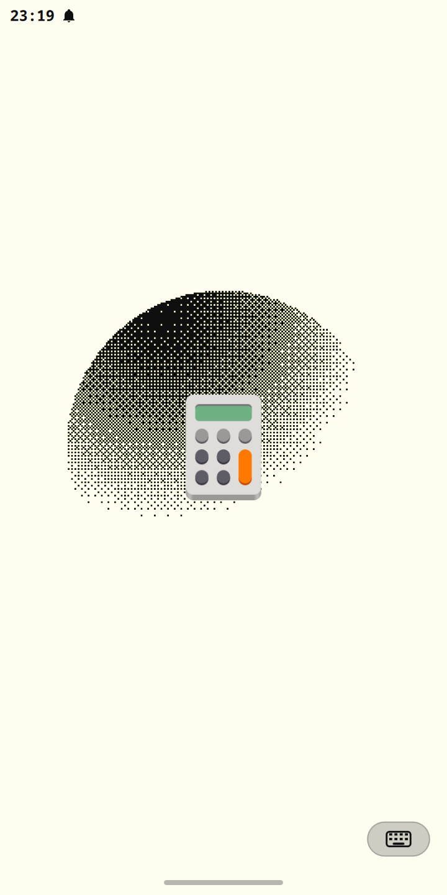

# Windows — specification

> **Copied from moarchy** — `docs/windows.md` at `d0e5dd2` (2026-09-09), with
> every AC id and every line of text unchanged. On Hyprland, W1-W5 are met by
> `default/etc/skel/.config/hypr/mobile.lua` rather than by `pinephone.conf`,
> and one-app-per-workspace is a window rule rather than moarchy's Python
> daemon. L1-L9 are `Splash.qml` inside `mobile.shell` rather than a plugin of
> its own, and the launch state is the shell plugin's rather than AppLibrary's:
> an installed plugin here is handed a seven-callback app-library facade with
> no launch feedback on it at all, so `Shell.launchApp()` opens the splash in
> the same call that asks for the launch and watches for the window itself.
> What upstream is asked for is silence — the bar declares `launchOsd: false`
> and `patches/launch-osd-bar-opt-out.patch` makes AppLibrary read it, the same
> shape as the bar's opt-out from the notification toasts.
> [`../acceptance.md`](../acceptance.md) carries the status.

What an app gets when it opens: the whole workspace, and its own icon on the
wallpaper while it is on its way there. Present tense, normative. The
archaeology lives in [build-log.md](build-log.md).

Ids are `W<n>` for the window area and `L<n>` for the launch splash, cited by
any check that proves one. Lines marked **?** are my reading of the code rather
than your decision — read those first.

Not here: how the bar and the gesture strip take their bands off the screen.
Those are exclusive zones, they are already subtracted from the workspace rect
before any of this applies, and they belong to [gestures.md](gestures.md).

---

## W1–W6. The window area

**W1** A single app on a workspace fills its workspace exactly. No wallpaper
shows around it, on any edge.
→ `swaymsg -t get_tree` reports the focused window's `rect` equal to the focused
workspace's `rect`

**W2** That is `gaps inner 0` doing it, not the border. Sway applies inner gaps
at the workspace edge as well as between windows, so `gaps inner 3` cost 6px of
a 360px width and 6px of a ~660px height on every app.
→ `default/sway/pinephone.conf` sets `gaps inner 0` and `gaps outer 0`

Worth knowing before you go looking for a bug: **`swaymsg reload` does not apply
a changed `gaps` to workspaces that already exist.** The config value is what a
workspace is *created* with. A session that predates this change keeps its old
gaps through any number of reloads and needs `swaymsg gaps inner all set 0`, or
a fresh session, to catch up.

**W3** The 2px border stays and costs nothing in the normal case: `looknfeel.conf`'s
`hide_edge_borders smart` drops every border of the only visible window on a
workspace, and `moarchy-one-app-per-workspace` makes that the normal case.
Split a workspace and the borders come back — they are then the only thing
saying which pane has focus.
→ W1 holds with one window; with two, each window's `rect` is inset by the
border and the two are adjacent

**W4** `moarchy-window-gaps-toggle` adds gaps and takes them away again.
Inverted from the desktop original, whose first press *removed* gaps: with the
default now none, that press did nothing at all and the second one added
padding to a phone.
→ one press narrows the workspace to `output width - 6` at `x=3`; a second
restores it to the full width at `x=0`. Width, not the window rect: the window
rect carries every exclusive zone on the screen, so the keyboard coming up
mid-check reads as a gaps failure.

**W5** Nothing is fullscreened on the user's behalf. A window that fills its
workspace (W1) is still a *tiled* window, and that is a different thing: sway
draws a fullscreen view above the Top layer and routes touches to it alone, so
a fullscreened window takes the bar, the launch splash and — the one that
decides this — the on-screen keyboard off the screen with it. The keyboard is
on Top by design and cannot simply move: on Overlay it maps before the home
strip and claims the bottom exclusive zone the pill needs
(`moarchy-keyboard/src/panel.cpp`). A fullscreen window also ignores exclusive
zones, so even a keyboard that stayed visible would cover the prompt instead of
pushing it up. Fullscreen stays available on `$mod+Shift+f`, as a thing the
user asks for and can undo.
→ no `fullscreen enable` rule in `default/sway/pinephone.conf`, and
`swaymsg -t get_tree` reports `fullscreen_mode: 0` for a window opened by
`moarchy-launch-tui`; with its prompt focused, a tap on a key of the raised
keyboard reaches the terminal

Until 2026-09-06 `pinephone.conf` fullscreened every `moa-tui` window, for ~46
columns that were never at stake — the bar anchors top, the keyboard anchors
bottom, and neither costs a character of width. What it cost was the keyboard:
Settings ▸ Install from the AUR, `passwd`, and every other bridged row that
asks a question drew a prompt over a keyboard whose keys took no touches.

**W6** *Added here, not moarchy's.* The shell's own screens — Settings, Wi-Fi,
Bluetooth — draw opaque, so the theme background they paint is the colour the
bar paints. They are windows and the bar is a layer surface, and upstream tags
every window for 0.985 / 0.96 opacity (`default/hypr/windows.lua`): through
that, the wallpaper tinted Settings `#1e1d27` under a `#1a1b26` bar on Tokyo
Night.
→ with Settings open, `hyprctl getprop` reports `opacity` and
`opacity_inactive` of 1 for its window, which carries no `default-opacity` tag

---

## L1–L9. The launch splash

Replaces upstream's launch OSD — a rounded panel reading "Launching Files…"
with a rocket glyph, shown two seconds after the tap. Two things were wrong
with it here: two seconds is most of a PinePhone app launch, so the feedback
arrived after the moment it was for, and a panel of chrome is not what a phone
shows while an app opens.

**L1** Tapping an app in the drawer puts that app's own icon on screen,
centred, as the drawer closes. Not two seconds later.
→ `omarchy-shell splash state` reads `open` within a second of the launch

**L2a** The splash is on the Overlay layer, not Top. Sway renders a fullscreen
view above the top layer, so on Top the splash disappeared behind any
fullscreen window — and at the time `pinephone.conf` fullscreened every TUI.
That rule is gone (it hid the keyboard for the same reason, see W5), which
changes how often this bites and not whether it is one: `$mod+Shift+f` and any
app that asks for fullscreen still draw above Top.
→ `omarchy-shell splash geometry` reports `layer=overlay`, read back off the
window rather than restated

**L2** Nothing is drawn but the icon. The background is transparent and the
wallpaper — or whatever was on the workspace — is what is behind it.
→ the splash surface is sized to the icon, not to the screen:
`omarchy-shell splash geometry` reports a width under half the screen's

**L3** The splash catches no input worth the name. The home pill, the back
edge and the status bar all keep working while it is up.
→ the surface is its own input region (L2) *and* its mask is one pixel, so this
holds twice over. One pixel rather than none: an empty mask reads as "no input"
and means the opposite — Qt treats an empty mask as unset, and an unset input
region is the whole surface. moarchy-keyboard's `src/panel.cpp` carries the
same workaround for the same reason.

**L4** It goes when the app's window appears, with a short fade so the app is
not revealed by a jump cut.
→ `omarchy-shell splash state` reads `closed` once the window has mapped

**L5** A `.desktop` entry that summons a shell plugin rather than starting a
process — `moarchy.device` is one — never produces a window. The splash
goes when that plugin's surface opens instead.
→ launching Device leaves `omarchy-shell splash state` at `closed`

**L6** If nothing ever appears, the splash gives up after 15 seconds rather
than sitting on the wallpaper. That is upstream's timeout, kept.
→ `omarchy-shell splash state` reads `closed` 16s after launching a command
that exits immediately

**L7** An app whose icon resolves to nothing still gets a splash: a rounded
outline in the theme's foreground, not a blank screen. The generic
`application-x-executable` is not the fallback, because on this image it is not
reachable — it exists only inside AdwaitaLegacy's `mimetypes/`, which the active
theme does not inherit, so Qt's themed lookup returns "" and so does upstream's
`iconSource("")`.
→ `omarchy-shell splash drawn` reports `icon <path>` or `fallback`, never
`nothing`

**L8** The icon pulses, slowly, while it is up. **?** A static icon on the
wallpaper reads as a stuck frame on hardware this slow; the pulse is what says
the launch is still running. It is one transform on one textured quad, which is
what the Mali-400 can afford.

**L9** The store's **Open** is a launch like any other, so it gets the splash
too. Installing something and opening it is the one moment a phone owner is
*least* willing to believe the tap registered, and it was the one launch with
no feedback at all: `moarchy-store` started the entry itself, through
`Gio.DesktopAppInfo.launch()`, which starts the app and tells the shell
nothing. You tapped Open and the store sat there — on this hardware for
seconds — until the window mapped and the workspace switched under you.

So the store asks the shell instead: `omarchy-shell drawer launch <id>`, the
same entry point a tap in the drawer goes through, with its own `Gio` call kept
as the fallback for a machine that has no shell to ask. That makes the drawer's
`launch` IPC a contract with a consumer outside this repo, not the test hook
its comment used to call it.

→ the installed `moarchy-store`'s `launcher.py` calls
`omarchy-shell drawer launch`, rather than reaching Open through `Gio` alone

**L9a** The id goes **without** its `.desktop` suffix. AppLibrary keys entries
by the bare id, so the suffixed form launches the app and matches no entry —
the splash then draws L7's fallback outline rather than the icon of the thing
you just installed, which is worse than a plain miss because it looks
deliberate. L7 cannot catch it: `fallback` is a pass there, by design.
→ `omarchy-shell drawer launch <bare id>` for a real app leaves
`omarchy-shell splash drawn` reading `icon <path>`, not `fallback`

  

### What the splash does not cover

Apps started from a terminal, from a keybinding, or by
`moarchy-launch-terminal` and friends. The splash hangs off
`AppLibrary.launch()`, which is the drawer's, the Omarchy menu's and — since L9
— the store's path, and nothing else's.

The store's other two Open paths are also outside it, and correctly so. A
plugin (`omarchy-shell shell toggle`) has a surface that maps at once, which is
the completion L5 is about rather than something to announce; a terminal app
goes to `moarchy-launch-tui`, which is one of the "and friends" above.
